<script type="text/javascript" src="http://cdn.mathjax.org/mathjax/latest/MathJax.js?config=TeX-AMS-MML_HTMLorMML"></script>
<script type="text/x-mathjax-config">
    MathJax.Hub.Config({ tex2jax: {inlineMath: [['$', '$']]}, messageStyle: "none" });
</script>

# 计算机网络：自顶向下方法，第7版

## 复习题和习题参考答案

### 版本时间：2016年12月

本文档包含Jim Kurose和Keith Ross编写的《计算机网络：自顶向下方法（第7版）》复习题和习题的参考答案。这些答案只对指导老师有效。请不要复制或者分发给其他人（即使是其他指导老师）。请不要在公共网络发布任何参考答案。如果有需要，我们很乐意提供此参考答案（最新版）。

声明：这些年来，很多同学和同事帮助我们准备此参考答案。特别感谢Honggang Zhang，Rakesh Kumar，Prithula Dhungel和VijayAnnapureddy。同时也感谢提建议和修正错误的所有读者。

所有材料©1996-2016 由J.F.Kurose 和K.W.Rose提供。版权所有。

<div STYLE="page-break-after: always;"></div>

# 说明

译者：幽弥狂

时间：2019-10-6

版本：V2.0.2019.11.23

电话：13812991101

QQ：1768478912

邮箱：1768478912@qq.com

环境：Manjaro Linux 18.1.0+vscode insider version Markdown

1、此参考答案所有内容版权由原作者所有，本人为了方便考研复习提供简体中文版本的翻译。

2、阁下在获取到此文档的同时，应该同时获取到此文档的英文原版PDF。此文档的中文版权归本人所有，提供给需要的人使用。

3、阁下在使用本文档时，不得添加水印、删减或修改内容。

4、当然，以上内容只是说说而已，你如果不遵守，我也不可能顺着网线去打你。

5、如果有侵权（对于原作者）或者其他的问题或者建议，欢迎联系我。

6、阁下在使用本文档时，请保留此页面和原版翻译的封面。

7、根据南京大学计算机845真题的内容，本文档只翻译第1-7章。

<div STYLE="page-break-after: always;"></div>

# 版本信息

## 2019年11月23日

- 发布第二个发布版，版本号：V2.0.2019.11.23
- 修复公式导出问题
- 添加第八章内容

## 2019年11月11日

- 发布第一个发布版，版本号：V1.0.2019.11.11

## 2019年10月6日

- 创建文档

<div STYLE="page-break-after: always;"></div>

# 目录

[第一章](#第一章)
- [复习题](#复习题1)
- [问题](#问题1)

[第二章](#第二章)
- [复习题](#复习题2)
- [问题](#问题2)

[第三章](#第三章)
- [复习题](#复习题3)
- [问题](#问题3)

[第四章](#第四章)
- [复习题](#复习题4)
- [问题](#问题4)

[第五章](#第五章)
- [复习题](#复习题5)
- [问题](#问题5)

[第六章](#第六章)
- [复习题](#复习题6)
- [问题](#问题6)

[第七章](#第七章)
- [复习题](#复习题7)
- [问题](#问题7)

[第八章](#第八章)
- [复习题](#复习题8)
- [问题](#问题8)

<div STYLE="page-break-after: always;"></div>

# 第一章

## 复习题1

1、（1）没有区别。根据书本内容，“主机”和“终端系统”是交换使用的。

（2）终端系统包括PC、工作站、网络服务器、邮件服务器、PDA、连接网络的游戏控制台等等。

（3）由（2）可知，网络服务器是终端系统。

2、来自维基百科：外交协议常用于描述一系列国家来往规则。这些构建完备和经过时间检验的规则可以使国家和人民生活和工作更简单。协议规则以人民准则为基础，其中的一部分已经作为现在分级的地位声明。

3、标准对于协议来说，可以让人们创建可以相互操作的网络系统和产品。

4、（1）通过电话线的拨号调制解调器：家庭

（2）通过电话线的DSL（Digital Subscriber Line，数字用户线）：家庭或小办公室

（3）混合光纤同轴电缆：家庭

（4）100M交换以太网：企业

（5）无线网：家庭或企业

（6）3G和4G：广域无线网

5、HFC带宽是由用户共享。下行通道中，所有的包都是由头端这一个单一源发出的。因此，下行通道中没有碰撞。

6、光纤到户、3G和4G无线网

7、10M、100M、1G、10G

8、双绞线、光纤

9、拨号调制解调器：最高56K，带宽专用
   ADSL：下行最高24M，上行最高2.5M，带宽专用
   HFC：下行最高42.8M，上行最高30.7M，带宽共享
   FTTH：上行2-10M，下行10-20M，带宽不共享

10、现在最流行的无线网技术有两种：

（1）WiFi。用于无线局域网，无线用户从辐射范围为几十米的基站（例如无线接入点）传输数据包。基站连接无线网络，并为无线用户提供无线网服务。

（2）3G和4G。大范围无线网，此系统通过电信服务商提供的基站，由蜂窝电话通过同一个无线设备传输数据。可以提供基站几十千米范围内的无线网络。

11、$t_0$时发送主机开始传输，$t_1=L/R_1$时发送端完成传输并且交换机收到完整的数据包（没有传播延时）。因为交换机在$t_1$时已收到完整包，那么$t_1$时交换机开始传输包至接收主机。$t_2=t_1+L/R_2$时交换机完成输出并且接收主机收到完整包（没有传播延时）。因此，端到端总延时是$L/R_1+L/R_2$。

12、电路交换网络可以在响应时间内保证一定量的端到端带宽。如今大部分分组交换网络（包括因特网）无法保证端到端带宽。FDM需要复杂的模拟硬件来将信号转换为合适的频率。

13、

（1）2个用户，每个用户只需要一半的链接带宽；

（2）既然每个用户传输时要求1Mpbs带宽，如果两个或者更少的用户同时传输，要求最多2Mbps。共享链路的可用带宽是2Mbps，那么传输前没有排队延时。如果有3个用户同时传输，带宽要求是3Mbps，超过了共享链接可用带宽。这种情况下，连接之前会有排队延时。

（3） 一个用户传输的概率是0.2

（4）3个用户同时传输的概率是 $\binom{3}{3} p^{3} (1-p)^{3-3}$ 。因为用户传输是队列会增加，队列增加时的时间因素是0.008。

14、如果两个ISP不对等，那么当他们给对方发送流量时他们需要通过一个付费流量ISP提供商（中间商）来发送数据。通过直接对等传输，两个ISP可以减少给其他ISP提供商的费用。多个ISP可以通过网络交换点（IXP）（通常由它自己的交换机单独构建）作为汇合点来直接对等传输。ISP通过对连接至IXP的每一个ISP收取少量费用来盈利，当然利润取决于IXP发送或接收的流量数。

15、谷歌的私有网络连接了它大大小小的所有的数据中心。谷歌数据中心的流量通过它的私有网络而不是公共网络来传输。大多数的数据中心位于或靠近与低级的ISP。因此，当谷歌向用户分发数据时，可以跳过高级的ISP。是什么推动着这些内容提供商创建这些网络？首先，如果内容提供商使用更少的中间的ISP，它可以更容易控制用户体验。其次，通过减少至提供商的网络流量来节省成本。第三，如果ISP向利润率高的内容提供商收取高费用（在网络中立状态不适用的国家或地区），内容提供商可以避免额外成本。

16、延迟组件包括处理延迟、传输延迟、传播延迟、排队延迟。除了排队延迟是变量其他的都是固定的。

17、

a）1000km, 1Mpbs, 100bytes

b）100km, 1Mpbs, 100bytes

18、
（1）10msec

（2）d/s

（3）无关

（4）无关

19、

(1) 500kps

(2) 64 seconds

(3) 100kps；

20、终端系统A将大文件拆分为块。A通过添加文件头信息至每一个块来从文件生成多个数据包。数据包的头信息包含目标（终端系统B）IP地址。数据包交换机通过包中的目标IP地址来决定发送链接。考虑到包目标地址，包选择哪条路走和包选择哪条外链走的方法相似。

21、最大发送速率为500包/s，最大传输速率是350包/s。相对应的话务量强度是500/350=1.43>1。每次实验最终都会发生数据丢失；由于传输的随机性，每一次实验的数据丢失发生的时间都是不同的。

22、五个功能是：错误控制、流控制、片段化和重组、多任务和连接设置。没错，在不同层这些功能可能重复。例如，不止一层提供错误功能。

23、网络协议的自顶向下的五层是：应用层、传输层、网络层、链路层和物理层。详见1.5.1。

24、应用层报文：应用程序想发送和通过传输层的数据；

传输层段：由传输层生成并且封装有传输层头信息的应用层报文

网络层数据段：封装有网络层头信息的传输层段

链路层帧：封装有链路层头信息的网络层数据段

25、路由器处理网络、链路、物理层（第1到3层）。（实际上现代路由器有时担任防火墙、缓存组件和处理传输层）链路层交换机处理链路层和网络层（第1到2层）。主机处理所有的五层。

26、

a）病毒

需要以下人的交互来传播。比如邮件病毒。

b）蠕虫

不需要用户介入。受感染主机中的蠕虫会扫描IP地址和端口号来查找可感染的进程。

27、创建僵尸网络需要攻击者发现以下应用或系统的薄弱点（比如利用应用中可能存在的缓冲区溢出漏洞）。发现薄弱点后，黑客需要查找可攻击的主机。目标一般是已发现漏洞的一系列系统。僵尸网络中的任何系统都可以通过漏洞自动扫描它的环境和传播。这种僵尸网络的重要属性就是僵尸网络的起点可以远程控制和发送命令至僵尸网络中的所有结点的每一个节点（例如僵尸网络中的所有结点可以被黑客命令发送TCP SYN信息至目标，并将导致目标的TCP SYN溢出攻击）。

28、Trudy可以假装为Bob（反之亦然）并且部分或者完全修改Bob发送给Alice的信息。例如，她可以很容易的修改语句“Alice，我欠你1000美元”为“Alice，我欠你10000美元”。更进一步，Trudy甚至可以丢弃Bob发送给Alice的加密信息（反之亦然）。

[Back to Index](#目录)

<div STYLE="page-break-after: always;"></div>

## 问题1

P1. 这个问题不止一个答案。很多协议都可以解决这个问题。下面是一个简单的答案：

| Msg name | purpose |
|--------- |-------- |
|HELO <userid> | Let server know that there is a card in the ATM machine . ATM card transmits user ID to Server |
|PASSWD <passwd> | User enters PIN, which is sent to server . BALANCE User requests balance |
|WITHDRAWL <amount> | User asks to withdraw money . BYE user all done |

从服务器至ATM机器的信息（显示）

| Msg name | purpose |
|--------- |-------- |
|PASSWD | Ask user for PIN (password) |
|OK | last requested operation (PASSWD, WITHDRAWL) OK |
|ERR | last requested operation (PASSWD, WITHDRAWL) in ERROR |
|AMOUNT <amt> | sent in response to BALANCE request |
|BYE | user done, display welcome screen at ATM |

正确回应：

|client | server |
|-------|--------|
|HELO (userid) | --------------> (check if valid userid) |
| | <------------- PASSWD |
|PASSWD <passwd> | --------------> (check password) |
| | <------------- OK (password is OK) |
|BALANCE |--------------> 
| | <------------- AMOUNT <amt> |
|WITHDRAWL <amt> | --------------> check if enough $ to cover withdrawl |
| | <------------- OK |
|ATM dispenses $ 
|BYE | --------------> |
| | <------------- BYE |

钱不够的情况下：

|client | server |
|-------|--------|
|HELO (userid) |--------------> (check if valid userid) |
| |<------------- PASSWD |
|PASSWD <passwd> |--------------> (check password) |
|| <------------- OK (password is OK) |
|BALANCE |--------------> |
|| <------------- AMOUNT <amt> |
|WITHDRAWL <amt> |--------------> check if enough $ to cover |
withdrawl ||
| |<------------- ERR (not enough funds) |
|error msg displayed ||
|no $ given out ||
|BYE |--------------> |
| | <------------- BYE|

P2. N*(L/R)时，第一个包到达目的地，第二个包存储在最后一个路由器中，第三个包存储在倒数第二个路由器中，等等。N*(L/R)+L/R时，第二个包到达目的地，第三个包存储在最后一个路由器中，等等。按照这个逻辑继续，我们可以看到在N*(L/R)+(P-1)*(L/R)=(N+P-1)*(L/R)时所有数据包到达目的地。

P3.

a.电路交换网，因为应用将以稳定速率，持续长时间运行，因此可以为其保留带宽。

b.不需要，传输速率总和小于链路容量。

P4.

a.在左上角的开关和右上角的开关之间，我们可以有4个连接。类似地，我们可以在其他3对相邻开关之间各有四个连接。因此，这个网络可以支持多达16个连接。

比如：

A 到 B ：4 条

B 到 C ：4 条

C 到 D ：4 条

D 到 A ：4 条

这 16 条可以同时连接。

b.我们可以通过右上角的开关通过4个连接，在左下角有4个通过开关的连接，总共有8个连接。

A 到 B ：4 条

B 到 C ：4 条

最多 8 条。

c.可以。对于A和C之间的连接，我们路由两个连接通过B，两个连接通过D。对于B和D之间的连接，我们路由两个连接通过A，两个连接通过C。这样，最多有4个连接通过任何链接。

A 到 B ：2 条

B 到 A ：2 条

A 到 D ：2 条

B 到 C ：2 条

P5.收费亭相距75公里，车辆以每小时100公里的速度传播。收费亭每12秒为一辆汽车提供服务。

a.有十辆车。第一个收费站服务这10辆车需要120秒钟，也就是2分钟。每辆汽车在到达第二个收费站之前都有45分钟的传播延迟(行驶75公里)。因此，在47分钟后的第二个收费站前，所有的汽车都排好了队。整个过程重复在第二个和第三个收费亭之间旅行。第三个收费站还需要2分钟才能为10辆车提供服务。因此，总的延迟时间是96分钟。

收费站将整个车队推向公路的时间为 d1 = 2min；

两收费站之间距离 75 km，从一个收费站到另一个的时间 d2 = 0.75 h

总时间 d = 3d1 + 2d2 = 96min

b.收费亭之间的延误为8*12秒加上45分钟，即46分钟和36秒。总延迟是这一数额的两倍，加上8*12秒，即94分48秒。

d1’ = 8辆 / 5辆/min = 1.6min

d’ = 3d1’ + 2d2 = 94.8min

P6.

a.$d_{prop}=m/s seconds$

b.$d_{trans}=L/R seconds$

c.$d_{e2e}=d_{prop}+d_{trans}=m/s+L/R$

d.刚刚离开A

e.第一位在链路上并且还没有到达B

f.已经到达B

g.$d_{prop}$ = $d_{trans}$

m/s = L/R

$m = Ls/R = 120b * (2.5 *10^8)m/s / 56kbps = (5.36 * 10^5)m$

P7.考虑数据包中的第一位。在传输此位之前，必须生成数据包。

主机 A 产生 56 字节的分组需要 = 56 * 8b / 64kbps = 7ms

传输时延 = 56 * 8b / 2Mbps = 0.224ms

总时间 = 7ms + 10ms + 0.224ms = 17.224ms

P8.

a.3Mbps/150kbps = 20

b.p = 0.1

c.$\binom{120}{n}p^n(1-p)^{120-n}$

d.$1-\sum_{n=0}^{20}\binom{120}{n}p^n(1-p)^{120-n}$

根据中心极限定理：令$X_j$为独立随机变量P($X_j$​=1)=p ；

P(21或更多用户)=1−P($\sum_{j=1}^{120}X_j≤21$)

P($\sum_{j=1}^{120}X_j≤21$)=$P\left ( \frac{\sum_{j=1}^{120}X_j-12}{\sqrt{120\cdot 0.1\cdot0.9}}\leq \frac{9}{\sqrt{120\cdot 0.1\cdot0.9}} \right )$≈P(Z≤9/3.2869​)=P(Z≤2.74)=0.997

因此 P(21或更多用户)≈0.003

P9.

a.N=1Gbps×100kbps=$10^4$

b.$\sum_{n=N+1}^{M}\binom{M}{n}p^n(1-p)^{M-n}$

P10.第一终端系统要求$L/R_1$将分组发送到第一链路；分组在$d_1/s_1$中的第一链路上传播；分组交换机增加$d_{proc}$的处理延迟；在接收到整个分组后，连接第一和第二链路的分组交换机要求$L/R_2$将该分组发送到第二链路；该分组通过$d_2/s_2$中的第二链路传播。同样，我们可以找到第二个交换机和第三个链路：$L/R_3$、$d_{proc}$和$d_3/s_3$所造成的延迟。加上这五个延迟

$D_{trans}=L/R_1+L/R_2+L/R_3$

$D_{prop}=d_1/s_1+d_2/s_2+d_3/s_3$

$D_{prop}=2∗d_{proc}$

$D=D_{trans}+D_{prop}+D_{proc}$

D=6+6+6+20+16+4+3+3=64ms

P11.由于比特是立即发送的，所以分组交换机不引入任何延迟；特别是，它不引入传输延迟。因此，

$d_{end2end}=L/R+d_1/s_1+d_2/s_2+d_3/s_3$

对于问题10中的值，我们得到$D=D_{prop}+L/R=20+16+4+6=46ms$

P12.到达的数据包必须首先等待链路发送4.5×1500字节=6750字节或54000比特。由于这些比特是以2Mbps发送的，所以队列延迟为27毫秒。一般情况下，排队延迟为(nL(L-x))/R。

有一个完整分组的排队时延为1500×8b×2Mbps=0.6ms

4.5个分组的总排队时延为 4.5∗0.6ms=2.7ms

P13.

a.第一个分组的排队时延为 0, 第二个 L/R, 第三个 2L/R，第N个 (N-1)L/R

因此平均排队时延为 (L/R + 2L/R + … + (N-1)L/R) / N = (N-1)L/2R

b.当下一批 N 个分组到达时，上一批已经传完，因此平均排队时延为 (N-1)L/2R

P14.

a.传输延迟为L/R。总延迟是$\frac{IL}{R(1-I)}+\frac{L}{R}=\frac{L/R}{1-I}$

b.以 L/R 为函数：

令 x = L/R： L/R(1-I) = x/(1-ax)

函数经过原点，在 x = 1/a 处趋于无穷

P15.μ = R/L 所以 L / R(1-I) = 1 / μ-a

P16.

N = 10 + 1 = 11个分组

d = 10ms + 1/100s = 0.02s

a = N/d = 11/0.02 = 550分组/s

P17.

a.有Q节点(源主机和Q-1路由器)。设$d_{proc}^{q}$表示q节点处的处理延迟。设$R^q$为第q个链路的传输速率，则

$d_{proc}^{q}=L/R^q$。设$d_{proc}^{q}$是穿越q个链路的传播延迟。然后$d_{end2end}=\sum_{q=1}^{Q}\begin{bmatrix}
d_{proc}^{q}+d_{trans}^{q}+d_{prop}^{q}
\end{bmatrix}

b.设$d_{queue}^{q}$是结点q的排队延迟。那么

$d_{end2end}=\sum_{q=1}^{Q}\begin{bmatrix}
d_{proc}^{q}+d_{trans}^{q}+d_{prop}^{q}+d_{queue}^{q}
\end{bmatrix}$

P18.在Linux上，您可以使用以下命令

```
traceroute www.targethost.com 
```

在Windows命令提示符中，可以使用
```
tracert www.targethost.com 
```

在这两种情况下，您将得到三个延迟测量。对于这三个测量，你可以计算平均和标准差。在一天中的不同时间重复实验，并对任何变化发表评论。

下面是一个示例解决方案：

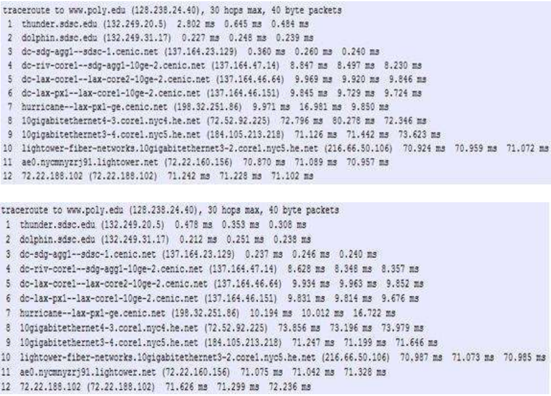

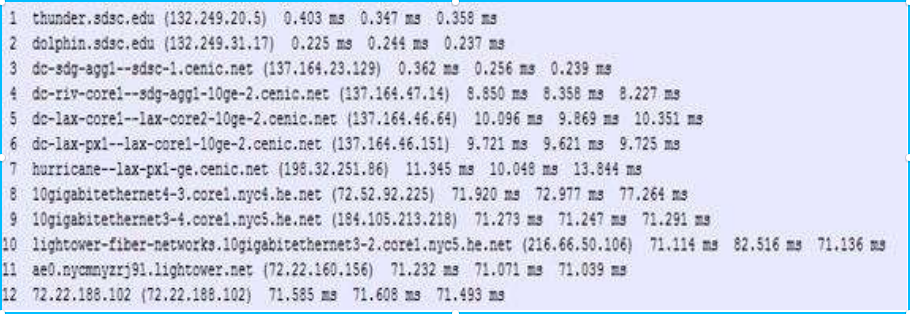

圣地亚哥超级计算机中心与www.poly.edu之间的追踪显示:

a)在三个小时中，往返时间的平均(平均)分别为71.18毫秒、71.38毫秒和71.55毫秒。标准偏差分别为0.075、0.21ms、0.05ms。

b)在本例中，跟踪器在三个小时中的每一个路径上都有12个路由器。不，在任何一个小时内路径都没有改变。

c)跟踪数据包从源到目的地通过四个ISP网络。是的，在这个实验中，最大的延迟发生在相邻ISP之间的窥视接口上。

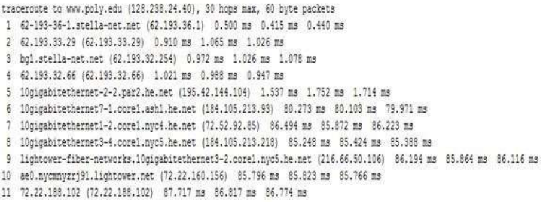

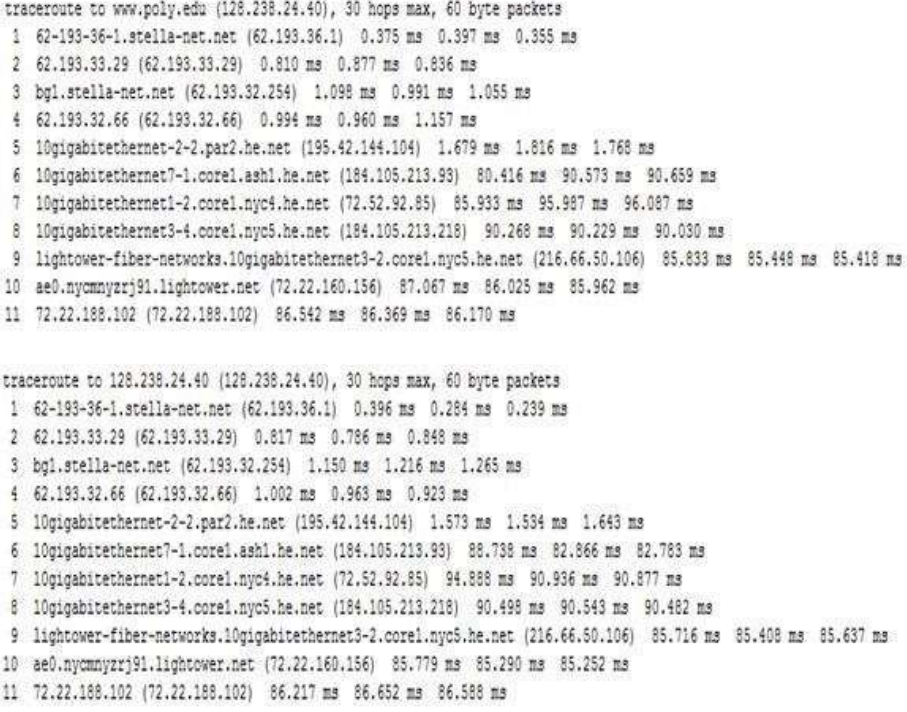

追踪网址：www.stella-Net.net(法国)至www.poly.edu(美国)。

d)该三小时的平均往返延误时间分别为87.09毫秒、86.35毫秒及86.48毫秒.标准偏差分别为0.53 ms、0.18 ms、0.23 ms。在本例中，三个小时中的每一个路径上都有11个路由器。不，在任何一个小时内路径都没有改变。Traceroute数据包将三个ISP网络从源传送到目的地。是的，在这个实验中，最大的延迟发生在相邻ISP之间的窥视接口上。

P19.范例:

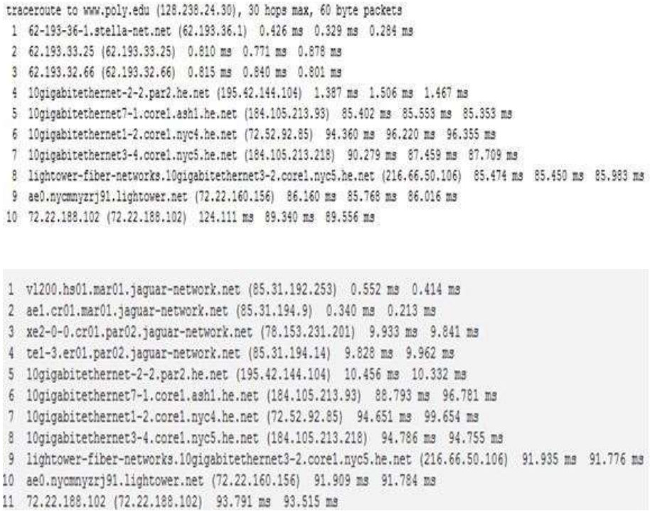

从法国的两个不同城市到美国的纽约市

a)从法国的两个不同城市到美国的同一目的地东道国，有七个联系是共同的，包括跨大西洋连接。

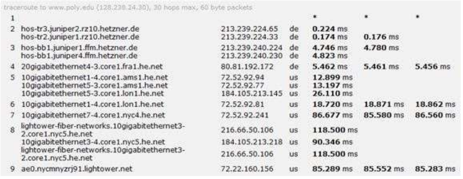

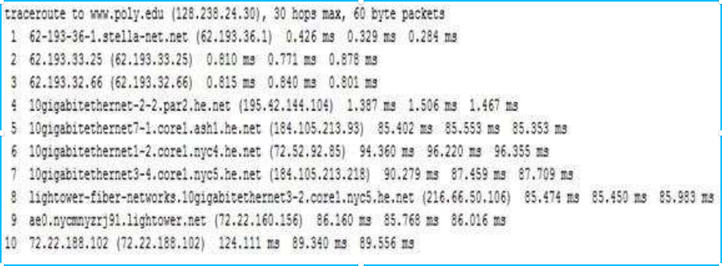

b)在法国的一个城市和德国的另一个城市到美国同一个东道国的示踪剂的例子中，三个联系是共同的，包括跨大西洋的联系。

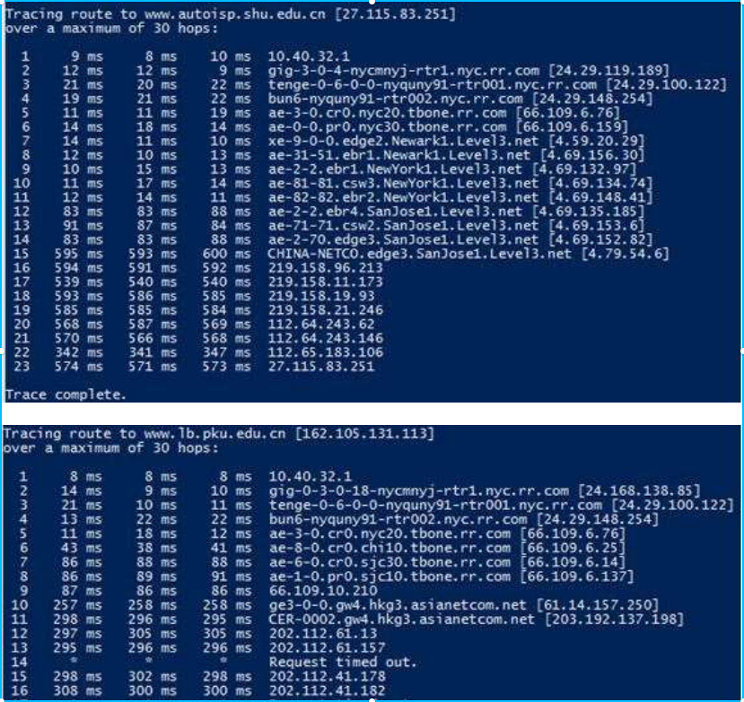

从美国同一地主地到中国两个不同城市的追踪，

c)五个链接在这两个追踪器中是常见的。这两种示踪剂在到达中国之前有分歧

P20. $min{\{R_s, R_c, R/M\}}$

P21.仅使用一条，最大吞吐量由：

$max\{min\{R_{1}^{1},R_2^1,...,R_N^1\},min\{R_1^2,R_2^2,...,R_N^2\},...,min\{R_1^M,R_2^M,...R_M^M\}\}$

使用 M 条：$\sum_{k=1}^{M}min\{R_1^k,R_2^k,...,R_N^k\}$

P22.不丢包概率为 1 - p， N 个路由器， 因此总的不丢包概率$p_s=(1−p)^N$

在客户端成功接收数据包之前需要执行的传输数是具有成功概率$p_s$的几何随机变量。因此，所需传输的平均次数为：$1/ps$。然后，所需重传的平均次数为：$1/p_s-1$。

P23.

a.$L/R_s$

b.可能，因为第二个分组 (用 P2 表示) 可能在第一个分组 (P1) 被推出之前到达；

P1 被完全推出的时间 $t_1 = L/R_s + L/R_c + d_{prop}$

P2 到达路由器的时间 $t_2 = 2L/R_s + d_{prop} + T$

要求t2 > t1:即 $T > L/R_c - L/R_s$；

因此T至少是$L/R_c - L/R_s$

P24.40兆字节=40*1012*8位因此，如果使用专用链接，则需要40*1012*8/(100*106)=3200000秒=37天。但是有了联邦快递的通宵递送，你可以保证数据在一天内到达，而且它的成本应该低于100美元。

P25.

a.$t_{prop} = 20000km / 2.5*10^8m/s = 0.08s$

$R * t_{prop} = 1.6 * 10^5 bits$

b.$1.6 * 10^5$bits

c.链路上的最大比特数量

d.$20000km / 1.6*10^5 = 125m$这比足球场长(正规足球场场地：长105米、宽68米)

e.s/R 

P26.

s/R = 20000km

R = 12.5Mbps

P27

a. $R * d_{prop} = 8 * 10^7 b$

b.$8 * 10^7$b 是 不对 的，因为文件为 $8 * 10^5$ b

c. s/R = 0.25m

P28.

a.$t_{trans} + t_{prop} = 0.48s$

b.$20*(t_{trans}+t_{prop})=20*(0.02+0.08)s=2s$

c.分解一个文件需要更长的时间来传输，因为每个数据包及其相应的确认包都会添加它们自己的传播延迟。

P29.

a. $d_{prop} = 36000km / (2.4 * 10^8) = 0.15s$

b. $R * d_{prop}=10Mbps*0.15s=1.5*10^6bits$

c. $60s * 10Mbps = 6 * 10^8 bits$

P30.假设乘客和他/她的行李对应到达协议栈顶部的数据单元。当旅客办理登机手续时，他/她的行李会被检查，并在行李和车票上贴上标签。这是在行李层中添加的附加信息，如果图1.20允许行李层在发送方实现服务或分离乘客和行李，然后将它们重新统一(希望如此！)在目的地那边。当乘客经过安检时，通常会在车票上加盖额外的印章，表示乘客通过了安全检查。这些信息用于确保(例如，通过以后对安全信息的检查)人员的安全转移。

P31.

a.

$8 * 10^6 / 2Mbps = 4s$

3 * 4s= 12s

b.

$1 * 10^4 b / 2Mbps = 5 * 10^(-3)s$

$2 * 5 * 10^(-3)s = 10^(-2)s$

c.$(800 + 3 - 1) * 0.5 * 10^(-2) = 4.01s$比 (a) 快非常多

d.便于检测错误并重传；不分段的大包容易使路由器缓存不足导致丢包；

e.分组需要排序；需加上首部信息；

P32.是的，Applet中的延迟对应于问题31中的延迟。对于分组交换和消息交换，传播延迟都会影响整个端到端延迟。

P33.有F/S包。每个包S=80位。在第一路由器接收最后一个数据包的时间是$\frac{S+80}{R}\times \frac{F}{S}$秒。此时，第一个F/S-2分组位于目的地，F/S-1分组位于第二路由器。最后一个数据包随后必须由第一个路由器和第二个路由器发送，每一个传输都需要$\frac{S+80}{R}$秒。因此，发送整个文件的延迟为$\frac{S+80}{R}\times (\frac{F}{S}+2)$，以计算导致最小延迟的S值，延迟为：$\frac{\mathrm{d} }{\mathrm{d} x}delay=0 \Rightarrow S=\sqrt{40F}$。
​
P34.电路交换电话网络和因特网在“网关”连接在一起。当Skype用户(连接到Internet)呼叫普通电话时，通过电路交换网在网关和电话用户之间建立电路。Skype用户的语音通过互联网以数据包的形式发送到网关。在网关处，对语音信号进行重构，然后通过电路发送。另一方面，语音信号通过电路交换网络发送到网关。网关对语音信号进行分组，并将语音分组发送给Skype用户。

[Back to Index](#目录)

<div STYLE="page-break-after: always;"></div>

# 第二章

## 复习题2

R1、网址：http；文件传输：ftp；远程登录：Telnet；电子邮件：smtp；BitTorrent文件共享：BitTorrent协议

R2、网络体系结构是指将通信过程组织成多个层次(例如，五层互联网体系结构)。另一方面，应用程序体系结构是由应用程序开发人员设计的，它决定了应用程序的广泛结构(例如，客户机-服务器或P2P)。

R3、发起通信的进程是客户端；等待联系的进程是服务器。

R4、没有。在P2P文件共享应用程序中，接收文件的对等方通常是客户端，发送文件的对等方通常是服务器。

R5、目标主机的IP地址和目标进程中套接字的端口号。

R6、你会用UDP。使用UDP，事务可以在一次往返时间(RTT)内完成--客户端将事务请求发送到UDP套接字，服务器将应答发送回客户端的UDP套接字。对于TCP，至少需要两个RTT--一个用于设置TCP连接，另一个用于客户机发送请求，另一个用于服务器发送回复。

R7、例如，使用Google文档进行远程文字处理就是一个这样的例子。但是，由于Google文档在Internet上运行(使用TCP)，因此没有提供定时保证。

R8、

a)可靠的数据传输TCP在客户端和服务器之间提供可靠的字节流，但UDP没有。

b)保证一定的吞吐量值既不保持，也不保证数据将在规定的时间内交付-既不保密，也不(通过加密)

c)保证数据将在规定的时间内交付-既不保密(通过加密)

d)保密(通过加密)

R9、SSL在应用层运行。SSL套接字从应用层接收未加密的数据，对其进行加密，然后将其传递给TCP套接字。如果应用程序开发人员希望使用SSL增强TCP，则必须在应用程序中包含SSL代码。

R10、如果两个通信实体在相互发送数据之前先交换控制包，则协议使用握手。SMTP在应用层使用握手，而HTTP不使用握手。

R11、与这些协议相关联的应用程序要求以正确的顺序接收所有应用程序数据，并且不存在空白。TCP提供此服务，而UDP不提供此服务。

R12、当用户第一次访问站点时，服务器将创建一个唯一的标识号，在其后端数据库中创建一个条目，并将此标识号作为cookie编号返回。此cookie编号存储在用户的主机上，并由浏览器管理。在每次后续访问(和购买)期间，浏览器将cookie编号发送回站点。因此，站点知道这个用户(更准确地说，是这个浏览器)访问该站点的时间。

R13、网络缓存可以使所需内容与用户“更接近”，可能与用户“更接近” 用户主机连接的局域网。网络缓存可以减少所有人的延迟对象，甚至没有缓存的对象，因为缓存减少了链接上的流量。

R14、默认情况下，Telnet在Windows 7中不可用。若要使其可用，请转到“控制面板”、“程序和功能”、“打开或关闭Windows功能”、“检查Telnet客户端”。要启动Telnet，在Windows命令提示符中，发出以下命令
```
>telnetwebserverver 80
```
其中“webserver”是一些webserver。发出命令后，您已经在客户端telnet程序和Web服务器之间建立了TCP连接。然后输入HTTPGET消息。举例如下：

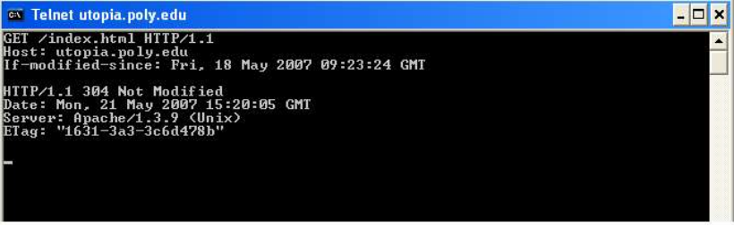

由于此Web服务器中的index.html页面自2007年5月18日(星期五)09：23：34格林尼治时间(GMT)以来未被修改，上述命令于2007年5月19日在沙特发布，服务器返回“304未修改”。注意，前4行是用户输入的GET消息行和头行，接下来的4行(从HTTP/1.1 304开始，未修改)是来自Web服务器的响应。

R15、几个流行的消息应用程序列表：WhatsApp、FacebookMessenger、微信和Snapchat。这些应用程序使用与SMS不同的协议。

R16、该消息首先通过HTTP从Alice的主机发送到她的邮件服务器。然后，Alice的邮件服务器通过SMTP向Bob的邮件服务器发送消息。然后Bob通过POP 3将消息从他的邮件服务器传输到他的主机。

R17、

|Action | Event|
|-------|------|
|Received: |from 65.54.246.203 (EHLO bay0-omc3-s3.bay0.hotmail.com) (65.54.246.203) by mta419.mail.mud.yahoo.com with SMTP; Sat, 19 May 2007 16:53:51 -0700 |
|Received: |from hotmail.com ([65.55.135.106]) by bay0-omc3-s3.bay0.hotmail.com with Microsoft SMTPSVC(6.0.3790.2668); Sat, 19 May 2007 16:52:42 - 0700 |
|Received:| from mail pickup service by hotmail.com with Microsoft SMTPSVC; Sat, 19 May 2007 16:52:41 -0700 |
|Message-ID: |<BAY130-F26D9E35BF59E0D18A819AFB9310@phx.gbl>|
|Received: |from 65.55.135.123 by by130fd.bay130.hotmail.msn.com with HTTP; Sat, 19 May 2007 23:52:36 GMT 
|From:| "prithula dhungel"| <prithuladhungel@hotmail.com> |
|To:| prithula@yahoo.com|
|Bcc:|| 
|Subject: |Test mail| 
|Date: |Sat, 19 May 2007 23:52:36 +0000| 
|Mime-Version:|1.0| 
|Content-Type: |Text/html; format=flowed |
|Return-Path:| prithuladhungel@hotmail.com|

图：接收到的邮件标题示例：

此标头字段指示SMTP服务器发送和接收邮件的顺序，包括相应的时间戳。

在本例中，有4个“接收：”标题行。这意味着邮件在发送到收件人的邮箱之前通过5个不同的SMTP服务器传递。最后(第四)“接收：”标头指示从发件人的SMTP服务器到服务器链中的第二个SMTP服务器的邮件消息流。发送方的SMTP服务器位于地址65.55.135.123，链中的第二个SMTP服务器为by130fd.bay130.hotmail.msn.com。

第三个“接收：”标头表示从链中的第二个SMTP服务器到第三个服务器的邮件消息流，依此类推。

最后，第一个“接收：”标头指示从第四个SMTP服务器到链中的最后一个SMTP服务器(即接收方的邮件服务器)的邮件消息流。

Message-id：邮件编号为BAY 130-F26D9E35BF59E0D18A819AFB9310@phx.gbl(由bay0-omc3-s3.bay0.hotmail.com提供)。Message-id是邮件系统首次创建消息时分配的唯一字符串。

出发地：这表示邮件发件人的电子邮件地址。在给定的示例中，发件人为“prithuladhungel@hotmail.com”，

该字段指示邮件接收方的电子邮件地址。在本例中，接收方为“prithula@yahoo.com”

主题：这将给出邮件的主题(如果发件人指定的话)。在此示例中，发件人指定的主题为“测试邮件”

日期：发件人发送邮件的日期和时间。在这个例子中，发件人于2007年5月19日(格林尼治时间23：52：36)发送了邮件。

MIME版本：用于邮件的MIME版本。在这个例子中，它是1.0。

内容类型：邮件正文中内容的类型。在这个例子中，它是“text/html”。

返回路径：如果该邮件的接收方希望回复发件人，则指定发送邮件的电子邮件地址。发件人的邮件服务器也使用它来返回邮件守护进程错误消息的不可交付邮件消息。在这个例子中，返回路径是“prithuladhungel@hotmail.com”。

R18、通过下载和删除，用户从POP服务器检索其消息后，消息将被删除。这给游牧用户带来了一个问题，他们可能希望从许多不同的机器(办公PC、家庭PC等)访问消息。在下载和保存配置中，在用户检索消息后不会删除消息。这也可能不方便，因为每次用户从新机器检索存储的消息时，所有未删除的消息都将传输到新机器(包括非常旧的消息)。

R19、是的，组织的邮件服务器和Web服务器可以具有与主机名相同的别名。MX记录用于将邮件服务器的主机名映射到其IP地址。

R20、您应该能够使用.edu电子邮件地址查看发送方的IP地址。但是，如果用户使用Gmail帐户，您将无法看到发件人的IP地址。

R21、鲍勃也没有必要为Alice提供块。Alice必须是Bob的前4位邻居，Bob才能向她发送块；即使Alice在30秒的间隔内向Bob提供块，也可能不会发生这种情况。

R22、回想一下，在BitTorrent中，一个对等点选择一个随机的对等点，并乐观地在短时间内解除该对等点的阻塞。因此，爱丽斯最终会被她的一个邻居放倒，在此期间，她会从邻居那里得到大块的食物。

R23、P2P文件共享系统中的覆盖网络由参与文件共享系统的节点和节点之间的逻辑链接组成。如果A和B之间有一个半永久的TCP连接，则从节点A到节点B有一个逻辑链路(图论术语中的“边缘”)。覆盖网络不包括路由器。

R24、一种服务器布局理念称为EntDep，它通过在全世界的Access ISP中部署服务器集群，深入到Internet服务提供商的接入网中。目标是减少延迟，提高终端用户和CDN服务器之间的吞吐量。另一种理念是将ISP带回家，在较小数量的站点上构建大型CDN服务器集群，并通常将这些服务器集群放置在IXP(Internet Exchange Point)中。这带来了居家设计典型的结果是较低的维护和管理成本，与进入深度的设计理念。

R25、除了与网络相关的因素之外，还有一些重要的因素需要考虑，例如负载平衡(客户端不应指向过载集群)、日变化、网络中DNS服务器之间的变化、很少访问视频的可用性有限以及需要缓解流行视频内容可能产生的热点。

参考文件：Torres，Ruben，等。“在Youtube CDN中剖析视频服务器的选择策略。”第31届IEEE国际会议。分布式计算系统(ICDCS)，2011年。

另一个需要考虑的因素是ISP交付成本--可以选择集群，以便使用特定的ISP来承载CDN到客户端的通信，同时考虑到ISP和集群运营商之间的契约关系中的不同成本结构。

R26、对于UDP服务器，没有欢迎套接字，来自不同客户端的所有数据都通过这个套接字进入服务器。对于TCP服务器，有一个欢迎套接字，每次客户端启动到服务器的连接时，都会创建一个新的套接字。因此，为了支持n个同时连接，服务器需要n个套接字。

R27、对于TCP应用程序，一旦客户端被执行，它就会尝试启动与服务器的TCP连接。如果TCP服务器没有运行，则客户端将无法建立连接。对于UDP应用程序，客户端在执行时不会立即启动连接(或尝试与UDP服务器通信)。

[Back to Index](#目录)

<div STYLE="page-break-after: always;"></div>

## 问题2

P1、

a) F 

b) T 

c) F 

d) F 

e) F 

P2、短消息服务(SMS)是一种允许移动电话之间通过蜂窝网络发送和接收短信的技术。一个SMS消息可以包含140个字节的数据，它支持国际语言。消息的最大大小可以是160个7位字符、140个8位字符或70个16位字符.SMS通过SS#7协议的移动应用部分(MAP)实现，短消息协议由3 GPP TS 23.040和3 GPP TS 23.041定义。此外，MMS(多媒体消息传递服务)扩展了原始文本消息的功能，并支持发送照片、更长的文本消息和其他内容。

iMessage是苹果公司开发的即时通讯服务。iMessage支持通过蜂窝数据网络或WiFi发送到IOS设备和Mac的文本、照片、音频或视频。苹果的iMessage基于专有的二进制协议APN(ApplePushNotificationService)。WhatsAppMessenger是一种即时通讯服务，支持iOS、Android、手机和黑莓等多种移动平台。WhatsApp用户可以通过蜂窝数据网络或WiFi相互发送无限的图像、文本、音频或视频。WhatsApp使用XMPP协议(可扩展消息传递和存在协议)。

iMessage和WhatsApp与SMS不同，因为它们使用数据计划发送消息，并且在TCP/IP网络上工作，而SMS使用我们从无线运营商购买的短信计划。此外，iMessage和WhatsApp支持发送照片、视频、文件等，而原始短信只能发送短信。最后，iMessage和WhatsApp可以通过WiFi工作，但SMS不能。

P3、应用层协议：DNS和HTTP传输层协议：UDP用于DNS；TCP用于HTTP

P4、

a)文档请求是http://gaia.cs.umass.edu/cs453/index.html.host：字段表示服务器的名称，/cs 453/index.html表示文件名。

b)浏览器正在运行HTTP1.1版本，就像第一对之前所指出的那样。

c)浏览器正在请求持久连接，如连接所示：保持-活动。

d)这是刁钻的问题。此信息不包含在任何地方的HTTP消息中。因此，仅看HTTP消息的交换就无法区分这一点。您需要从IP数据报(承载承载HTTPGET请求的TCP段)中获得信息来回答这个问题。

e)Mozilla/5.0。服务器需要浏览器类型信息将同一对象的不同版本发送到不同类型的浏览器。

P5、

a）状态代码200和短语ok表示服务器能够找到文档成功。答复于2008年3月7日星期二提供格林威治标准时间12:39:45。

b）上一次修改index.html文档是在2005年12月10日星期六18:27:46 格林尼治时间。

c）返回的文档中有3874个字节。

d）返回文件的前五个字节是：<！医生服务器同意持久连接，如connection:Keep Alive字段所示

P6、
a）在RFC 2616的第8节中讨论了持久连接（这一点的真正目的问题是让你检索并阅读一份RFC）第8.1.2和8.1.2.1节
rfc表示客户机或服务器可以向另一个表明它是将关闭永久连接。它通过包含连接令牌来实现“关闭”在http请求/回复的连接头字段中。

b）http不提供任何加密服务。

c)（来自rfc 2616）“使用持久连接的客户端应该限制同时维护到给定服务器的连接。单用户客户端与任何服务器或代理服务器的连接不应超过2个。”

d)是。(来自RFC 2616)“在服务器决定关闭”空闲“连接的同时，客户端可能已经开始发送新请求。从服务器的角度来看，连接是在空闲时关闭的，但从客户端的角度来看，请求正在进行中。“

P7、获取IP地址的总时间为$RTT_1+RTT_2+...+RTT_n$

一旦知道IP地址，$RTT_O$就会经过以建立TCP连接，而另一个$RTT_O$则会经过以请求和接收小对象。总响应时间为$2+RTT_O+RTT_1+RTT_2+...+RTT_n$

P8、

a)$RTT_1+RTT_2+...+RTT_n+2RTT_O+8*2RTT_O=18RTT_O+RTT_1+...+RTT_n$

b)$RTT_1+RTT_2+...+RTT_n+2RTT_O+2*2RTT_O=6RTT_O+RTT_1+...+RTT_n$

c)与流水线的持久连接。这是HTTP的默认模式。$RTT_1+RTT_2+...+RTT_n+2RTT_O+RTT_O=3RTT_O+RTT_1+...+RTT_n$

持续连接，没有流水线，没有并行连接。$RTT_1+RTT_2+...+RTT_n+2RTT_O+8RTT_O=10RTT_O+RTT_1+...+RTT_n$

P9、

a)在链路或速率R上传输大小为L的对象的时间是L/R，平均时间是对象的平均大小除以R：

$\delta$= (850,000 bits)/(15,000,000 bits/sec) = .0567 sec 

链路上的流量强度由$\beta \delta$=(16个请求/秒)(0.567秒/请求)=0.907表示。因此，平均访问延迟为(0.567秒)/(1-0.907)≈0.6秒。因此，总的平均响应时间为0.6秒+3秒=3.6秒。

b)由于60%的请求在机构网络中得到满足，接入链路上的业务强度降低了60%。因此，平均访问延迟为(.0567秒)/[1-(4)(.907)]=.089秒。如果请求由缓存满足(发生概率为6)，则响应时间大约为零；如果缓存丢失，平均响应时间为0.089秒，3秒=3.089秒(40%的时间)。因此，平均响应时间为(6)(0秒)(4)(3.089秒)=1.24秒。因此，平均响应时间从3.6秒缩短到1.24秒。

P10、请注意，每个下载的对象都可以完全放入一个数据包中。让TP表示客户端和服务器之间的单向传播延迟。

首先考虑使用非持久连接的并行下载。并行下载将允许10个连接共享150位/秒带宽，每个带宽仅15个位/秒。因此，接收所有对象所需的总时间由下式给出：

（200/150TP200/150TP200/150TP100,000/150TP）(200/(150/10)TP200/(150/10)TP200/(150/10)TP100,000/(150/10)TP)=737778*TP（秒）

现在请考虑持久的HTTP连接。所需的总时间由下式给出：

（200/150TP200/150TP200/150TP100,000/150TP）10*（200/150TP100,000/150TP）=735124*TP（秒）

假设光速是300*106m/sec，然后TP=10/(300*106)=0.03微秒。TPTP因此与传输延迟相比是可忽略的。

因此，我们看到，持久性HTTP的速度并不显著（小于1%）并行下载的非持久性案例。

P11、

a)是的，因为Bob有更多的连接，他可以获得更大的链路带宽份额。

B)是的，Bob仍然需要执行并行下载；否则，他将获得比其他四个用户更少的带宽。

P12、

Server.py 

```
from socket import * 
serverPort=12000 
serverSocket=socket(AF_INET,SOCK_STREAM) 
serverSocket.bind(('',serverPort)) 
serverSocket.listen(1) 
connectionSocket, addr = serverSocket.accept() 
while 1: 
 sentence = connectionSocket.recv(1024) 
 print 'From Server:', sentence, '\n' 
serverSocket.close() 
```

P13、来自:inSMTP的邮件是从SMTP客户端发送的标识发件人的邮件将邮件消息发送到SMTP服务器。

发件人：在邮件消息本身不是SMTP邮件，而不是邮件正文中的一行。

P14、SMTP使用仅包含句点的行来标记邮件正文的结束。http使用“内容长度标题字段”来表示消息正文的长度。不，HTTP不能使用SMTP使用的方法，因为HTTP消息可以是二进制数据，而在SMTP中，消息主体必须是7位的ASCII格式。

P15、MTA代表邮件传输代理。主机将消息发送给MTA。然后，该消息遵循一系列MTA以到达接收者的邮件阅读器。我们看到这个垃圾邮件遵循一个MTA链。诚实的MTA应该报告它收到消息的位置。请注意，在此消息中，“asusus-4b96([58.88.21.177])”不报告它收到电子邮件的位置。由于我们假定只有发端人是不诚实的，所以“asusus-4b96([58.88.21.177])”必须是发起人。

P16、uidl缩写“唯一ID列表”。当POP3客户端发出uidl命令时,服务器用唯一的消息ID来响应于在该服务器中存在的所有消息,用户的邮箱。此命令对“下载并保持”是有用的。通过维护文件该列表列出了在较早的会话期间检索到的消息，客户端可以使用Urel用于确定服务器上的哪些消息已被看到的命令。

P17、

a) C: dele 1 

C: retr 2 

S: (blah blah … 

S: ………..blah) 

S: . 

C: dele 2 

C: quit 

S: +OK POP3 server signing off 

b) C: retr 2 

S: blah blah … 

S: ………..blah 

S: . 

C: quit 

S: +OK POP3 server signing off 

c) C: list 

S: 1 498 

S: 2 912 

S: . 

C: retr 1 

S: blah ….. 

S: ….blah 

S: . 

C: retr 2 

S: blah blah … 

S: ………..blah 

S: . 

C: quit 

S: +OK POP3 server signing off 

P18、

a)对于给定的域名输入(如ccn.com)、IP地址或网络管理员名称，whois数据库可用于定位相应的注册服务器、whois服务器、DNS服务器等。

b)NS4.YAHOO.COM，网址：www.Registry er.com；NS1.MSFT.NET，网址：ww.Registry er.com。

c) Local Domain: www.mindspring.com 

Web servers : www.mindspring.com 

207.69.189.21, 207.69.189.22, 

207.69.189.23, 207.69.189.24, 

207.69.189.25, 207.69.189.26, 207.69.189.27, 207.69.189.28 

Mail Servers : mx1.mindspring.com (207.69.189.217) 

mx2.mindspring.com (207.69.189.218) 

mx3.mindspring.com (207.69.189.219) 

mx4.mindspring.com (207.69.189.220) 

Name Servers: itchy.earthlink.net (207.69.188.196) 

scratchy.earthlink.net (207.69.188.197) 

www.yahoo.com 

Web Servers: www.yahoo.com (216.109.112.135, 66.94.234.13) 

Mail Servers: a.mx.mail.yahoo.com (209.191.118.103) 

b.mx.mail.yahoo.com (66.196.97.250) 

c.mx.mail.yahoo.com (68.142.237.182, 216.39.53.3) 

d.mx.mail.yahoo.com (216.39.53.2) 

e.mx.mail.yahoo.com (216.39.53.1)

f.mx.mail.yahoo.com (209.191.88.247, 68.142.202.247) 

g.mx.mail.yahoo.com (209.191.88.239, 206.190.53.191) 

Name Servers: ns1.yahoo.com (66.218.71.63) 

ns2.yahoo.com (68.142.255.16) 

ns3.yahoo.com (217.12.4.104) 

ns4.yahoo.com (68.142.196.63) 

ns5.yahoo.com (216.109.116.17) 

ns8.yahoo.com (202.165.104.22) 

ns9.yahoo.com (202.160.176.146) 

www.hotmail.com 

Web Servers: www.hotmail.com (64.4.33.7, 64.4.32.7) 

Mail Servers: mx1.hotmail.com (65.54.245.8, 65.54.244.8, 65.54.244.136) 

mx2.hotmail.com (65.54.244.40, 65.54.244.168, 65.54.245.40) 

mx3.hotmail.com (65.54.244.72, 65.54.244.200, 65.54.245.72) 

mx4.hotmail.com (65.54.244.232, 65.54.245.104, 65.54.244.104) 

Name Servers: ns1.msft.net (207.68.160.190) 

ns2.msft.net (65.54.240.126) 

ns3.msft.net (213.199.161.77) 

ns4.msft.net (207.46.66.126) 

ns5.msft.net (65.55.238.126) 

d)YahooWeb服务器有多个IP地址www.yahoo.com(216.109.112.135,66.94.234.13)e)职业技术大学的地址范围：128.230.0.0.0-128.230.255

f)攻击者可以使用whois数据库和nslookup工具来确定目标机构的IP地址范围、DNS服务器地址等。

g)通过分析攻击数据包的源地址，受害者可以使用whois获取攻击所来自的域的信息，并可能通知源域的管理员。

P19、
a) The following delegation chain is used for gaia.cs.umass.edu 

a.root-servers.net 

E.GTLD-SERVERS.NET 

ns1.umass.edu(authoritative) 

First command: 

dig +norecurse @a.root-servers.net any gaia.cs.umass.edu 

;; AUTHORITY SECTION: 

edu. 172800 IN NS E.GTLD-SERVERS.NET. 

edu. 172800 IN NS A.GTLD-SERVERS.NET. 

edu. 172800 IN NS G3.NSTLD.COM. 

edu. 172800 IN NS D.GTLD-SERVERS.NET. 

edu. 172800 IN NS H3.NSTLD.COM. 

edu. 172800 IN NS L3.NSTLD.COM. 

edu. 172800 IN NS M3.NSTLD.COM. 

edu. 172800 IN NS C.GTLD-SERVERS.NET. 

Among all returned edu DNS servers, we send a query to the first one. 

dig +norecurse @E.GTLD-SERVERS.NET any gaia.cs.umass.edu 

umass.edu. 172800 IN NS ns1.umass.edu.

umass.edu. 172800 IN NS ns2.umass.edu. 

umass.edu. 172800 IN NS ns3.umass.edu. 

Among all three returned authoritative DNS servers, we send a query to the first one.

dig +norecurse @ns1.umass.edu any gaia.cs.umass.edu 

gaia.cs.umass.edu. 21600 IN A 128.119.245.12 

b) The answer for google.com could be: 

a.root-servers.net 

E.GTLD-SERVERS.NET 

ns1.google.com(authoritative) 

P20、我们可以定期拍摄本地DNS服务器中DNS缓存的快照。该组织在DNS缓存中出现最频繁的Web服务器是最流行的服务器。这是因为如果更多的用户对Web服务器感兴趣，那么DNS请求就会对此感兴趣服务器更频繁地由用户发送。因此，该Web服务器将出现在DNS中缓存更频繁。

关于完整的测量研究，见： Craig E.Wills，Mikhail Mikhailov，郝尚 “通过主动查询DNS传递互联网应用的相对普及性” “缓存”，2003年10月27日至29日，IMC03，美国佛罗里达州迈阿密海滩。

P21、是的，我们可以在本地DNS服务器中使用DIG查询该网站。例如，“digCNN.com”将返回查找CNN.com的查询时间。如果CNN.com几秒钟前刚刚被访问，那么CNN.com的条目将缓存在本地DNS缓存中，因此查询时间为0毫秒。否则，查询时间很长。

P22、在计算客户端-服务器分发的最小分发时间时，我们使用以下公式：

$d_{cs}=max\{NF/u_s，F/d_{min}\}$。

同样地，在计算P2P分发的最小分发时间时，我们使用以下公式：

$D_{p2p}=max\{F/u_s，F/d_{min}，NF/(u_s+\sum_{i=1}^{N}u_i)\}$

其中F=15Gbit=15*1024Mbit 

u_s=30 Mbps 

$d_{min}=d_i$=2 Mbps，

其中300 Kbps=300/1024 Mbps。

Client Server 
N 
10 100 1000 
u 
300 Kbps 7680 51200 512000 
700 Kbps 7680 51200 512000 
2 Mbps 7680 51200 512000 

Peer to Peer 
N 
10 100 1000 
u 
300 Kbps 7680 25904 47559 
700 Kbps 7680 15616 21525 
2 Mbps 7680 7680 7680 

P23、

a)考虑一种分发方案，其中服务器以$u_s/N$的速率并行地向每个客户端发送文件，注意此速率低于客户端的每个下载速率，因为假设我们$u_s/N≤d_{min}$。因此，每个客户端也可以以$u_s/N$的速率接收，因为每个客户端以$u_s/N$的速率接收，每个客户端接收整个文件的时间是$F/(u_s/N)=NF/u_s$。由于所有客户端都在$NF/u_s$中接收文件，所以总的分发时间也是$NF/u_s$。

b)考虑一种分发方案，其中服务器并行地向每个客户端发送文件，速率为$d_{min}$。注意，聚合速率N $d_{min}$小于服务器的链接速率我们，因为假设我们$u_s/N≥d_{min}$。由于每个客户端以$d_{min}$的速率接收，每个客户端接收整个文件的时间是$F/d_{min}$。因为所有客户端都在这段时间内接收文件，所以整个分发时间也是$F/d_{min}$。

c)从2.6条我们知道

$D_{CS}>=max\{NF/u_s,F/d_{min}\}$

假设$u_s/N<=d_{min}$。那么我们可以从上面的等式得到

$D_{CS}>=NF/u_s$

但是我们从（a）可以得到$D_{CS}<=NF/u_s$。

那么可以得到$D_{CS}=F/d_{min} 当u_s/N>=d_{min}$

P24、

a)定义u=u1+u2+....+uN。假设$u_s<=(u_s+u)/N$

将文件划分为N个部分，第i部分具有大小$(u_i/u)F$。服务器传输第i部分对等i的速率$r_i=(u_i/u)u_s$。请注意，$r_1+r_2+...+r_N=u_s$，聚合服务器速率不超过服务器的链路速率。也具有每个对等I以速率$r_i$将其接收的比特转发到N-1个对等点中的每一个。最大对等I的转发速率是$(N-1)r_i$。我们有

$(N-1)r_i=(N-1)(u_su_i)/u<=u_i$

其中最后一个不等式来自上一个方程。因此，节点I的总转发速率小于它的链路速率UI。

在此分配方案中，对等点i以合计速率接收比特

$r_{i}+\sum_{j<>i}{r_j}=u_s$

因此，每个对等点接收$F/u_s$中的文件。

b)定义u=u1+u2+....+uN。假设$u_s>=(u_s+u)/N$

定义$r_i=u_i/(N-1)$

$r_{N+1}=(u_s-u/(N-1))/N$

在此分发方案中，文件被分成N+1个部分。服务器发送位从第i部分到第i个对等点(i＝1，....N)在速率$r_i$。每个对等i转发该比特以速率$r_i$到达其它N-1对等体中的每一个。此外，服务器发送位来自$(N+1)^{st}$部分以速率$r_{N+1}$到达N个对等端中的每一个。对等端不转发来自$(n+1)^{st}$部分。

服务器的聚合发送速率

$r_1+…+r_N+Nr_{N+1}=u/(N-1)+u_s–u/(N-1)=u_s$

因此，服务器的发送速率不超过其链路速率。第一对等点的总发送速率为$N-1)r_i=u_i$

因此，每个对等点的发送速率不超过其链路速率。在此分配方案中，对等点i以合计速率接收比特。

$r_i+r_{N+1}+\sum_{j<>i}{rj}=u/(N-1)+(u_s-u/(N-1))/N=(u_s+u)/N$

因此，每个对等端接收$NF/(u_s+u)$中的文件。

(为了简单起见，我们忽略了为i=1，...，n1。我们现在在这里提供了。假设$\delta=(u_s+u)/N$为分配时间。对于i=1，...,n,第i个文件部分是$F_i＝r_i \delta$比特。$(N+1)^{st}$文件部分是$F_{N+1}＝r_{N+1} \delta$(比特)。它是直接显示$F_1+...F_{N+1}=F.）

c)本部的解决办法与第17(C)条的解决办法相似。我们从2.6节中得知

$D_{p2p}>=max\{F/u_s，NF/(u_s+u)\}$

结合了a)和b)给出了预期的结果。

P25、在覆盖网络中存在N个节点。n(n-1)/2边。

P26、是的。只要有足够的对等人留在蜂群中，他的第一个索赔就可能是可能的。足够长的时间。Bob可以总是通过乐观的非阻塞来接收数据对等端。

他的第二次索赔也是真实的。他可以在每个主机上运行客户端，让每个客户端“免费乘坐，”并将收集的chunks从不同的主机合并为单个文件。他甚至可以编写一个小的调度程序，使不同的主机请求不同的chunks文件。这实际上是P2P网络中的一种Sybil攻击。

P27、

a)n文件，假设我们通过将视频版本与音频版本按质量和速率的顺序配对来进行一对一的匹配。

b)2N个文件。

P28、

a)如果首先运行TCPClient，则客户端将尝试与TCP连接不存在的服务器进程。将不进行TCP连接。

b)UDPClient不与服务器建立TCP连接。因此，一切如果第一次运行udpClient，则应正常工作，然后运行udpServer，然后键入一些输入键盘。

c)如果使用不同的端口号，则客户端将尝试建立TCP连接错误的进程或不存在的进程。会出现错误。

P29、在原始程序中，UDPClient在创建端口时未指定端口号插座。在这种情况下，代码允许底层操作系统选择端口号。使用附加行，在执行UDPClient时，使用端口创建UDP套接字5432号。

UDPServer需要知道客户端端口号，以便它可以将数据包发回给正确的客户端套接字。查看UDPServer，我们看到客户端端口号不“硬连线”进入服务器代码；相反，UDPServer确定客户端端口号通过解开从客户端接收的数据报。因此，UDP服务器将与任何客户端端口号，包括5432。因此,UDPServer不需要已修改。

前：

客户端套接字=X（由OS选择）

服务器套接字=9876

在以下情况下：

客户端套接字=5432

P30、是的，您可以配置许多浏览器来打开到网站的多个同时连接。优点是您可以更快地下载该文件。缺点是您可能占用了带宽，从而大大减缓了共享相同物理链接的其他用户的下载速度。

P31、对于远程登录(telnet和ssh)之类的应用程序，面向字节流的协议是非常自然的，因为应用程序中没有消息边界的概念。当用户键入一个字符时，我们只需将该字符放到TCP连接中即可。在其他应用程序中，我们可能会发送一系列在它们之间具有固有边界的消息。例如，当一个SMTP邮件服务器向另一个SMTP邮件服务器连续发送多个电子邮件时。由于TCP没有指示边界的机制，所以应用程序必须自己添加指示，以便应用程序的接收方能够区分一条消息和另一条消息。如果将每条消息放入一个不同的udp段中，则接收端将能够在没有任何指示的情况下，区分各种讯息、申请。

P32、要创建Web服务器，我们需要在主机上运行Web服务器软件。许多供应商出售Web服务器软件。然而，当今最流行的Web服务器软件是Apache，它是开放的源并且是自由的。多年来，它一直受到开源社区的高度优化。

[Back to Index](#目录)

<div STYLE="page-break-after: always;"></div>

# 第三章

## 复习题3

R1、

a)将此协议称为简单传输协议(STP)。在发送方，STP从发送进程接受不超过1196字节的数据块、目标主机地址和目标端口号。STP在每个块中添加一个4字节的头，并将目标进程的端口号放在这个标头中。然后，STP将目标主机地址和结果段提供给网络层。网络层将段传送到目标主机上的STP。STP然后检查段中的端口号，从段中提取数据，并将数据传递给由端口号标识的进程。

b)段现在有两个头字段：源端口字段和目标端口字段。在发送方，STP接受不超过1192字节的数据块、目标主机地址、源端口号和目标端口号。STP创建一个段，其中包含应用程序数据、源端口号和目标端口号。然后，它将段和目标主机地址提供给网络层。在接收到段后，接收主机上的STP给出应用程序的应用程序数据和源端口号。

c)不，传输层不需要在核心中做任何事情；传输层“生命”在最终系统中。

R2、

a)在寄信时，家庭成员必须将信件本身、目的地住所的地址和收件人的姓名交给代表。委托将收件人的姓名清楚地写在信函的顶部。然后，委托将信放入信封中，并在信封上写入目标住宅的地址。然后，代表将这封信交给地球的邮件服务部门。在接收方，委托收到来自邮件服务的信函，从信封中取出信件，并记下在信件顶部写的收件人姓名。然后，代表将这封信交给具有此名称的家庭成员。

b).不，邮件服务部门不必打开信封；它只检查信封上的地址。

R3、源端口号y和目标端口号x。

R4、应用程序开发人员可能不希望其应用程序使用TCP的拥塞控制，这会在拥塞时限制应用程序的发送速率。通常，IP电话和IP视频会议应用程序的设计者选择在UDP上运行他们的应用程序，因为他们希望避免TCP的拥塞控制。另外，有些应用程序不需要TCP提供的可靠数据传输。

R5、由于大多数防火墙都被配置为阻止UDP通信，因此使用TCP进行视频和语音通信可以让通信通过防火墙。

R6、是的。应用程序开发人员可以将可靠的数据传输放到应用层中协议。然而，这需要大量的工作和调试。

R7、是的，两个段将指向同一个套接字。对于每个接收到的段，在套接字接口上，操作系统将为进程提供IP地址，以确定各个段的来源。

R8、对于每个持久连接，Web服务器创建一个单独的“”连接插座“”。每个连接套接字被标识为具有四个元组:(源IP地址,源端口号、目标IP地址、目标端口号）。当主机C接收和IP数据报，它检查数据报/段中的这四个字段确定哪个套接字应该通过TCP段的有效负载。因此,来自A和B的请求通过不同的套接字。这两个参数的标识符用于目标端口的套接字具有80；但是，这些套接字的标识符源IP地址的不同值。与UDP不同，传输层通过时TCP段对应用程序进程的有效负载，它不指定源IP地址，因为这是由套接字标识符隐式指定的。

R9、接收机需要序列号来确定到达的数据包是包含新数据还是是重传。

R10、处理通道中的损失。如果在该分组的计时器持续时间内未接收到发送分组的ACK，则假定该分组(或其ACK或NACK)已丢失。因此，分组被重传。

R11、在RDT 3.0协议中仍然需要计时器。如果知道往返时间，那么唯一的优势是，发送方肯定知道数据包或数据包的ACK(或Nack)已经丢失，而实际情况是，在计时器过期后，ACK(或Nack)可能仍在发送方的途中。然而，要检测丢失，对于每个包，一个持续时间不变的定时器仍然需要在发送者。

R12、

a)丢包造成一段时间后，所有五个包都被重传。

b)由于Go-Back-N使用累积数据，ACK的丢失没有触发任何重传承认。

c)发送方无法发送第六个分组，因为发送窗口大小固定为5。

R13、

a)当分组丢失时，接收的4个分组被缓冲接收器。完成后超时，发送方重新发送丢失的数据包，接收方传送缓冲的数据包数据包以正确的顺序应用。

b)接收器为丢失的ACK发送了重复ACK。

c)发送窗口大小固定为5时，发送方无法发送第六数据包当分组丢失时，返回-N重传所有的分组，而选择性地重传所有的分组。仅重发丢失的数据包。在丢失确认的情况下，选择性重复发送重复ACK，并作为返回-N使用的累积确认，不需要重复ACK。

R14、

a)假

b)假

c)真

d)假

e)真

f)假

g)假

R15、

a) 20 bytes 

b) ack number = 90 

R16、3段。第一段：SEQ=43，ack=80；第二段：SEQ=80，ack=44；第三段；seq=44，ack=81

R17、R/2 

R18、false，它设置为拥塞窗口的当前值的一半。

R19、让X=RTTTFE，Y=RTTTBE和ST=搜索时间。考虑以下时序图。

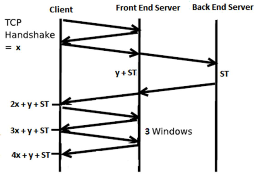

客户端和服务器(后端)之间使用代理(前端)之间的TCP数据包交换图。

从这个图中我们可以看到，总时间是4XYST=4*RTTFE RTTBE搜索时间。

[Back to Index](#目录)

<div STYLE="page-break-after: always;"></div>

## 问题3 

R1、

||source port numbers | destination port numbers | 
|---|---|---|
|a) A→S| 467 |23 |
|b) B→S |513 |23 |
|c) S→A |23 |467 |
|d) S→B |23| 513 |

e) Yes. 

f) No. 

P2、假设主机A、B和C的IP地址分别为a、b、c。（请注意，a，b， c各不相同）。

主机A：源端口=80，源IP地址=b，DEST端口=26145，DESTIP地址=a 

到主机C，左进程：源端口=80，源IP地址=b，DEST端口=7532，DESTIP 地址=c 

到主机C，右进程：源端口=80，源IP地址=b，DEST端口=26145，DEST IP地址=c。

P3、注意，如果溢出，请绕一圈。
```
   1 0 1 1 1 0 0 1
 + 0 1 1 0 0 1 1 0
------------------
   0 1 0 1 0 0 1 1


   0 1 1 1 0 1 0 0
 + 1 0 1 1 1 0 0 1
 -----------------
   0 0 1 0 1 1 1 0
```
补码为： 1 1 0 1 0 0 0 1

为了检测错误，接收方添加四个单词(三个原始单词和校验和)。如果和包含一个零，接收器知道有一个错误。所有的一位错误都会被检测到，但是两位错误可以不被检测到(例如，如果第一个单词的最后一个数字被转换为0，第二个单词的最后一个数字被转换为1)。

P4、

a)将这两个字节相加得到11000001。取一个人的补给量就等于00111110。

b)把这两个字节相加，等于01000000；补码等于10111111。

c)第一个字节=01010100；第二个字节=01101101。

P5、不，接收方不能完全确定没有发生任何位错误。这是因为计算数据包的校验和的方式。如果包中两个16位字的对应位(相加在一起)是0和1，那么即使这些位分别翻转到1和0，和仍然保持不变。因此，接收方计算的1s补码也将是相同的。这意味着，即使存在传输错误，校验和也将进行验证。

P6、假设发送方处于“从上面等待呼叫1”状态，而接收方(作业问题中显示的接收方)处于“从下面等待1”状态。发送方发送一个序列号为1的数据包，并转换为“等待ACK或NAK 1”，等待ACK或NAK。现在假设接收方正确地接收序列号为1的数据包，发送一个ACK，然后转换为状态“从下面等待0”，等待序列号为0的数据包。但是，ACK已损坏。当rdt2.1发送方获得损坏的ACK时，它用序列号1重新发送数据包。然而，接收方正在等待序列号为0的数据包，并且(如家务问题所示)总是在没有得到序列号为0的数据包时发送NAK。因此，发送方将始终发送一个序列号为1的数据包，而接收方将始终锁定该数据包。也不会从那个州前进。

P7、要想最好地回答这个问题，首先考虑一下为什么我们需要序列号。我们看到发送方需要序列号，以便接收方能够判断数据包是否是已经接收到的数据包的副本。在ACK的情况下，发送方不需要这个信息(即ACK上的序列号)来判断是否检测到重复的ACK。对于rdt3.0接收器来说，一个重复的ACK是显而易见的，因为当它接收到原始ACK时，它会转换到下一个状态。重复的ACK不是发送方需要的ACK，因此被rdt3.0发送方忽略。

P8、协议rdt3.0的发送方与协议2.2的发送方不同，因为已经添加了超时。我们已经看到，超时的引入增加了在发送方到接收方数据流中重复数据包的可能性。然而，协议rdt.2.2中的接收方已经可以处理重复的数据包。(如果接收方发送丢失的ACK，然后发送方重新传输旧数据，则RDT 2.2中的接收方重复出现)。因此，协议rdt2.2中的接收器也将作为协议rdt3.0中的接收器工作。

P9、假设协议已经运行了一段时间。发送方处于“从上等待呼叫”状态(左上角)，接收方处于“从下等待0”的状态。图1显示了损坏的数据和损坏的ACK的场景。

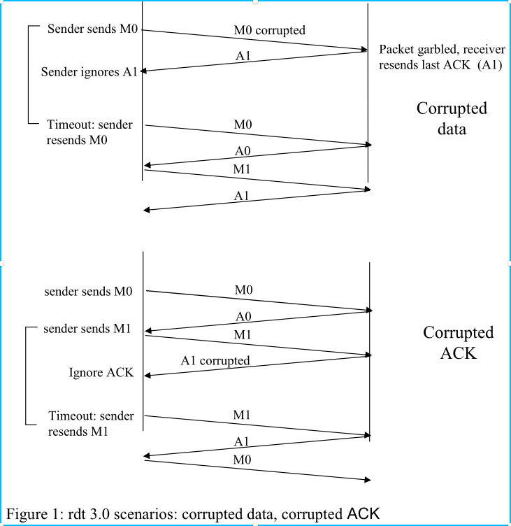

P10、在这里，我们添加一个计时器，它的值大于已知的往返传播延迟.我们将超时事件添加到“等待ACK或NAK 0”和“等待ACK或NAK 1”状态。如果发生超时事件，则重新发送最近发送的数据包。让我们看看为什么这个协议仍将与rdt2.1接收器一起工作。
- 假设超时是由丢失的数据包引起的，即发送方到接收方通道上的数据包。在这种情况下，接收机从未接收到先前的传输，并且从接收机的角度来看，如果接收到超时重传，它看起来与接收到的原始传输完全相同。
- 假设现在一个ACK丢失了。接收器最终会在超时时重新发送数据包。但是，重传与ACK被混淆时的动作完全相同。因此，发送者的反应与损失是一样的，就像混乱的ACK一样。RDT 2.1接收器已经可以处理混淆的ACK的情况。

P11、如果删除了该消息的发送,发送和接收侧将死锁，等待永远不会发生的事件。以下是一种场景：
- sender发送pKT0，输入“等待Ack0状态”，等待数据包返回来自接收机
- 接收器处于“从下面等待0”状态，接收到损坏的数据包来自发送方。假设它不发送任何信息，只需重新输入“等待0”处于“下”状态。

现在,ender正在等待来自接收机的某种类型的ACK,并且接收机等待数据包形成发送方-死锁！

P12、该协议仍在工作，因为如果重新传输将是如果接收到错误的分组实际上已经丢失(并且从接收机的观点来看，它从不知道这些事件中的哪一个发生（如果有的话）。

为了解决这个问题背后的更微妙的问题，一个必须允许过早的发生超时。在这种情况下，如果分组的每个额外副本被确认并且每个副本接收的额外ACK导致要发送的当前分组的另一个额外拷贝，发送分组N的次数将随着N接近无穷大而不受限制地增加。

P13、

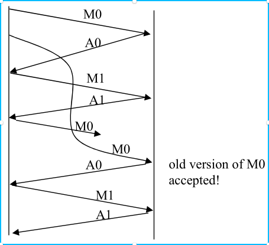

P14、在仅NAK协议中，只有当接收到分组x1时，接收方才检测丢包x。也就是说，接收器接收x-1，然后x-1，只有当接收到x 1时，接收器才会意识到x被忽略了。如果x的传输和x1的传输之间存在很长的延迟，那么在只使用NAK协议下，需要很长时间才能恢复x。

另一方面，如果数据经常被发送，那么以NAK为唯一方案的恢复可能会很快发生。此外，如果错误很少发生，那么Naks只是偶尔被发送(当需要时)，并且ACK永远不会被发送--NAK中的反馈大大减少--仅在ACK的情况下才发送。

P15、发送数据包需要12微秒(或0.012毫秒)，作为1500*8/109=12微秒。为了使发送者在98%的时间里忙碌，我们必须使用util=0.98=(0.012n)/30.012或n大约2451个数据包。

P16、是。这实际上会导致发送方向通道发送大量流水线数据。

是。这里有一个潜在的问题。如果数据段丢失在通道中，那么RDT 3.0的发送方将不会重新发送这些段，除非应用程序中有一些从丢失中恢复的额外机制。

P17、

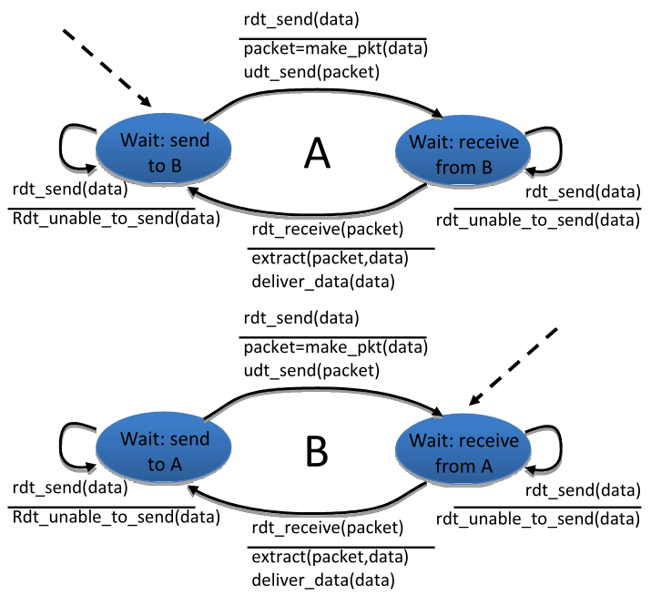

P18、在我们的解决方案中，发送方将等待接收到一对消息(seqnum和seqnum 1)的ACK，然后再转到下一对消息。数据包有一个数据字段，并携带两位序列号.也就是说，有效序列号为0、1、2和3。(注意：您应该考虑为什么1位序列号空间0，1在下面的解决方案中不能工作。)ACK消息携带他们正在确认的数据包的序列号。

发送方和接收方的FSM如图2所示。请注意，发送方状态记录：(I)当前对未收到ACK，(Ii)接收到用于seqnum(仅)的ACK，或接收到用于seqnum 1的ACK(仅)。在这个图中，我们假设seqnum最初为0，并且发送者已经发送了第一个两个数据消息（获取要进行的事情）。发送方和接收方的时间线跟踪从丢失的数据包中恢复如下所示：

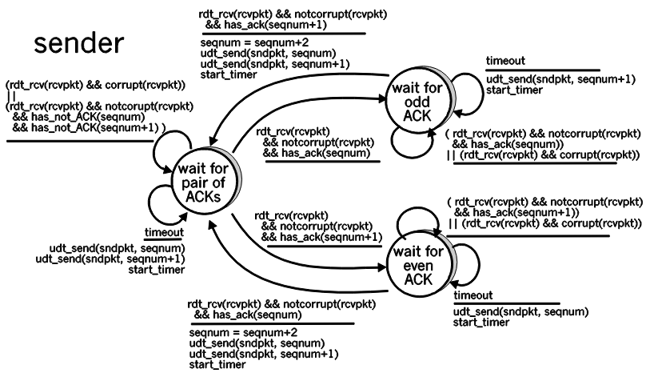

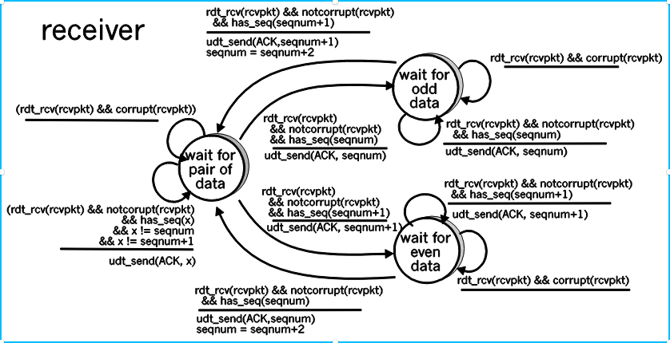

图2：问题的发送方和接收方(3.18)

|Sender |Receiver| 
|---|---|
|make pair (0,1) ||
|send packet 0 ||
|Packet 0 drops ||
|send packet 1 ||
||receive packet 1 |
||buffer packet 1 |
||send ACK 1 |
|receive ACK 1 ||
|(timeout) ||
|resend packet 0 ||
||receive packet 0 |
||deliver pair (0,1) |
||send ACK 0 |
|receive ACK 0||

P19、这个问题是简单停止和等待协议(rdt3.0)上的一个变化。由于信道可能丢失消息，并且由于发送方可能重新发送其中一个接收方已经接收到的消息(要么由于过早超时，要么由于另一个接收方尚未正确接收数据)，因此需要序列号。在rdt3.0中，0位序列号在这里就足够了。

发送方和接收方FSM如图3所示。在此问题中，发送方状态指示发送方是否从B(仅)、从C(仅)或从非C或B接收到ACK。接收方状态指示接收方正在等待哪个序列号。

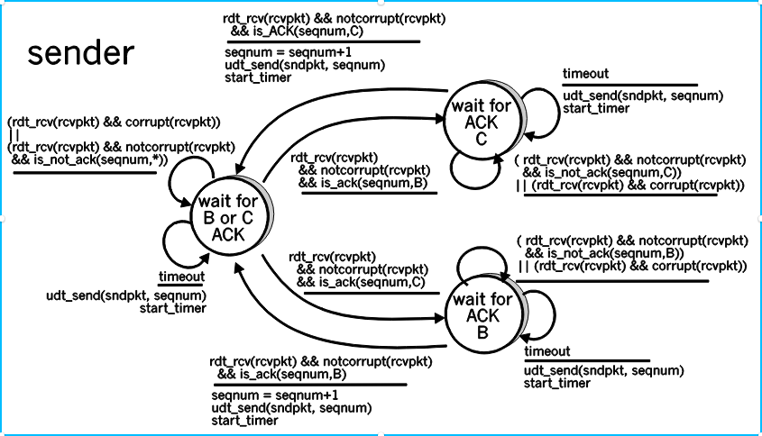

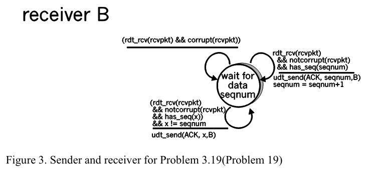

P20、

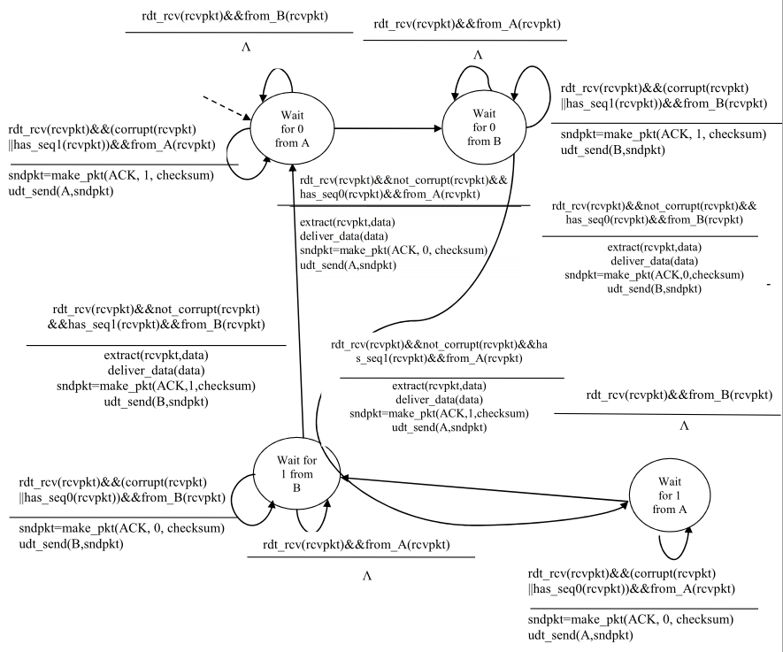

图4：3.18的接收端FSM

发送方FSM完全相同，如图3.15中的文本所示

P21、由于A-to-B信道可能丢失请求消息,A将需要超时,并且重新发送其请求消息（能够从丢失中恢复）。因为信道延迟是可变的且unknown,可能A将发送重复的请求(即,重新发送已经被b)接收到的请求消息。为了能够检测重复请求消息，协议将使用序列号。1位序列数量将足以用于停止和等待类型的请求/响应协议。A（请求者）有4个状态：

- “从上面等待请求0。”在这里，请求者正在等待一个呼叫以请求数据单元。当接收到上述请求时，它发送一个请求消息R0，到B，启动计时器，并向“等待”过渡D0”状态。当在“等待来自以上“状态”的请求0，A忽略从B收到的任何东西。
- “等D0”在这里，请求者正在等待来自B的D0数据消息。定时器总是在这种状态下运行。如果计时器过期，A将发送另一条R0消息，重新启动定时器并保持此状态。如果从B接收到D0消息，A将停止时间并传输到“从上面等待请求1”状态。如果A在此状态下接收D1数据消息，则忽略它。
- “等待上面的请求1。”在这里，请求者再次等待来自上面的呼叫来请求一个数据单元。当它从上面接收到一个请求时，它向B发送一个请求消息R1，启动一个定时器并转换到“等待D1”状态。当处于“等待上述请求1”状态时，A会忽略从B接收的任何内容。
- “等待D1”。在这里，请求者正在等待来自B的d1数据消息。定时器总是在这种状态下运行。如果计时器过期，A将发送另一条R1消息，重新启动定时器并保持此状态。如果从B接收到D1消息，A将停止定时器并传输到“从上面等待请求0”状态。如果A在此状态下接收到D0数据消息，则忽略它。

数据供应商(B)仅有两种状态:
- 在此状态下的“发送D0。”，B继续响应收到的R0消息。发送D0，然后保持在该状态。如果B收到R1消息，则它知道其D0消息已正确接收。因此它丢弃该D0数据（由于它已在另一侧收到），然后过渡到“发送D1”状态，其中它将使用d1来发送下一个请求的数据块。
- “发送D1”在这种状态下，B继续通过发送D1来响应接收到的R1消息，然后保持这种状态。如果B接收到R1消息，则它知道其D1消息已被正确接收，从而传输到“发送D1”状态。

P22、

a)这里我们的窗口大小为n=3。假设接收机接收到分组k-1,并且已经将该分组和所有其它之前的分组进行了分组。如果所有这些ACK都已被由发送方接收，则发送方的窗口为[k,kn-1]。假设下一个没有在发送方接收到ACK。在第二种情况下,发送方S窗口包含k-1和n个分组，并包括k-1。因此,发送者的窗口是这样的,[K-N,K-1]。通过这些参数，“发件人”窗口的大小为3，并开始在范围[K-N,K]的某处。

b)如果接收机正在等待分组k，则它已经接收(和被处理)分组k-1和N-1个分组。如果尚未收到这些N个ACK中的任何一个，发送方，然后可以传播具有[k-n,k-1]值的ACK消息由于发送方发送了数据包[k-n,k-1],所以必须是这样的情况:发送方已经接收到用于k-n-1的ACK。一旦接收机发送了ACK,对于k-n-1，它将永远不会发送小于k-n-1的ACK。因此，飞行中的ACK值的范围可以从k-n-1到k-1。

P23、为了避免图3.27中的场景，我们希望避免接收方窗口的前缘(即具有“最高”序列号的窗口)在序列号空间中环绕，并与后面的边缘(发送方窗口中具有“最低”序列号的窗口)重叠。也就是说，序列号空间必须足够大，以适应整个接收方窗口和整个发送方窗口，而不存在这种重叠条件。因此-我们需要确定接收方和发送方窗口在任何给定时间都可以覆盖多大的序列号。

假设接收者等待的最低序列号是包m，在这种情况下，它的窗口是[m，mw-1]，它已经接收到(并加进)包m-1和之前的w-1包，其中w是窗口的大小。如果发送方尚未接收到这些wACK中的任何一个，则值为[m-w，m-1]的ACK消息可能仍在传播。如果发送方没有收到带有这些ACK号的ACK，那么发送方的窗口将是[mw，m-1]。

因此，发送方窗口的下边缘为m-w，接收者窗口的前缘为mw-1。为了使接收方窗口的前缘不与发送方窗口的后缘重叠，序列号空间必须因此，足够大以容纳2w序列号。也就是说，序列号空间必须至少是窗口大小k2w的两倍。

P24、

a)真。假设发送方具有3的窗口大小并且在T0发送分组1、2、3。在T1(T1/T0)接收机ACK1、2、3。在t2(t2，t1)发送方超时，并且重新连接1、2、3。在t3,接收机接收重复并重新确认1、2,3、在T4，发送方接收到在T1发送的接收机并使其前进的ACK。窗口至4、5、6。在t5，发送方接收在T2发送的接收机的ACK1、2、3。这些棚屋在窗户外面。

b)真。实质上与(a)中相同的情形。

c)真。

d)真。请注意，具有1、SR、GBN和交替位协议的窗口大小功能等同。窗口大小1排除了无序分组的可能性(在窗口内)。累积ACK仅仅是普通ACK,这种情况，因为它只能指窗口内的单个分组。

P25、

a)考虑在传输协议上发送应用消息。使用TCP，应用程序将数据写入连接发送缓冲区，TCP将抓取字节必须在TCP段中放置一个消息；TCP可能会或多或少地发送消息而不是在段中的单个消息。另一方面，UDP封装在无论应用程序给出什么，都会分段；因此，如果应用程序提供UDP应用消息，此消息将是UDP段的有效负载。因此,对于UDP，应用程序对数据段中的数据进行了更多控制。

b)由于流量控制和拥塞控制，TCP由于流量控制和拥塞控制，可能会有显著的延迟从应用程序向其发送缓冲器写入数据直到数据被指定给网络层。UDP由于流控制而没有延迟,拥塞控制。

P26、共有$2^{32}= 4294967296$个可能的序列。

a)序列号不随每个段增加一个。相反，它会增加发送的数据字节数。因此，MSS的大小是无关的--从A到B发送的最大大小文件就是可以表示为$2^{32}≈4.19$GBytes的字节数。

(B)分段数为$\left [ \frac{2^{32}}{536} \right ]=8012999$.66字节的标头添加到每个段中，总共生成528857934字节的标头。传输的字节总数为$2^{32}+528857934=4.824\times10^9$字节。因此，在155~Mbps链路上传输文件需要249秒。

P27、

a)在从主机A到B的第二段中，序列号为207，源端口号为302，目的端口号为80。

b)如果所述第一段在所述第二到达段之前到达，则在所述第一到达段的确认中，所述确认号为207，所述源端口号为80，所述目的端口号为302。

c)如果第二段到达第一段之前，在第一个到达段的确认中，确认号为127，表示它仍在等待字节127和以后。d）

d)

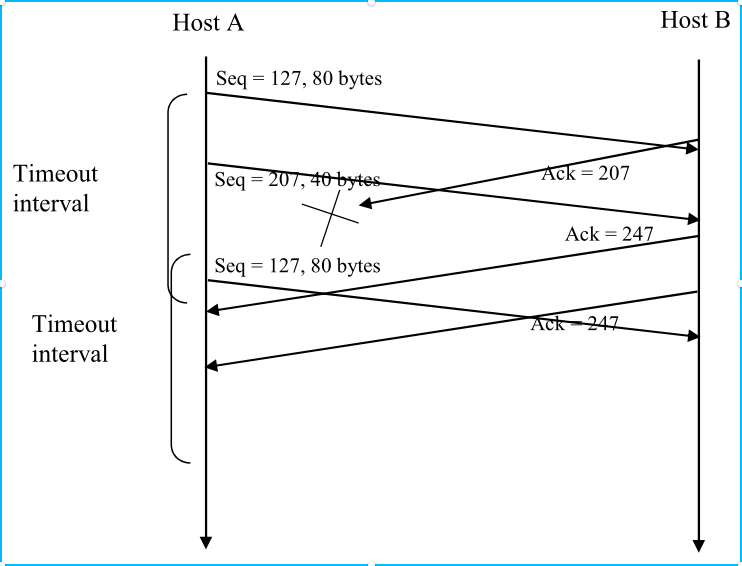

P28、由于链路容量只有100 Mbps，所以主机A的发送速率最多可达100 Mbps。不过，主机A向接收缓冲区发送数据的速度比主机B从缓冲区中删除数据的速度要快。接收缓冲区的填充速率约为40 Mbps。当缓冲区已满时，主机B通过设置RcvWindow=0向主机A发送停止发送数据的信号。然后主机A停止发送，直到接收到RcvWindow>0的TCP段为止。主机A将作为RcvWindow值的函数反复停止并开始发送从主机B接收。平均而言，主机A向主机发送数据的长期速率b作为此连接的一部分，不超过60Mbps。

P29、

a)服务器使用特定的初始序列号(从源和目的地IP和端口的散列中获取)来抵御SYN洪水攻击。

b)不，攻击者不能通过向目标发送和ACK数据包来创建半开放或完全打开的连接。半开连接是不可能的，因为在建立完整连接之前，使用SYNcookie的服务器不会维护任何连接的连接变量和缓冲区。为了建立完全开放的连接，攻击者应该从攻击者那里知道与(伪造的)源IP地址对应的特定初始序列号。这个序列号需要每个服务器使用的“秘密”编号。由于攻击者不知道这个秘密号码，她无法猜测初始序列号。

c)不，服务器可以简单地在计算这些初始序列号时加上时间戳，并为这些序列号选择一个存活值，即使攻击者重播，也可以丢弃过期的初始序列号。

P30、

a)如果超时值是固定的，则发送方可能会过早超时。因此，一些包即使没有丢失也被重新传输.

b)如果估计超时值(就像TCP所做的那样)，那么增加缓冲区大小肯定有助于提高该路由器的吞吐量。但可能有一个潜在的问题。排队延迟可能非常大，类似于场景1中所示。

P31、

DevRTT = (1- beta) * DevRTT + beta * | SampleRTT - EstimatedRTT | 
EstimatedRTT = (1-alpha) * EstimatedRTT + alpha * SampleRTT 
TimeoutInterval = EstimatedRTT + 4 * DevRTT 
After obtaining first SampleRTT 106ms: 
DevRTT = 0.75*5 + 0.25 * | 106 - 100 | = 5.25ms 
EstimatedRTT = 0.875 * 100 + 0.125 * 106 = 100.75 ms 
TimeoutInterval = 100.75+4*5.25 = 121.75 ms 
After obtaining 120ms: 
DevRTT = 0.75*5.25 + 0.25 * | 120 – 100.75 | = 8.75 ms 
EstimatedRTT = 0.875 * 100.75 + 0.125 * 120 = 103.16 ms 

TimeoutInterval = 103.16+4*8.75 = 138.16 ms 
After obtaining 140ms: 
DevRTT = 0.75*8.75 + 0.25 * | 140 – 103.16 | = 15.77 ms 
EstimatedRTT = 0.875 * 103.16 + 0.125 * 140 = 107.76 ms 
TimeoutInterval = 107.76+4*15.77 = 170.84 ms 
After obtaining 90ms: 
DevRTT = 0.75*15.77 + 0.25 * | 90 – 107.76 | = 16.27 ms 
EstimatedRTT = 0.875 * 107.76 + 0.125 * 90 = 105.54 ms 
TimeoutInterval = 105.54+4*16.27 =170.62 ms 
After obtaining 115ms: 
DevRTT = 0.75*16.27 + 0.25 * | 115 – 105.54 | = 14.57 ms 
EstimatedRTT = 0.875 * 105.54 + 0.125 * 115 = 106.72 ms 
TimeoutInterval = 106.72+4*14.57 =165 ms 

P32、

a)$EstimatedRTT^{(n)}$表示第n个样本后估计的RTT值。

$EstimatedRTT^{(4)}=xSampleRTT_1+(1-x)[xSampleRTT_2+(1-x)[xSampleRTT_3+(1-x)SampleRTT_4]]=xSampleRTT_1+(1-x)xSampleRTT_2+(1-x)^2xSampleRTT_3+(1-x)^3xSampleRTT_4$

b)$EstimatedRTT^{(n)}=x\sum_{j=1}^{n-1}(1-x)^{j-1}SampleRTT_j+(1-x)^{n-1}SampleRTT_n$

c)$EstimatedRTT^{(\infty)}=\frac{x}{1-x}\sum_{j=1}^{n-1}(1-x)^{j}SampleRTT_j=\frac{1}{9}\sum_{j=1}^{\infty}\cdot9^jSampleRTT_j$

赋予过去样本的权重呈指数衰减。

P33、让我们来看看如果TCP为重新传输的段度量SampleRTT会发生什么错误。假设源发送数据包P1，P1的计时器过期，然后源发送P2，即同一数据包的新副本。此外，假设源度量P2(重发数据包)的SampleRTT。最后，假设在发送P2后不久，对P1的确认到达。源将错误地将此确认视为P2的确认，并计算不正确的SampleRTT值。

让我们看看如果TCP为重新传输的段度量SampleRTT，可能会发生什么错误。假设源发送数据包P1，P1的计时器过期，然后源发送P2，即同一数据包的新副本。此外，假设源度量P2(重发数据包)的SampleRTT。最后，假设在发送P2后不久，对P1的确认到达。源将错误地将此确认视为P2的确认，并计算不正确的SampleRTT值。

P34、在任何给定的时间t，sendBase-1是发送方知道的最后一个字节的序列号，发送方知道该字节已在接收方正确地、有序地接收到。如果管道中有确认，则接收方在时间t处实际接收的最后一个字节(正确和有序)可能更大。因此

SendBase-1<=LastByteRcvd

P35、当在时间t,发送者接收具有值y的确认时,发送者知道确保接收器接收到所有通过Y-1的所有信息。实际最后一个字节如果是，则在时间t处的接收器处接收(正确地和有序地)可以是更大的。SendBase或在管道中是否有其他确认。因此,

Y-1<=LastByteVCD

P36、假设分组N、N1和N2被发送，并且分组N被接收和确认。如果分组N1和N2沿着端到端路径(即，在顺序N2，N1)，则分组N_2的接收将为N生成重复ACK，并且在仅等待第二重复ACK的策略下触发重传用于重传。通过等待三重重复ACK，必须是两个假设分组N、N1和N2被发送的情况，并且分组N被接收和确认。如果分组N1和N2沿着端到端路径(即，在顺序N2，N1)，则分组N_2的接收将为N生成重复ACK，并且在仅等待第二重复ACK的策略下触发重传用于重传。通过等待三重重复ACK，必须在正确接收到分组N之后的TWT的情况，而没有接收到N1。设计者三重重复ACK方案可能认为等待两个数据包（而非等待1个数据包）是在需要时触发快速重传之间的正确权衡，但不在分组重新排序的情况下提前重传。

P37、

a)GOBACKN：A总共发送9个段。它们最初被发送段1、2、3、4、5和随后重新发送段2、3、4和5。B发送8个ACK。它们是4个带有序号1和4个ACK的ACK序列号2、3、4和5。选择性重复：A总共发送6个段。它们最初被发送段1、2、3、4、5和随后重新发送段2。B派5个ACK。它们是序列号1、3、4、5的4个ACK。有一个人序列号为2的ACK。TCP:A总共发送6个段。它们最初被发送段1、2、3、4、5和随后重新发送段2。B派5个ACK。它们是具有序列号2的4个ACK。有一个ACK序列号6。请注意，TCP始终发送带有预期序列的ACK编号。

b)TCP。这是因为TCP使用快速重传而不等待，直到超时。

P38、如果到达率超过图3.46(b)中的R/2，则到达的总到达速率队列超过队列的容量，导致由于到达速率而导致的损失增加增加。当到达速率等于R/2时，每3个分组中的1个离开。队列是重传。随着损失的增加，甚至更大的分组部分离开队列将是重传。假定最大偏离率其中一个会话的队列是R/2,并且假定第三或更多个会话将随着到达速率的增加而传输,成功递送数据的吞吐量可以不会增加到外面。在类似的推理之后，如果有一半的数据包离开了队列是重传,每个会话的输出分组的最大速率是R/2,则其最大值为(R/2)/2或R/4。

P40、

a)TCPSlowStart以[1,6]和[23,26]的间隔运行

b)TCP拥塞避免以间隔[6,16]和[17,22]运行

c)第16次传输循环后，数据包丢失由三重复制识别ACK。如果超时，则拥塞窗口大小将下降到1。

d)第22次传输循环后，由于超时而检测到段丢失，因此，拥塞窗口大小设置为1。

e)阈值最初是32，因为它处于慢启动停止的窗口大小，并且拥塞避免开始。

f)当分组丢失时阈值被设置为拥塞窗口的值的一半。已检测到。当在传输循环16期间检测到丢失时，拥塞Windows的大小为42。因此在第18传输循环期间阈值为21。

g)当分组丢失时阈值被设置为拥塞窗口的值的一半。已检测到。当在传输循环22期间检测到丢失时，拥塞Windows的大小为29。因此，阈值为14（取下下限为14.5）。24号传动轮。

h)在第1次传输循环期间，数据包1被发送；数据包2-3在第2次发送中发送传输循环；数据包4-7在第3传输循环中发送；数据包8-15在第4个传输回合中发送；数据包16-31在第5个传输中发送数据包32-63在第6个传输回合中发送；数据包64-96被发送在第7次传输循环中。因此，在第7发送循环中发送分组70。

i)阈值将设置为拥塞窗口(8)的当前值的一半。出现丢失和拥塞窗口将设置为新的阈值3MSS。因此，阈值和窗口的新值分别为4和7。

j)阈值为21，拥塞窗口大小为1。

k)圆形17，1个分组；圆形18，2个分组；圆形19，4个分组；圆形20，8个分组；第21轮，16个分组；第22轮，21个分组。因此，总数是52。

P41、参见图5。在图5(a)中，线性减小与损耗之间的比率连接1和连接2与线性增加的比率相同：单位。在这种情况下情况下，吞吐量永远不会离开AB线段。在图5(b)中,连接1和连接2之间的线性减少是2:1。即,每当有丢失时，连接1将其窗口减少两倍连接2。我们认为，最终，在足够的损失和随后的增加之后，连接1的吞吐量将变为0，并且将分配全部链路带宽连接2。

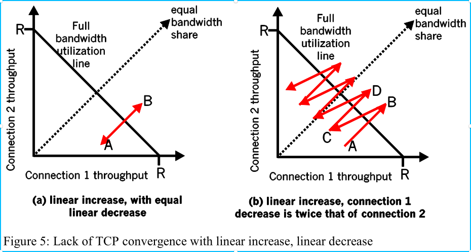

P42、如果tcp是一个停止和等待协议，那么超时间隔加倍就足够作为拥塞控制机制了。然而，TCP使用流水线(因此不是停止和等待协议)，它允许发送方有多个未确认的未确认段。超时间隔的加倍不会阻止tcp发送者向网络发送大量第一时间传输的数据包，即使端到端路径非常拥挤。因此，当出现网络拥塞的迹象时，需要一种拥塞控制机制来阻止“从上面的应用程序接收到的数据流”。

P43、在此问题中,由于接收器的接收,在溢出接收器中没有危险,缓冲区可以保存整个文件。而且,因为没有丢失和确认,在计时器过期之前返回，TCP拥塞控制不会限制发送方。但是，主机A中的进程不会连续将数据传递到套接字，因为发送缓冲区将快速填满。发送缓冲区已满，进程将通过以平均速率的数据或$R\ll S$

P43、

a) 1 RTT增加到7 MSS，2 RTTs增加到8 MSS，3 RTTS增加到9 MSS，4 RTTs增加到10 MSS，5 RTTs增加到11 MSS，6 RTTS增加到12 MSS。

b)在第一次发送RTT 6 MSS；在第二RTT 7 MSS发送；在第三RTT 8 MSS发送；在第四RTT 9 MSS发送；在第5 RTT MSS发送；在第六RTT MSS发送11 MSS。因此，发送时间为6 RTT，6 7 8 9 10 11=5 1 MSS。因此，我们可以说，6 RTT的平均吞吐量为(51 MSS)/(6 RTT)=8.5MSS/RTT。

P44、

a)丢失率L是在分组数量上丢失的分组的数目的比率,已发送。在一个周期中，丢失了1个数据包。在一个周期中发送的分组的数目

$\frac{W}{2}+\left ( \frac{W}{2} +1\right )+...+W=\sum_{n=0}^{W/2}(\frac{W}{2}+n)=\left ( \frac{W}{2}+1 \right )\frac{W}{2}+\frac{W/2(W/2+1)}{2}=\frac{W^2}{4}+\frac{W}{2}+\frac{W^2}{8}+\frac{W}{4}=\frac{3}{8}W^2+\frac{3}{4}W$

因此，损失率是：

$\frac{1}{\frac{3}{8}W^2+\frac{3}{4}W}$

b)如果W足够大，$\frac{3}{8}W^2\gg \frac{3}{4}W$。因此，$L\approx 8/3W^2$或者$W\approx \sqrt{\frac{8}{3L}}$

因此可以有

平均传输速率：$\frac{3}{4}\sqrt{\frac{8}{3L}}\frac{MSS}{RTT}=\frac{1.22 \cdot MSS}{RTT\cdot\sqrt{L}}$

P46、

a)让w表示在段中测量的最大窗口大小。然后，w*ms/RTT==10Mbps，如果最大发送速率超过链路，数据包将被丢弃容量。因此，我们拥有W*1500*8/0.15=10*10、6，然后W约为125个片段。

(B)当拥挤窗口大小在W/2~W之间变化时，平均窗口大小为0.75W=94(上限为93.75)。平均吞吐量为94*1500*8/0.15=7.52 Mbps。

c)当数据包丢失时，W变为W/2，即125/2=62。(125-62)*0.15=9.45秒，因为RTT的数量(此TCP连接将其窗口大小从62增加到125)为63。回想一下，每个RTT窗口的大小都会增加一个。

P47、设w表示最大窗口大小。让S表示缓冲区大小。为了简单起见,假设TCP发送器以圆形的方式发送数据包，每个循环对应于RTT。如果窗口大小达到W，则会发生丢失。那么,发送方将其拥塞窗口大小减半，等待W/2的ACK在其开始再次发送数据段之前未完成的数据包。为了确保链路始终支持发送数据，我们需要让链路忙发送数据期间w/(2*c)(这是发送方等待ACK的时间间隔W/2未完成数据包）。因此，S/C必须不小于W/(2*C)，即S＞＝W/2。

让TP表示发送器和接收器之间的单向传播延迟。当窗口大小达到最小w/2且缓冲区为空时，我们需要确保链接也在忙发送数据。因此，我们必须具有W/2/(2TP)＞＝C，因此，W/2>=C*2TP。

因此，S>=C*2TP。

P48、

a)让W表示最大窗口大小。当最大发送速率达到链路容量时，当数据包丢弃时，W*MSS/RTT=10 Gbps。因此，我们有W*1500*8/0.15=10*10^9，然后W=125000段。

b)当拥塞窗口大小在W/2到W之间变化时，平均窗口大小为0.75W=93750。平均吞吐量为93750*1500*8/0.1=7.5Gbps。

c)93750/2*0.15/60=117分钟。为了加快窗口增长的速度，我们可以将窗口大小增加一个更大的值，而不是在每个RTT中只增加一个窗口大小。针对这一问题，本文提出了一些协议，如ScalableTCP或高速TCP。

P49、当TCP的平均吞吐量B由下式给出时

$B=\frac{1.22 \cdot MSS}{RTT \cdot \sqrt{L}}$

我们知道，

$L=(1.22\ast MSS/(B\ast RTT))^2$

由于在两个连续的分组丢失之间，由TCP发送的1/L分组因此，发送方T=(1/L)*MSS/B。因此，我们发现T=B*RTT22/(1.222*ms)，即T是AB.

P50、C1与C2的主要区别在于C1的RTT仅为C2的一半。因此，C1在50毫秒后调整其窗口大小，而C2在100毫秒后调整其窗口大小。假设无论何时发生丢失事件，C1在50毫秒后接收，C2在100毫秒后接收。我们还得到了以下TCP简化模型。在每个RTT之后，连接决定是否应该增加窗口大小。对于C1，我们计算前50毫秒链路中的平均总发送速率。如果该速率超过链路容量，则假设C1检测丢失并缩小其窗口大小。但是对于C2，我们计算了前100毫秒链路中的平均总发送速率。如果该速率超过链路容量，则假设C2检测丢失并缩小其窗口大小。请注意，在最后50毫秒内的平均发送速率可能高于链路容量，但最后100毫秒内的平均发送速率小于或等于链路容量，那么在这种情况下，我们假设C1将经历丢失事件，而C2不会。

下表描述了基于上述假设的窗口大小和发送速率的演变。

|   |C1||C2||
|---|---|---|---|---|
|时间（秒）|窗口大小（在下一个50毫秒内发送的段数）|平均数据发送速率（每个段）第二=窗口/0.05）|窗口尺寸（编号。第页的分段在下一个发送下100毫秒）|平均数据发送速率(段每秒，=Window/0.1)|
|0|10|200（在[0-50]秒内）|10|100（在[0-50]秒内）|
|50|5(减小窗口大小作为avg。在最后50毫秒内向链路发送的总速率为300=200 100)|100（在[50-5100]秒内）||100（在[50-5100]秒内）|
|100|2（减少了窗口大小作为AVG。总发送至最后链接50毫秒为200=100100）|40|5（减少了窗口大小作为AVG。总发送至最后链接100毫秒为250==(200100)/2+(100+100)/2|50|
|150|1（减少了窗口大小作为AVG。总发送至最后链接50毫秒为90=(4050)|20||50|
|200|1(不再减少，因为窗口大小已经是1)|20|2 （减少窗口大小作为AVG。发送总数截至2008年12月31日的链接在最后 100毫秒 80= （4020）/2 （5050）/2）|20|
|250|1(不再减少，因为窗口大小已经是1)|20||20|
|300|1(不再减少，因为窗口大小已经是1)|20|1（减少了窗口大小作为AVG。总发送至最后链接100毫秒为40==(2020)/2(2020)/2)|10|
|350|2|40||10|
|400|1|20|1|10|
|450|2|40||10|
|500|1（减少了窗口大小作为AVG。总发送上次连接到链接的速率50毫秒为50=(4010)|20|1|10|
|550| 2| 40 |10 |
|600 |1 |20| 1 |10 |
|650| 2| 40 |10 |
|700 |1| 20| 1 |10 |
|750 |2 |40 |10 |
|800 |1| 20 |1| 10 |
|850 |2 |40 |10 |
|900 |1| 20 |1| 10 |
|950 |2 |40| 10 |
|1000| 1| 20| 1| 10 |

基于上表，我们发现，在1000msec后，C1"s和C2"的窗口大小均为1段。

b)在长期运行中，C1的带宽份额大约是C2的两倍，因为C1具有较短的RTT，仅是C2的一半，因此C1可以将其窗口大小调整两次，快速ASC2。如果我们看上面的表，我们可以每隔200毫秒看到一个周期，例如，850msec至1000msec（含）。在一个周期内,C1的发送速率(40204020)＝120，它是由发送C2给出的三倍大（10101010）=40。

P51、

a)类似于上一个问题，我们可以在下表中计算它们随时间变化的窗口大小。在2200毫秒后，C1和C2的窗口大小都是相同的。

||C1||C2||
|-|-|-|-|-|
|时间（秒）|窗口大小在下一个100毫秒内发送的段数量|数据发送速度(每秒分段=Window/0.1)|窗口大小在下一个100毫秒内发送的段)|数据发送速度(每秒分段，=Window/0.1)|
|0| 15 |150 (in [0-100]msec]| 10 |100 (in [0-100]msec) |
|100 |7| 70| 5| 50 |
|200| 3| 30| 2 |20 |
|300| 1 |10| 1 |10 |
|400 |2| 20 |2 |20 |
|500| 1 |10 |1| 10 |
|600 |2 |20 |2| 20 |
|700 |1 |10 |1 |10 |
|800 |2 |20 |2 |20 |
|900 |1 |10 |1 |10 |
|1000 |2| 20 |2| 20 |
|1100 |1 |10 |1 |10 |
|1200 |2 |20 |2| 20 |
|1300| 1 |10 |1 |10 |
|1400 |2 |20 |2| 20 |
|1500 |1 |10 |1| 10 |
|1600 |2 |20| 2 |20 |
|1700 |1 |10 |1 |10 |
|1800 |2 |20| 2 |20 |
|1900 |1 |10 |1 |10 |
|2000 |2 |20 |2| 20 |
|2100 |1| 10 |1 |10 |
|2200| 2 |20| 2| 20 |

b)是的，这是由于TCP的AIMD算法，而且这两个连接具有相同的RTT。

c)是的，从上表可以清楚地看出这一点。它们的最大窗口大小为2.

d)不，这种同步将无助于提高链路利用率，因为这两个连接在最小窗口和最大窗口大小之间充当一个单一连接振荡。因此，该链接没有得到充分利用(回想一下，我们假设这个链接没有缓冲区)。中断同步的一种可能方法是在链路中添加一个有限的缓冲区，并在缓冲区溢出之前将数据包随机丢弃到缓冲区中。这将导致不同的连接在不同的时间削减其窗口大小。主动队列管理(AQM)技术有很多种，如RED(随机早期检测)、PI(比例积分AQM)、AVQ(AdaptiveVirtualQueue)和REM(随机指数标记)等。

P52、请注意，W表示最大窗口大小。首先，我们可以找到在TCP期间间隔期间发送的段总数将其窗口大小从W/2更改为并包括W。这通过以下方式给出：S=W/2（W/2）*（1个单位）（W/2）*（1个单位）2(w/2)*(1%)3(&C)..(w/2)*(1%)kK我们发现K=log(1%)2，然后S=w*(2/1)/(2))。损耗率L由下式给出：L=1/s=(2%)/(w*(2/1))。TCP用于将其窗口大小从W/2增加到W的时间由下式给出：k*RTT＝(log(1％)2)*RTT，这显然与TCP的平均吞吐量无关。注意，TCP的平均吞吐量由下式给出：b=MSS*S/((k1)*RTT)=MSS/(L*(k1)*RTT)。

请注意，这与具有平均吞吐量的tcp不同：$B=\frac{1.22 \cdot MSS}{RTT \cdot \sqrt{L}}$，其中L的平方根出现在分母中。

P53、让我们假设1500字节的数据包和100ms的往返时间。从TCP吞吐量方程$B=\frac{1.22 \cdot MSS}{RTT \cdot \sqrt{L}}$

我们已经有了10Gbps=22*(1500*8位)/(.1秒*SRQT(L))，或sqrt(l)=14640位/(10，9位)=0.00001464，或L=2.14*10（-10）

P54、在t2使用cwnd和ss阈值的早期值的一个优点是，tcp将不必经历缓慢的启动和拥塞避免以提高在t1处获得的吞吐量值。使用这些值的一个缺点是它们可能不再准确。特别是，如果路径在T1和T2之间变得更加拥挤，发送方将向已经(更多)拥挤的路径发送一个大窗口的段值。

P55、

a)服务器将其对y的响应。

b)服务器可以确定客户端确实在Y上。如果是在某个其他服务器上地址欺骗Y，SYNACK将被发送到地址Y，并且主机中的TCP将不发送TCPACK段。即使攻击者要发送适当定时的TCPACK段，它将不知道正确的服务器序列号（因为服务器使用随机初始序列数字。

P56、

a)参考下图，我们认为总延迟是

RTTRTTS/RRTTS/RRTT12S/R=4RTT14S/R

b)类似地，在这种情况下的延迟是：RTTRTTS/RRTTS/RRTTS/RRTT8S/R=5RTT11S/R

c)类似地，在这种情况下的延迟是：RTTRTTs/rRTT14s/r=3RTT15s

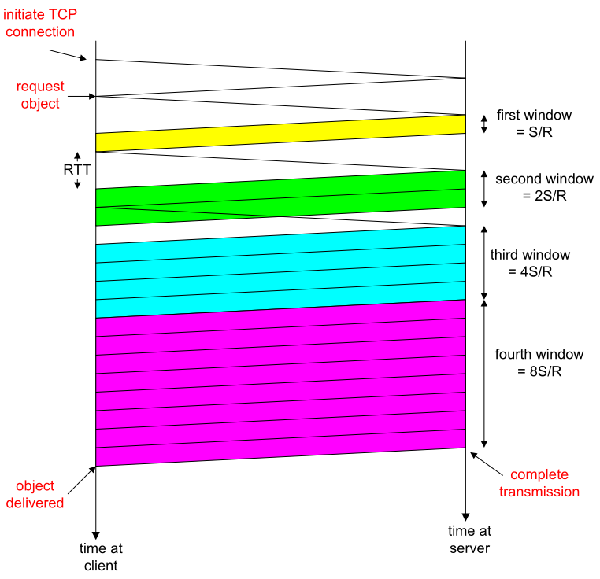

[Back to Index](#目录)

<div STYLE="page-break-after: always;"></div>

# 第四章

## 复习题4 

R1、网络层数据包是一种数据报.路由器根据数据包的IP(第3层)地址转发数据包。链路层交换机根据分组的MAC(第2层)地址转发分组.

R2、数据平面的主要功能是转发数据包，转发数据报从它们的输入链路到它们的输出链路。例如,数据平面S输入端口执行终止传入物理链路的物理层功能在路由器处，执行链路层功能以在另一个路由器上与链路层互操作传入链路的一侧，并在输入端口上执行查找功能。

控制平面的主要功能是路由，即确定数据包从源到目的地的路径。控制平面负责执行路由协议，响应连接的上下链路，与远程控制器通信，并执行管理功能。

R3、路由和转发之间的主要区别在于转发是路由器S将分组从其输入接口传送到其输出接口的本地动作，和转发发生在非常短的时标(通常为几纳秒),并且因此通常以硬件实现。路由是指网络范围确定数据包从来源接收到的端到端路径的过程目的地。路由发生在更长时间的时标上(通常是秒)，以及通常用软件实现。

R4、路由器内的转发表的作用是保存条目以确定即将通过切换转发到达数据包的输出链路接口织物。

R5、Internet网络层的服务模式是尽力而为的服务.使用该服务模型，无法保证按发送顺序接收数据包，无法保证其最终交付，不能保证端到端的延迟，也没有最小的带宽保证。

R6、输入端口、交换结构和输出端口在硬件中实现，因为它们的数据报处理功能对于软件实现来说太快了。传统路由器内部的路由处理器使用软件来执行路由协议，维护路由表和附加的链路状态信息，并计算路由器的转发表。此外，SDN路由器中的路由处理器还依赖于与远程控制器通信的软件，以便接收转发表条目并将它们安装在路由器的输入端口中。

数据平面通常由于需要快速而在硬件中实现例如以纳秒时标处理。控制平面通常在软件并以毫秒或秒时间工作,例如用于执行路由协议、响应向上或向下的附加链路,与远程控制器通信，并执行管理功能。

R7、利用阴影复制,在每个输入端口处本地地进行转发查找,而无需调用集中式路由处理器。这种分散的方法避免在路由器内的单个点创建查找处理瓶颈。

R8、基于目的地的转发意味着到达路由器的数据报将仅基于数据报的最终目的地转发到输出接口。广义转发意味着除了它的最终目的地之外，其他因素当路由器确定输出时，还考虑与数据报关联数据报的接口。软件定义的网络采用广义转发，例如，转发决策可以基于数据报的TCP/UDP源或目的端口号，除了其目的IP地址之外。

R9、路由器使用最长的前缀匹配来确定如果数据包的目标地址与转发表中的两个或多个条目匹配，数据包将被转发到哪个链路接口。也就是说，数据包将被转发到与数据包的目的地具有最长前缀匹配的链路接口。

R10、通过存储器进行切换；通过总线进行切换；通过互连网络进行切换。只要所有分组都被转发到不同的输出端口，互连网络就可以并行地转发分组。

R11、如果数据包到达交换矩阵的速率超过交换矩阵速率，则数据包需要在输入端口排队。如果此速率不匹配仍然存在，队列会变得更大和更大，并最终溢出输入端口缓冲区，从而导致数据包丢失。如果交换结构速度至少为N，则可以消除分组丢失输入线速度快，其中N为输入端口的数量。

R12、假设输入和输出线路速度相同，如果数据包到达单个输出端口的速率超过线路速度，则仍可能发生丢包。如果这种速率不匹配仍然存在，队列将变得越来越大，并最终溢出输出端口缓冲区，从而导致数据包丢失。请注意，提高开关结构的速度并不能防止此问题的发生。

R13、HOL阻塞：有时在输入端口队列中首先排队的数据包必须必须等待，因为它想要的输出端口没有可用的缓冲区空间被转发。当发生这种情况时,第一分组后面的所有分组被阻塞,即使它们的输出队列具有容纳它们的空间。发生HOL阻塞发生在输入端口处。

R14、(本问题中的一个错误：第一个问号应改为句号)。只有FIFO才能确保所有数据包按照到达的顺序离开。

R15、例如，携带网络管理信息的分组应当接收优先于常规用户流量。另一个示例是实时语音IP分组可能需要在非实时流量（如电子邮件）上接收优先级。

R16、(问题中的一个错误：不同的→差异)

与RR，所有服务类被同等对待，也就是说，没有任何服务类比任何其他服务类具有优先级。对于WFQ，服务类被不同的对待，也就是说，每个类在任何时间间隔内都可以接收到不同的服务量。当WFQ的所有类都具有相同的服务权重时，WFQ与RR是相同的。

R17、IP数据报中的8位协议字段包含关于目的地主机应该将段传递给哪个传输层协议的信息。

R18、生存时间。

R19、没有。IP报头校验和只计算IP数据包的IP报头字段的校验和，这些字段与IP数据报的传输层段部分不共享公共字节。

R20、IP数据报片段的重新组装是在数据报的目标主机中完成的。

R21、是。每个接口都有一个地址。

R22、11011111 00000001 00000011 00011100. 

R23、略

R24、8接口；3个转发表。

R25、50%的间接费用。

R26、通常，无线路由器包括DHCP服务器。DHCP用于为5台PC和路由器接口分配IP地址。是的，无线路由器也使用NAT，因为它只从ISP获得一个IP地址。

R27、路由聚合意味着ISP使用单个前缀为多个网络做广告。路由聚合很有用，因为ISP可以使用这种技术向Internet的其他部分宣传ISP拥有的多个网络的单一前缀地址。

R28、即插即用或Zeroconf协议意味着该协议能够自动配置主机的网络相关方面，以便将主机连接到网络中。

R29、网络中的设备的私有网络地址指的是仅对该网络内的那些设备有意义。具有私有数据的数据报网络地址不应存在于较大的公共Internet中，因为私有网络地址可能由他们自己的许多网络设备使用专用网络。

R30、IPv6具有固定长度的报头，其中不包括IPv4的大部分选项标题可以包括。即使IPv6报头包含两个128位地址（源和目标IP地址）整个报头的固定长度为40字节只有。几个领域在精神上是相似的。流量等级，有效载荷长度，下一个 IPv6的报头和跳限分别与服务类型、数据报相似长度，上层协议和在IPv4中生活的时间。

R31、是的，因为整个IPv6数据报(包括头字段)都封装在IPv4数据报中。

R32、转发有两个主要操作：匹配和操作。通过基于目的地的转发，路由器的匹配操作只查找待转发数据报的目标IP地址，路由器的操作操作包括将数据包发送到交换结构到指定的输出端口。使用广义转发，可以在协议栈中不同层上与不同协议相关联的多个报头字段上进行匹配，该操作可以包括将包转发到一个或多个输出端口，跨多个输出接口进行负载均衡，重写报头值(如NAT)，故意阻塞/丢弃数据包(如防火墙)，将数据包发送到特殊服务器以供进一步处理和操作，等等。

R33、基于目的地的转发的转发表中的每个条目仅包含IP报头字段值和数据包的输出链路接口（匹配IP报头字段值)将被转发。流表的每个条目OpenFlow包括一组报头字段值,输入分组将匹配的一组计数器，这些计数器被更新为数据包与流表匹配条目，以及数据包与流表条目匹配时要采取的一组操作。

R34、“匹配加动作”是指路由器或交换机试图在流表中有某些条目的包的一些报头值之间找到匹配，然后根据该匹配，路由器决定将该数据包转发到哪个接口，甚至决定对该分组进行更多的操作。在基于目的地的转发分组交换机的情况下，路由器只尝试在流表条目与到达数据包的目标IP地址之间找到匹配，并且决定将该数据包转发到哪个接口。在SDN的情况下，可以匹配许多字段，例如IP源地址、TCP源端口和源MAC地址；还可以采取许多操作，例如转发、删除和修改字段值。

R35、可以在OpenFlow 1.0通用转发中匹配的IP数据报中的三个示例头字段是IP源地址、TCP源端口和源MAC地址。三个无法匹配的字段是：TTL字段、数据报长度字段、标头校验和(依赖于TTL字段)。

[Back to Index](#目录)

<div STYLE="page-break-after: always;"></div>

## 问题4 

P1、

(A)发送给主机H3的数据是通过接口3转发的

|目标地址|链接接口|
|--|--|
|H3 |3|

b)否，因为转发规则仅基于目标地址。

P2、

a)否，您只能在共享总线上一次发送一个数据包。

b)否，如文本中所述，一次只能进行一次内存读取/写入。共享系统总线。

c)否，在这种情况下，必须在相同的输出总线上在相同的输出总线上发送这两个数据包。同样的时间，这是不可能的。

P3、

a)(n-1)d

b)(n-1)d

c)0

P4、所需的最小时隙数为3，调度如下。

插槽1：在顶部输入队列中发送X，在中间输入队列中发送Y。

插槽2：在中间输入队列中发送X，在底部输入队列中发送Y，

插槽3：在底部输入队列中发送Z。

实际上，基于一个非空输入队列永远不空闲的假设，第一个时隙总是由在顶部输入队列中发送X和在中间或底部输入队列中发送Y组成，而在第二个时隙中，我们总是可以多发送两个数据报，最后一个数据报可以在第三时间时隙发送。

注意：实际上，如果底部输入队列中的第一个数据报是X，那么最坏的情况是需要4个时隙。

P5、

a)

|前缀匹配|链路接口|
|------|---|
|11100000 00 |0|
|11100000 01000000 |1|
|1110000| 2|
|11100001 1 |3|
|否则 | 3|

b)第一个地址的前缀匹配是第5条目的：链路接口3第二个地址的前缀匹配是3nd条目:链路接口2第三个地址的前缀匹配是第4条目的:链路接口3

P6、

|Destination Address Range| Link Interface|
|-------------------------|---------------|
|00000000|| 
|through |0| 
|00111111|| 
|01000000 ||
|through| 1 |
|01011111|| 
|01100000|| 
|through| 2 |
|01111111|| 
|10000000 ||
|through |2 |
|10111111|| 
|11000000 ||
|through| 3| 
|11111111|| 

接口0的地址数量=$2^6=64$个

接口1的地址数量=$2^5=32$个

接口2的地址数量=$2^6+2^5=64+32=96$个。

接口3的地址数量=$2^6=64$个

P7、

|Destination Address Range| Link Interface|
|-------------------------|---------------|
|11000000|| 
|through(32个地址) |0| 
|11011111|| 
|10000000 ||
|through（64个地址）| 1 |
|10111111|| 
|11100000|| 
|through(32个地址）| 2 |
|11111111|| 
|00000000 ||
|through（128个地址） |3 |
|01111111|| 

P8、

223.1.17.0/26 

223.1.17.128/25 

223.1.17.192/28 

P9、

|Destination Address |Link Interface| 
|--------------------|--------------|
| 200.23.16/21 | 0 | 
| 200.23.24/24 | 1 | 
| 200.23.24/21 | 2 | 
| otherwise | 3 | 

P10、

|Destination Address |Link Interface |
|--------------------|---------------|
|11100000 00 (224.0/10)| 0 |
|11100000 01000000 (224.64/16)| 1 |
|1110000 (224/8)| 2 |
|11100001 1 (225.128/9) |3 |
|otherwise |3 |

P11、任何IP地址在128.119.40.128至128.119.40.191范围内

四个同等大小的子网：128.119.40.64/28，128.119.40.80/28，128.119.40.96/28， 128.119.40.112/28.

P12、从214.97.254/23开始, 可能的分配是：

a) 子网A: 214.97.255/24 (256 addresses) 

子网B: 214.97.254.0/25 - 214.97.254.0/29 (128-8 = 120 addresses) 

子网C: 214.97.254.128/25 (128 addresses) 

子网D: 214.97.254.0/31 (2 addresses) 

子网E: 214.97.254.2/31 (2 addresses) 

子网F: 214.97.254.4/30 (4 addresses) 

b)为了简化解决方案，假设没有数据报将路由器接口作为最终目的地。此外，标号D，E，F分别用于右上、下和左上的内部子网.

Router 1
 
|Longest Prefix Match| Outgoing Interface |
|--------------------|--------------------|
|11010110 01100001 11111111| Subnet A |
|11010110 01100001 11111110 0000000 |Subnet D |
|11010110 01100001 11111110 000001 |Subnet F| 
 
 Router 2
 
|Longest Prefix Match |Outgoing Interface |
|--------------------|--------------------|
|11010110 01100001 11111111 0000000|Subnet D|
|11010110 01100001 11111110 0|Subnet B|
|11010110 01100001 11111110 0000001| Subnet E |
 
 Router 3
 
|Longest Prefix Match |Outgoing Interface| 
|--------------------|--------------------|
|11010110 01100001 11111111 000001|Subnet F|
|11010110 01100001 11111110 0000001|Subnet E|
|11010110 01100001 11111110 1|Subnet C|

P13、纽约大学理工学院的IP地址块为：

NetRange：128.238.0.0-128.238.255.255 

CIDR：128.238.0.0/16

斯坦福大学IP地址块为：

NetRange：171.64.0.0-171.67.255.255 

CIDR：171.64.0.0/14

华盛顿大学IP地址块为：

NetRange：140.142.255.255 

CIDR：140.142.0.0/16 

不，OWIS服务不能用于确切地确定特定IP地址的地理位置。

www.maxmin.com用于确定纽约大学理工学院、斯坦福大学和华盛顿大学网络服务器的位置。

纽约大学理工学院Web服务器的位置是

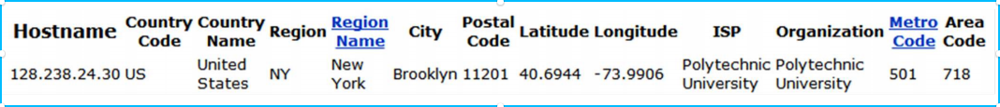

Web服务器斯坦福大学的位置是

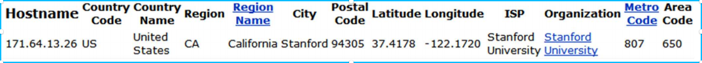

麻萨诸塞大学网络服务器的位置

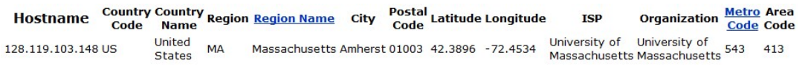

P14、每个片段中数据字段的最大大小=680(因为有20个字节的IP报头)。因此，所需的片段数$\left \lceil \frac{2400-20}{680} \right \rceil =4$。每个片段将具有识别号422。除最后一个片段外，每个片段的大小为700个字节(包括IP报头)。最后一个数据报的大小为360字节(包括IP报头)。这4个片段的偏移量为0，85，170，255。前三个片段中的每一个都有标志=1；最后一个片段将有标志=0。

P15、MP3文件大小=500万字节。假设数据是在TCP段中携带的，每个TCP段也有20个字节的标头。然后，每个数据报可以携带1500-40=1460字节的MP3文件。

需要的数据报数为$\left \lceil 
\frac{5 \times 10^6}{1460}
\right \rceil$=3425。除了最后一个数据报之外，所有的数据报都是1500字节；最后的数据报是960+40=1000字节。注意，这里没有碎片--源主机不会创建大于1500个字节的数据报，并且这些数据报小于链接的MTU。

P16、

a) 家庭地址：192.168.1.1、192.168.1.2、192.168.1.3，路由器接口为192.168.1.4

b) 
|NAT Translation Table ||
|-|-|
|WAN Side |LAN Side |
|24.34.112.235, 4000 |192.168.1.1, 3345 |
|24.34.112.235, 4001 |192.168.1.1, 3346 |
|24.34.112.235, 4002 |192.168.1.2, 3445 |
|24.34.112.235, 4003 |192.168.1.2, 3446 |
|24.34.112.235, 4004 |192.168.1.3, 3545 |
|24.34.112.235, 4005 |192.168.1.3, 3546 |


P17、

a)由于所有IP数据包都发送到外部，所以我们可以使用数据包嗅探器记录NAT后面的主机生成的所有IP数据包。由于每个主机都生成一个具有序列号的IP数据包序列，并且有一个不同的(很可能是从一个大空间中随机选择的)初始标识号(ID)，因此我们可以将具有连续ID的IP数据包分组到一个集群中。集群的数量是NAT背后的主机数量。

有关更多实用算法，请参阅以下论文。

“A Technique for Counting NATted Hosts”, by Steven M. Bellovin, appeared in 
IMW’02, Nov. 6-8, 2002, Marseille, France. 

“Exploiting the IPID field to infer network path and end-system characteristics.” 
Weifeng Chen, Yong Huang, Bruno F. Ribeiro, Kyoungwon Suh, Honggang Zhang, 
Edmundo de Souza e Silva, Jim Kurose, and Don Towsley. 

PAM'05 Workshop, March 31 - April 01, 2005. Boston, MA, USA. 


b)但是，如果这些识别号码不是按顺序分配的，而是随机分配的，则a)部分中所建议的技术将无法工作，因为在嗅探数据中不会出现集群。

P18、想出这样的技术是不可能的。为了在Arnold和Bernard之间建立一个直接的TCP连接，Arnold或Bob必须启动到另一个连接。但是覆盖Arnold和Bob的NAT丢弃了从WAN端到达的SYN数据包。因此，无论是Arnold还是Bob，如果它们都落后于NAT，就无法启动到对方的TCP连接。

P19、

|S2 Flow Table ||
|-|-------------|
|Match |Action |
|Ingress Port = 1; IP Src = 10.3.*.*; IP Dst = 10.1.*.* |Forward (2) |
|Ingress Port = 2; IP Src = 10.1.*.*; IP Dst = 10.3.*.* |Forward (1) |
|Ingress Port = 1; IP Dst = 10.2.0.3 |Forward (3) |
|Ingress Port = 2; IP Dst = 10.2.0.3 |Forward (3) |
|Ingress Port = 1; IP Dst = 10.2.0.4 |Forward (4) |
|Ingress Port = 2; IP Dst = 10.2.0.4 |Forward (4) |
|Ingress Port = 4 |Forward (3) |
|Ingress Port = 3 |Forward (4)|

P20、

|S2 Flow Table ||
|-|-------------|
|Match |Action |
|Ingress Port = 3; IP Dst = 10.1.*.* |Forward (2) |
|Ingress Port = 3; IP Dst = 10.3.*.* |Forward (2) |
|Ingress Port = 4; IP Dst = 10.1.*.* |Forward (1) |
|Ingress Port = 4; IP Dst = 10.3.*.* |Forward (1) |

P21、

|S1 Flow Table ||
|-|-------------|
|Match |Action |
|IP Src = 10.2.*.*; IP Dst = 10.1.0.1 |Forward (2) |
|IP Src = 10.2.*.*; IP Dst = 10.1.0.2 |Forward (3) |
|IP Src = 10.2.*.*; IP Dst = 10.3.*.* |Forward (1) |

|S3 Flow Table ||
|-|-------------|
|Match |Action |
|IP Src = 10.2.*.*; IP Dst = 10.3.0.6 |Forward (1) 
|IP Src = 10.2.*.*; IP Dst = 10.3.0.5 |Forward (2) 
|IP Src = 10.2.*.*; IP Dst = 10.1.*.* |Forward (3) |


P22、

| S2 Flow Table||
|-|-------------| 
|Match | Action |
|IP Src = 10.1.0.1; IP Dst = 10.2.0.3 |Forward (3) |
|IP Src = 10.1.0.1; IP Dst = 10.2.0.4 | Forward (4) |
|IP Src = 10.3.0.6; IP Dst = 10.2.0.3 |Forward (3) |
|IP Src = 10.3.0.6; IP Dst = 10.2.0.4 |Forward (4) |

|S2 Flow Table ||
|--|--|
|Match |Action| 
|IP Src =.*.*.*.*; IP Dst = 10.2.0.3; port = TCP |Forward (3) |
|IP Src =.*.*.*.*; IP Dst = 10.2.0.4; port = TCP |Forward (4) |


|S2 Flow Table| |
|--|--|
|Match |Action |
|IP Src =.*.*.*.*; IP Dst = 10.2.0.3 |Forward (3) |

|S2 Flow Table| |
|--|--|
|Match |Action |
|IP Src = 10.1.0.1; IP Dst = 10.2.0.3; port = UDP |Forward (3) |

[Back to Index](#目录)

<div STYLE="page-break-after: always;"></div>

# 第五章

## 复习题5

R1、每个路由器控制意味着一个路由算法在每个路由器中运行；转发和路由功能在每个路由器内都受到约束。每个路由器都有一个路由组件，它与其他路由器中的路由组件通信，以计算其转发表的值。在这种情况下，我们说网络控制和数据平面是以单一方式实现的，因为每个路由器作为一个独立的实体来实现自己的控制和数据平面。

R2、逻辑集中控制是指逻辑中央路由控制器计算和分配每个路由器使用的转发表，而每个路由器不计算其转发表，这与每个路由器控件不同。在逻辑集中控制的情况下，数据平面和控制平面在单独的设备中实现；控制平面在中央服务器或多个服务器上实现，数据平面在每个路由器中实现。

R3、集中式路由算法通过使用关于网络的完整的全局知识来计算源和目的地之间的最小成本路径。该算法需要对所有节点之间的连通性和所有链路的代价有完整的了解。实际计算可以在一个站点上运行，也可以在每个路由器的路由组件中复制。一种分布式路由算法通过路由器以迭代的、分布式的方式计算租赁成本路径.使用分散算法，任何节点都没有关于所有网络链路成本的完整信息。每个节点开始时只知道自己直接连接链路的成本，然后通过与其相邻节点进行计算和信息交换的迭代过程，节点逐渐计算出到达目的地或一组目的地的最小成本路径。

OSPF协议是集中式路由算法的一个例子，BGP协议是分布式路由算法的一个例子。

R4、链路状态算法：使用完整的、全局的网络知识来计算源和目的地之间的最小成本路径。距离向量路由：最小成本路径的计算是以迭代的、分布式的方式进行的。节点只知道它应该向其转发数据包的邻居，以便沿着成本最低的路径到达给定的目的地，以及该路径从自身到目的地的成本。

R5、计数-无穷大问题是指距离矢量路由的问题。所需的问题意味着需要很长的时间用于距离矢量路由算法,当链路成本增加时收敛。例如，考虑三个网络节点X、Y和Z。最初假定链路代价是C(x，y)＝4，c(x，z)＝50，并且C(y，z)＝1。距离矢量路由算法的结果是Z的X的路径是Z→Y→X，成本为5(＝4+1)。当链路(x,y)的成本从4增加到60时,它将花费44次迭代来运行节点Z的距离矢量路由算法,实现其对X的新的最小成本路径通过其直接链路到X，因此Y也将通过Z实现对X的最低成本路径。

R6、没有。每个AS都具有在AS中路由的管理自主权。

R7、政策：在屁股中，政策问题占主导地位。重要的是，源自给定的流量不能通过另一个特定的AS。类似地，一个给定的可能想要控制它在其他驴之间的过境流量。在AS内部，所有事物名义上都处于相同的管理控制之下，因此政策在选择路线方面所起的作用要小得多。

规模：路由算法及其数据结构处理大量网络路由的能力是跨网络路由中的一个关键问题。在AS中，可伸缩性不太受关注。首先，如果单个管理域变得太大，则始终可以将其划分为两个ASS，并在两个新ASS之间执行互选路由。

性能：由于路由非常面向策略，所以使用的路由的质量(例如性能)往往是次要关注的(也就是说，满足某些策略标准的较长或更昂贵的路由很可能被选择在较短但不符合该标准的路由上)。事实上，我们看到，在驴中，甚至没有与路线相关的成本(除了作为跳数)的概念。然而，在一个单一的地方，这种策略关注点就不那么重要了，这使得路由能够更多地关注在路由上实现的性能水平。

R8、假的。

使用ospf，路由器将其链路状态信息广播到它所属的自治系统中的所有其他路由器，而不仅仅是它的邻近路由器。这是因为使用OSPF，每个路由器都需要构造一个完整的AS拓扑图，然后本地运行Dijkstra的最短路径算法来确定它对所有其他节点的最小代价路径。

R9、OSPF自治系统中的一个区域是指一组路由器，其中每个路由器向同一组中的所有其他路由器广播其链路状态。OSPF可以分层配置成多个区域，每个区域运行自己的OSPF链路状态路由算法。在每个区域内，一个或多个区域边界路由器负责在区域外路由数据包。基于扩展性的考虑，引入了Area的概念，即我们希望为大规模OSPF建立分层路由，而区域是分层路由的重要组成部分。

R10、子网是较大网络的一部分；子网不包含路由器；其边界由路由器和主机接口定义。前缀是CDIR地址的网络部分；它以A.B.C.D/x形式写成；前缀包括一个或多个子网。当路由器在BGP会话中通告前缀时，它在前缀中包含许多BGP属性。在BGP术语中，前缀及其属性是BGP路由(或简单地说是路由)。

R11、路由器使用AS-Path属性来检测和防止循环广告；它们还使用它在多个路径中选择相同的前缀。下一跳属性表示沿通告路径的第一个路由器的IP地址(在接收到广告的外部)到给定的前缀。配置时配置它的转发表，路由器使用下一跳属性。

R12、第1级ISP B可能不会携带其他两个一级ISP之间的过境流量，例如A和C，B与它们有对等协议。为了执行这一政策，ISP B不会向通过C的A路做广告，也不会向经过A的C路做广告。

R13、假的。

BGP路由器可以选择不将自己的标识添加到接收到的路径中，然后将新路径发送到其所有邻居，因为bgp是一种基于策略的路由协议。在下面的场景中可能会发生这种情况。接收路径的目的地是其他路径，而不是BGP路由器的AS，而BGP路由器不想充当传输路由器。

R14、通信层通过OpenFlow等协议负责SDN控制器与受控网络设备之间的通信。通过这一层，SDN控制器控制远程SDN启用交换机、主机或其他设备的操作，并且设备将本地观察到的事件(例如，指示链路故障的消息)与控制器通信。

网络范围的状态管理层提供关于网络主机、链路、交换机和其他SDN控制设备的最新信息.控制器还维护各种受控设备的流表的副本。

网络控制应用层代表SDN控制平面的大脑.该层的应用程序使用SDN控制器提供的API来指定和控制网络设备中的数据平面。例如，路由网络控制应用程序可能确定源和目的地之间的端点路径.另一个网络应用程序可能执行访问控制。

R15、我将在SDN的网络控制应用层实现一个新的路由协议，因为这是一个路由协议决定源和目的地之间端到端路径的层。

R16、下面是通过SDN控制器从控制器南行到被控制设备的消息类型的列表。这些消息的接收方是一个受控的数据包交换机。

- 配置。此消息允许控制器查询和设置交换机的配置参数。
- 修改-状态。控制器使用此消息添加/删除或修改交换机流表中的条目，并设置开关端口属性。
- 阅读状态。此消息由控制器用于从交换机的流表和端口收集统计信息和计数器值。
- 发送包。此消息由控制器用于发送特定的数据包在受控开关上的指定端口。

网络控制应用程序(作为发送者)也会通过北向接口向控制器发送消息，例如，在控制器的状态管理层中读取/写入网络状态和流表的消息。

R17、从受控设备到控制器的两种消息类型：

- 流删除消息.它的目的是通知控制器，流表项已被删除，例如，通过超时或接收到的修改状态消息的结果。

- 端口-状态消息.其目的是将港口状态的变化通知控制器。

从控制器到受控设备的两种消息类型：

- 修改-状态。其目的是添加/删除或修改交换机流表中的条目，并设置开关端口属性。

- 读状态。其目的是收集统计数据和计数器值，以查询交换机的流表和端口。

R18、服务抽象层允许内部网络服务应用程序相互通信。它允许控制器组件和应用程序相互调用对方的服务，并订阅它们生成的事件。该层还为通信层中特定的底层通信协议(包括OpenFlow和SNMP)提供了统一的抽象接口。

R19、

Echo回复（至Ping），类型0，代码0

目标网络不可达，类型3，代码0

目标主机不可达，类型3，代码1。

源抑制（拥塞控制），类型4代码0。

R20、ICMP警告消息(类型11代码0)和无法到达的目标端口ICMP消息(类型3代码3)。

R21、管理服务器是一个应用程序，通常有一个人在循环中，运行在网络操作中心的集中网络管理站中。它控制网络管理信息的收集、处理、分析和/或显示。在管理服务器中启动操作以控制网络行为，网络管理员使用管理服务器与网络设备交互。

托管设备是驻留在托管网络上的一段网络设备(包括其软件)。托管设备可能是主机、路由器、交换机、中间盒、调制解调器、温度计或其他网络连接的设备.

网络管理代理是在托管设备中运行的进程，该进程与管理服务器通信，在管理服务器的命令和控制下在托管设备上采取本地操作。

管理信息库(MIB)收集与托管网络中的那些托管对象相关联的信息。MIB对象可以是计数器，例如由于IP数据报报头中的错误而丢弃在路由器上的IP数据报的数量，或者在主机上接收到的UDP段的数量，或者诸如特定设备是否正常工作的状态信息。

R22、GetRequest是从管理服务器发送给代理的消息，用于在代理的托管设备上请求一个或多个MIB对象的值。SetRequest是管理服务器用于在托管设备中设置一个或多个MIB对象的值的消息。

R23、SNMP陷阱消息是作为对设备的管理服务器需要通知的托管设备上发生的事件的响应而生成的。它用于将导致MIB对象值更改的异常情况(例如，向上或向下的链接接口)通知管理服务器。

[Back to Index](#目录)

<div STYLE="page-break-after: always;"></div>

## 问题5

P1、

y-x-u,y-x-v-u,y-x-w-u,y-x-w-v-u,

y-w-u,y-w-v-u,y-w-x-u,y-w-x-v-u,y-w-v-x-u,

y-z-w-u,y-z-w-v-u,y-z-w-x-u,y-z-w-x-v-u,y-z-w-v-x-u,

P2、

x to z:

x-y-z,x-y-w-z,

x-w-z,x-w-y-z,

x-v-w-z,x-v-w-y-z,

x-u-w-z,x-u-v-w-u-z

x-u-v-w-z,x-u-v-w-y-z

z to u:

z-w-u,

z-w-v-u,z-w-x-u,z-w-v-x-u,z-w-x-v-u,z-w-y-x-u,z-w-y-x-v-u,

z-y-x-u,z-y-x-v-u,z-y-x-w-u,z-y-x-w-y-u,z-y-x-v-w-u,

z-y-w-v-u,z-y-w-x-u,z-y-w-v-x-u,z-y-w-x-v-u,z-y-w-y-x-u,z-y-w-y-x-v-u

z to w:

z-w,z-y-w,z-y-x-w,z-y-x-v-w,z-y-x-u-w,z-y-x-u-v-w,z-y-x-v-u-w


P3、

|step|$N^{'}$|D(t),p(t)|D(u),p(u)|D(v),p(v)|D(w),p(w)|D(y),p(y)|D(z),p(z)|
|-|-|-|-|-|-|-|-|
|0|x|$\infty$|$\infty$|3,x|6,x|6,x|8,x|
|1|xv|7,v|6,v|3,x|6,x|6,x|8,x|
|2|xvu|7,v|6,v|3,x|6,x|6,x|8,x|
|3|xvuw|7,v|6,v|3,x|6,x|6,x|8,x|
|4|xvuwy|7,v|6,v|3,x|6,x|6,x|8,x|
|5|xvuwyt|7,v|6,v|3,x|6,x|6,x|8,x|
|6|xvuwytz|7,v|6,v|3,x|6,x|6,x|8,x|

P4、

a)

|step|$N^{'}$|D(x),p(x)|D(u),p(u)|D(v),p(v)|D(w),p(w)|D(y),p(y)|D(z),p(z)|
|-|-|-|-|-|-|-|-|
|0|x|$\infty$|2,t|4,t|$\infty$|7,t|$\infty$|
|1|xv|$\infty$|2,t|4,t|5,u|7,t|$\infty$|
|2|xvu|7,v|2,t|4,t|5,u|7,t|$\infty$|
|3|xvuw|7,v|2,t|4,t|5,u|7,t|$\infty$|
|4|xvuwy|7,v|2,t|4,t|5,u|7,t|15,x|
|5|xvuwyt|7,v|2,t|4,t|5,u|7,t|15,x|
|6|xvuwytz|7,v|2,t|4,t|5,u|7,t|15,x|

b)

|step|$N^{'}$|D(x),p(x)|D(t),p(t)|D(v),p(v)|D(w),p(w)|D(y),p(y)|D(z),p(z)|
|-|-|-|-|-|-|-|-|
|0|x|$\infty$|2,u|3,u|3,u|$\infty$|$\infty$|
|1|xv|$\infty$|2,u|3,u|3,u|9,t|$\infty$|
|2|xvu|6,v|2,u|3,u|3,u|9,t|$\infty$|
|3|xvuw|6,v|2,u|3,u|3,u|9,t|$\infty$|
|4|xvuwy|6,v|2,u|3,u|3,u|9,t|14,x|
|5|xvuwyt|6,v|2,u|3,u|3,u|9,t|14,x|
|6|xvuwytz|6,v|2,u|3,u|3,u|9,t|14,x|

c)

|step|$N^{'}$|D(x),p(x)|D(u),p(u)|D(t),p(t)|D(w),p(w)|D(y),p(y)|D(z),p(z)|
|-|-|-|-|-|-|-|-|
|0|v|3,v|3,v|4,v|4,v|8,v|$\infty$|
|1|vx|3,v|3,v|4,v|4,v|8,v|11,x|
|2|vxu|3,v|3,v|4,v|4,v|8,v|11,x|
|3|vxut|3,v|3,v|4,v|4,v|8,v|11,x|
|4|vxutw|3,v|3,v|4,v|4,v|8,v|11,x|
|5|vxutwy|3,v|3,v|4,v|4,v|8,v|11,x|
|6|vxutwyz|3,v|3,v|4,v|4,v|8,v|11,x|

d)

|step|$N^{'}$|D(x),p(x)|D(u),p(u)|D(v),p(v)|D(t),p(t)|D(y),p(y)|D(z),p(z)|
|-|-|-|-|-|-|-|-|
|0|w|6,w|3,w|4,w|$\infty$|$\infty$|$\infty$|
|1|wu|6,w|3,w|4,w|5,u|$\infty$|$\infty$|
|2|wuv|6,w|3,w|4,w|5,u|12,v|$\infty$|
|3|wuvt|6,w|3,w|4,w|5,u|12,v|$\infty$|
|4|wuvtx|6,w|3,w|4,w|5,u|12,v|14,x|
|5|wuvtxy|6,w|3,w|4,w|5,u|12,v|14,x|
|6|wuvtxyz|6,w|3,w|4,w|5,u|12,v|14,x|

e)

|step|$N^{'}$|D(x),p(x)|D(u),p(u)|D(v),p(v)|D(w),p(w)|D(t),p(t)|D(z),p(z)|
|-|-|-|-|-|-|-|-|
|0|y|6,y|$\infty$|8,y|$\infty$|7,y|12,y|
|1|yx|6,y|$\infty$|8,y|12,x|7,y|12,y|
|2|yxt|6,y|9,t|8,y|12,x|7,y|12,y|
|3|yxtv|6,y|9,t|8,y|12,x|7,y|12,y|
|4|yxtvu|6,y|9,t|8,y|12,x|7,y|12,y|
|5|yxtvuw|6,y|9,t|8,y|12,x|7,y|12,y|
|6|yxtvuwz|6,y|9,t|8,y|12,x|7,y|12,y|

f)

|step|$N^{'}$|D(x),p(x)|D(u),p(u)|D(v),p(v)|D(w),p(w)|D(y),p(y)|D(t),p(t)|
|-|-|-|-|-|-|-|-|
|0|z|8,z|$\infty$|$\infty$|$\infty$|12,z|$\infty$|
|1|zx|8,z|$\infty$|11,x|14,x|12,z|$\infty$|
|2|zxv|8,z|14,v|11,x|14,x|12,z|15,v|
|3|zxvy|8,z|14,v|11,x|14,x|12,z|15,v|
|4|zxvyu|8,z|14,v|11,x|14,x|12,z|15,v|
|5|zxvyuw|8,z|14,v|11,x|14,x|12,z|15,v|
|6|zxvyuwt|8,z|14,v|11,x|14,x|12,z|15,v|


P5、

||||值||||
|-|-|-|-|-|-|-|
|||u|v|x|y|z|
||v|$\infty$|$\infty$|$\infty$|$\infty$|$\infty$|
|从|x|$\infty$|$\infty$|$\infty$|$\infty$|$\infty$|
||z|$\infty$|6|2|$\infty$|0|

||||值||||
|-|-|-|-|-|-|-|
|||u|v|x|y|z|
||v|1|0|3|$\infty$|6|
|从|x|$\infty$|3|0|3|2|
||z|7|5|2|5|0|

||||值||||
|-|-|-|-|-|-|-|
|||u|v|x|y|z|
||v|1|0|3|3|5|
|从|x|4|3|0|3|2|
||z|6|5|2|5|0|

||||值||||
|-|-|-|-|-|-|-|
|||u|v|x|y|z|
||v|1|0|3|3|5|
|从|x|4|3|0|3|2|
||z|6|5|2|5|0|

P6、这个问题的措辞有点含糊。我们的意思是，“第一次运行算法时的迭代次数”(也就是说，假设节点最初拥有的唯一信息是其最近的邻居的成本)。我们假设该算法是同步运行的(即，在一个步骤中，所有节点同时计算它们的距离表，然后交换表)。

在每次迭代时，节点与其邻居交换距离表。因此，如果您是节点A，而您的邻居是B，则B的所有邻居(它们都是您的一两跳)在一次迭代后(即B告诉他们它对您的成本后)将知道一到两个跳到您的最短代价路径。

d是网络的“直径”--网络中任何两个节点之间最长的无环路路径的长度。使用上面的推理，经过d-1迭代后，所有节点都将知道d或更少跳到所有其他节点的最短路径代价。由于任何大于d跳的路径都会有循环(因此比去掉循环的路径花费更大)，该算法最多会在d-1迭代中收敛。

旁白：如果DV算法是由于链路成本的变化而运行的，则在收敛之前，所需迭代次数不存在先验界，除非还指定了链路成本的约束。

P7、

a)Dx(w) = 2, Dx(y) = 4, Dx(u) = 7 

b)首先考虑如果c(x，y)发生变化会发生什么。如果c(x，y)变大或变小(只要c(x，y)>=1)，那么从x到u的最小成本路径仍然至少要花费7。因此c(x，y)的改变(如果c(x，y)>=1)不会使x通知其邻居。

如果c(x，y)=$\sigma$<1，那么最小成本的路径现在通过y，并有成本$\sigma$+6。

现在考虑如果c(x，w)改变。如果c(x，w)=$\varepsilon$<=1，那么u的最小成本路径将继续通过w，其成本将更改为5+$\varepsilon$; x将通知它的邻居这个新的成本。如果c(x，w)=$\sigma$>6，那么最小成本路径现在经过y并花费了11；x将再次通知它的邻居这个新成本。

c)链路成本c(x，y)(以及只要c(x，y)>=1)中的任何更改都不会导致x通知其邻居关于u的新的最小成本路径。

P8、

结点x表

|||值|||
|-|-|-|-|-|
|||x|y|z|
||x|0|3|4|
|从|y|$\infty$|$\infty$|$\infty$|
||z|$\infty$|$\infty$|$\infty$|

|||值|||
|-|-|-|-|-|
|||x|y|z|
||x|0|3|4|
|从|y|3|0|6|
||z|4|6|0|

结点y表

|||值|||
|-|-|-|-|-|
|||x|y|z|
||x|$\infty$|$\infty$|$\infty$|
|从|y|3|0|6|
||z|$\infty$|$\infty$|$\infty$|

|||值|||
|-|-|-|-|-|
|||x|y|z|
||x|0|3|4|
|从|y|3|0|6|
||z|4|6|0|

结点z表

|||值|||
|-|-|-|-|-|
|||x|y|z|
||x|$\infty$|$\infty$|$\infty$|
|从|y|$\infty$|$\infty$|$\infty$|
||z|4|6|0|

|||值|||
|-|-|-|-|-|
|||x|y|z|
||x|0|3|4|
|从|y|3|0|6|
||z|4|6|0|

P9、不，这是因为降低链路成本不会导致循环(由该链路的两个节点之间的下一跳关系引起)。将两个节点连接到一个链路相当于将链路重量从无限降到有限权。

P10、在每一步中，节点距离向量的每一次更新都是基于Bellman-Ford方程，即只减少距离向量中的这些值。价值没有增加。如果没有更新，则不会发送消息。因此，D(X)是不增加的。由于这些代价是有限的，那么最终距离向量将稳定在有限的步骤。

P11、

a)
| | |
|-|-|
|Router z |Informs w, Dz(x)=$\infty$|
| |Informs y, Dz(x)=6 |
|Router w |Informs y, Dw(x)=$\infty$|
|| Informs z, Dw(x)=5 |
|Router y |Informs w, Dy(x)=4 |
|| Informs z, Dy(x)=4 |

b) 是的，会有一个数不胜数到无穷大的问题。下表显示了路由收敛过程。假设在t0时间发生链路成本更改。在时间T1，y更新其距离向量并通知邻居w和z。在下表中，“$\to$”表示“通知”。

|time |t0 |t1 |t2 |t3 |t4 |
|-----|---|---|---|---|---|
|Z | $\to$ w, Dz(x)=$\infty$||No change |$\to$ w, Dz(x)=$\infty$||
||$\to$y, Dz(x)=6|||$\to$y, Dz(x)=11 ||
|W|$\to$y, Dw(x)=$\infty$||$\to$y, Dw(x)=$\infty$| |No change |
||$\to$z,Dw(x)=5||$\to$z,Dw(x)=10 ||
|Y|$\to$w, Dy(x)=4 |$\to$w, Dy(x)=9 ||No change|$\to$w, Dy(x)=14 |
||$\to$z, Dy(x)=4 |$\to$z, Dy(x)=$\infty$|||$\to$z, Dy(x)=$\infty$|

我们看到w，y，z在计算路由器x的开销时形成一个循环。如果我们继续上面表中所示的迭代，那么在T27，z通过它与x的直接联系检测到它对x的最小成本是50。在T29，w通过z得知它对x的最小成本为51。在t30，y将其最小成本更新为52(通过w)。最后，在T31，没有更新，路由是稳定的。

|time |t27 |t28 |t29 |t30 |t31|
|-----|----|----|----|----|---|
|Z |$\to$w, Dz(x)=50 ||||via w, $\infty$|
||$\to$y, Dz(x)=50|||| via y, 55 |
||||||via z, 50 |
|W ||$\to$y, Dw(x)= |$\to$y, Dw(x)=51 ||via w, $\infty$|
||| $\to$z, Dw(x)=50 |$\to$z, Dw(x)= $\infty$ ||via y, $\infty$|
||||||via z, 51 |
|Y| |$\to$w, Dy(x)=53| |$\to$w, Dy(x)= $\infty$ |via w, 52 |
|| |$\to$z, Dy(x)= $\infty$ ||$\to$z, Dy(x)= 52 |via y, 60 |
||||||via z, 53 |

c)切断y和z之间的连接。

P12、由于在BGP、循环中从AS到目的地都提供了完整的路径信息检测是简单的-如果BGP对等体接收到包含自己的AS号的路由AS路径，然后使用该路由将导致环路。

P13、选择的路径不一定是最短的路径.回顾一下，在路线选择过程中有许多问题需要考虑。由于经济原因，较长的无环路路径很可能比较短的无环路路径更可取。例如，AS可能更愿意将流量发送给一个邻居，而不是另一个距离较短的邻居。

P14、

a) eBGP 

b) iBGP 

c) eBGP 

d) iBGP 


P15、

a)I1，因为这个接口开始从1D到网关路由器1c的最低成本路径。

b)I2。这两种路由都有相等的路径长度，但I2开始的路径有最近的下一跳路由器。

c)一.1。I1开始具有最短路径的路径。

P16、C迫使B在东海岸将所有B的流量移交给D的方法之一是C只在东海岸通过其东海岸凝视点登出其到D的路线。

P17、

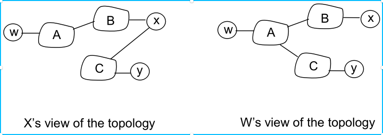

在上述解决方案中，X不知道AC链路，因为X没有接收到包含AC链路的w或y的广告路由(即，X在到达目的地的路径上没有接收包含A和AS C的广告。

P18、BitTorrent文件共享和Skype P2P应用程序。考虑一个BitTorrent文件共享网络，其中对等点1、2和3分别位于存根网络W、X和Y中。由于BitTorrent的文件共享机制，使得Peer 2有可能从Peer 1中获取数据块，然后将这些数据块转发到3，这相当于最终被发送到存根网络Y的B转发数据。

P19、A应该建议B两条路线，A-W和A-V。

A应该只向C建议一条路线，A-V。

C作为路径接收：B-A-W、B-A-V、A-V。

P20、由于Z想要传输Y的流量，Z将以这种方式向Y发送路由广告。这样，当Y有一个发送到可以通过Z到达的IP的数据报时，Y将可以选择通过Z发送该数据报。但是，如果Z将路由转发到Y，Y可以将这些路由重登到X。因此，在这种情况下，Z无法阻止从X到Z的传输。

P21、请求响应模式通常会有更多的开销(以交换消息的数量来衡量)，原因有几个。首先，经理收到的每一条信息都需要两条消息：投票和响应。陷阱只向发送方生成一条消息。如果管理器只希望在发生条件时才得到通知，那么轮询的开销就会更大，因为许多轮询消息可能表明等待条件尚未发生。陷阱只在条件发生时生成消息。

在发生事件时，陷阱还会立即通知经理。使用轮询，管理器需要等待半个轮询周期(平均)，从事件发生到经理(通过其轮询消息)发现事件已经发生。

如果丢失了陷阱消息，托管设备将不会发送其他副本。如果一个投票消息或它的响应丢失了，经理就会知道已经丢失了一条消息(因为答复永远不会到达)。因此，如果需要，经理可以重新投票。

P22、通常，最需要网络管理的时间是在压力时，网络可能会严重拥挤，数据包正在丢失。在TCP上运行SNMP时，TCP的拥塞控制将导致SNMP在网络管理器需要发送SNMP消息时退出并停止发送消息。

[Back to Index](#目录)

<div STYLE="page-break-after: always;"></div>

# 第六章

## 复习题6 

R1、交通方式，如汽车、公共汽车、火车、汽车。

R2、虽然每个链路保证通过链路发送的IP数据报将在链路的另一端无错误地被接收，但不能保证IP数据报将以适当的顺序到达最终目的地。使用IP，同一TCP连接中的数据报可以在网络中采取不同的路由，从而导致出现故障。仍然需要TCP以正确的顺序向应用程序的接收端提供字节流。此外，IP可能由于路由循环或设备故障而丢失数据包。

R3、帧：IP和TCP中也有帧；链路访问；可靠传递：TCP中也有可靠的传递；流控制：TCP中也有流控制；错误检测：IP和TCP中也有错误检测；错误更正；全双工：TCP也是全双工。

R4、当一个节点正在发送时，它将开始从另一个节点接收一个分组，这将发生冲突。

R5、时隙ALOHA：1、2和4(时隙ALOHA仅部分分散，因为它要求所有节点中的时钟是同步的)。令牌环：1，2，3，4。

R6、在第5次碰撞之后，适配器从{0，1，2，…中选择，31。它选择4的概率是1/32。等待204.8微秒。

R7、在民意测验中，讨论领袖一次只允许一个参与者说话，每个参与者都有机会以一种循环的方式交谈。对于象征性的戒指，没有讨论的领导者，但有葡萄酒杯，参与者轮流持有。只有当参与者拿着酒杯时，才允许参与者说话。

R8、当节点发送帧时，节点必须等待帧在整个环周围传播，然后节点才能释放令牌。因此，如果L/R比tprop小，那么协议就会效率低下。

R9、$2^{48}$个MAC地址；$2^{32}$个IPv4地址；$2^{128}$个IPv6地址。

R10、C的适配器将处理这些帧，但是适配器不会将数据报传递到协议栈中。如果使用LAN广播地址，则C的适配器将处理帧并将数据报传递到协议栈。

R11、在广播帧中发送ARP查询，因为查询主机没有将哪个适配器地址对应于所述IP地址。对于响应，发送节点知道应该将响应发送到的适配器地址，因此不需要发送广播帧(必须由LAN上的所有其他节点处理)。

R12、不可能。每个LAN都有自己的一组不同的适配器，每个适配器都有一个唯一的LAN地址。

R13、这三种以太网技术具有相同的帧结构。

R14、2(内部子网和外部因特网)

R15、在802.1Q中有一个12位的VLAN标识符。因此，可以支持212=4096个VLAN。

R16、我们可以把N个开关串在一起。第一个也是最后一个交换机将使用一个端口进行中继；中间的N-2交换机将使用两个端口。因此，端口总数为2+2(N-2)=2N-2端口。

[Back to Index](#目录)

<div STYLE="page-break-after: always;"></div>

## 问题6 

P1、

1 1 1 0 1 

0 1 1 0 0 

1 0 0 1 0 

1 1 0 1 1 

1 1 0 0 0 

P2、假设我们从初始的二维奇偶矩阵开始：

0 0 0 0 

1 1 1 1 

0 1 0 1 

1 0 1 0 

由于在第2行第3栏中出现了一些错误，第2行和第3列的奇偶校验现在在下面的矩阵中是错误的：

0 0 0 0 

1 1 0 1 

0 1 0 1 

1 0 1 0 

现在假设第2行、第2列和第3列有一个位错误。第2行的奇偶校验现在是正确的！列2和3的奇偶校验是错误的，但是我们不能检测错误发生在哪一行！

0 0 0 0

1 0 0 1 

0 1 0 1 

1 0 1 0 

上述示例显示，可以检测到双比特错误(如果没有纠正)。

P3、
```
  01001100 01101001 
+ 01101110 01101011 
------------------------------ 
  10111010 11010100 
+ 00100000 01001100 
------------------------------ 
  11011011 00100000 
+ 01100001 01111001
----------------------------- 
  00111100 10011010 (溢出，然后绕过去) 
+ 01100101 01110010 
------------------------------ 
  10100010 00001100 
```
和的补码是： 01011101 11110011 

P4、

a) 要计算网络检验值，我们将16位量的值加起来： 
```
 00000001 00000010 
 00000011 00000100 
 00000101 00000110 
 00000111 00001000 
 00001001 00001010 
 ------------------------- 
 00011001 00011110 
```
和补码为：11100110 11100001. 
b) 要计算网络检验值，我们将16位量的值加起来： 
```
01000010 01000011 
01000100 01000101 
01000110 01000111 
01001000 01001001 
01001010 01001011 
------------------------- 
10011111 10100100 
```
和补码为：01100000 01011011 

c) 要计算网络检验值，我们将16位量的值加起来
```
01100010 01100011 
01100100 01100101 
01100110 01100111 
01101000 01101001 
01101010 01101011 
------------------------- 
00000000 00000101 
```
和补码为：11111111 11111010.


P5、如果我们将10011分为1010101010 0000，我们可以得到1011011100，剩余R=0100。注意G=10011是CRC-4-ITU标准。 

P6、

a)我们得到1000110000，剩余R=0000。

b)我们得到0101010101，剩余R=1111. 

c)我们得到1011010111，剩余R=1001. 


P7、

a)在不失去通用性的情况下，假设ith位被翻转，其中0<= i <= d+r-1 并假设最不重要的位是第0位。单比特错误意味着接收到的数据为K=D*2R XOR R2 i。很明显，如果我们把K除以G，那么提醒不是零。通常情况下，如果G包含至少两个1，则总是可以检测到单个比特错误。

b)这里的关键洞见是G可以被11(二进制数)除以，但任何奇数的1‘s不能除以11。因此，奇数位错误的序列(不一定是连续的)不能除以11，因此不能被G除以G。

P8、

a)

$E(p)=NP(1-p)^{N-1}$

$E'(p)=N(1-p)^{N-1}-Np(N-1)(1-p)^{N-2}=N(1-p)^{N-2}((1-p)-p(N-1))$

b) 

$E(p^\ast )=N\frac{1}{N}(1-\frac{1}{N})^{N-1}=(1-\frac{1}{N})^{N-1}=\frac{(1-\frac{1}{N})^N}{1-\frac{1}{N}}$

$\lim_{N \to \infty }(1-\frac{1}{N})=1$

$\lim_{N \to \infty }(1-\frac{1}{N})^N=\frac{1}{e}$

因此

$\lim_{N \to \infty }E(p^\ast )=\frac{1}{e}$

P9、

$E(p)=NP(1-p)^{2(N-1)}$

$E'(p)=N(1-p)^{2(N-1)}-Np2(N-1)(1-p)^{2(N-3)}=N(1-p)^{2(N-3)}((1-p)-p2(N-1))$

$E'(p)=0\Rightarrow p^*=\frac{1}{2N-1}$

$E(p^*)=\frac{N}{2N-1}(1-\frac{1}{2N-1})^{2(N-1)}$

$\lim_{N \to \infty }E(p^*)=\frac{1}{2}\cdot \frac{1}{e}=\frac{1}{2e}$

P10、

a)A的平均吞吐量由Pa(1-PB)给出.总效率为Pa(1-PB)PB(1-Pa).

b)A的吞吐量为Pa(1-PB)=2PB(1-PB)=2PB-2(PB)2，B的吞吐量为PB(1-Pa)=PB(1-2PB)=PB-2(PB)2，很明显，A的吞吐量不是B的两倍，为了使PA(1-PB)=2PB(1-Pa)，我们需要PA=2-(Pa/PB)。

c)A的吞吐量为2p(1-p)N1，任何其他节点的吞吐量p(1-p)N-2(1-2p)。

P11、

a) (1 – p(A))4 p(A) 

其中p(A) = A在一个槽中成功的概率 

p(A) = p(A传输并且B不传输并且C不传输并且D不传输) = p(A传输) p(B不传输) p(C不传输) p(D不传输) = p(1 – p) (1 – p)(1-p) = p(1 – p)3 

因此， p(A第一次在5号槽成功) = (1 – p(A))4 p(A) = (1 – p(1 – p)3)4 p(1 – p)3 

b) p(A在4槽中成功) = p(1-p)3 

p(B在4槽中成功) = p(1-p)3 

p(C在4槽中成功) = p(1-p)3 

p(D在4槽中成功) = p(1-p)3 

p(要么A或者B或者C或者D在4号槽中成功) = 4 p(1-p)3 (因为这些事件是相互排斥的) 

c) p(一些结点在一个槽中成功) = 4 p(1-p)3 

p(一个槽中没有结点成功) = 1 - 4 p(1-p)3

因此，p(第一个成功发生在3槽) = p(没有结点在前2个槽中成功) p(一些结点在第三个槽中成功) = (1 - 4 p(1-p)3)2 4 p(1-p)3 

d) 效率 = p(在一个槽中成功) =4 p(1-p)3 


P12、

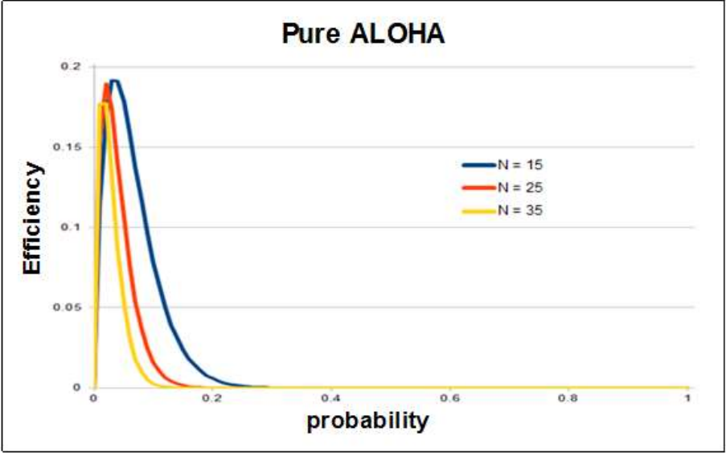

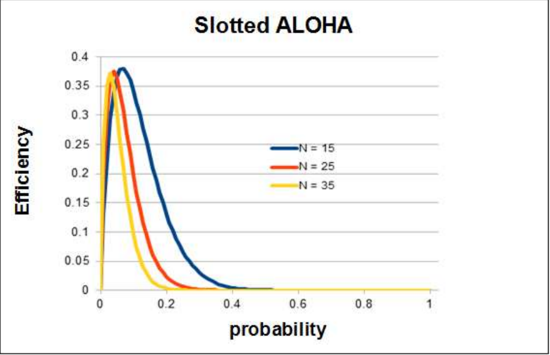

P13、轮询轮的长度为：

$N(Q/R+d_{poll})$

在轮询轮中传输的比特数是NQ。因此，最大吞吐量是:

$\frac{NQ}{N(Q/R+d_{poll})}=\frac{R}{1+\frac{d_{poll}R}{Q}}$

P14、

a)

b)见下图：

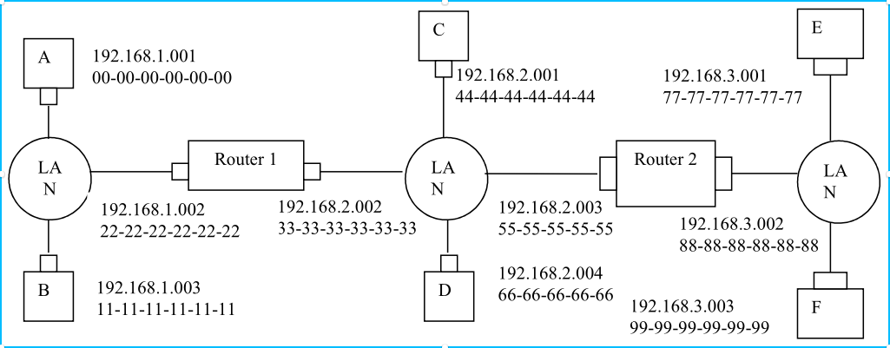

c)
1.E中的转发表确定数据报应路由到接口192.168.3.002。

2.E中的适配器创建具有以太网目的地地址88-88-88-88-88-88-88的以太网数据包。

3.路由器2接收数据包并提取数据报。此路由器中的转发表指示数据报将被路由到198.162.2.002。

4.路由器2然后通过其与IP地址198.162.003的接口发送目的地址为33-33-33-33-33-33-33-33和源地址为55-55-55-55-55-55-55-55-55-55的以太网分组。

5.这一过程一直持续到数据包到达主机B为止。

d)E中的ARP现在必须确定198.162.3.002的MAC地址。主机E在广播以太网帧内发送ARP查询包。路由器2接收查询包并向主机E发送ARP响应包。此ARP响应包由以太网帧承载，以太网目的地地址为77-77-77-77-77-77-77-77。

P15、

a)否。E可以检查主机F的IP地址的子网前缀，然后了解F在同一个局域网上。因此，E不会将数据包发送到默认路由器R1。

从E到F的以太网帧：

源IP=E的IP地址

目的地IP=F的IP地址

源MAC=E的MAC地址

目的地MAC=F的MAC地址

b)不，因为它们不在同一个局域网上。E可以通过检查B的IP地址来发现这一点。

从E到R1的以太网帧：

源IP=E的IP地址

目的地IP=B的IP地址

源MAC=E的MAC地址

目的地MAC=连接到子网的R1接口的MAC地址。

c)交换机S1将通过两个接口广播以太网帧，因为接收到的ARP帧的目的地地址是广播地址。它了解到A驻留在连接到子网1的子网1上，并且S1将更新它的转发表以包括主机A的条目。

是的，路由器R1也接收这个ARP请求消息，但是R1不会将消息转发到子网3。

B不会发送请求A的MAC地址的ARP查询消息，因为这个地址可以从A的查询消息中获得。

一旦交换机S1接收到B的响应消息，它将在其转发表中为主机B添加一个条目，然后删除接收到的帧，因为目的地主机A与主机B在同一个接口上(即A和B位于同一个LAN段上)。

P16、让我们称子网2和3s2之间的切换为S2。也就是说，子网2和3之间的路由器R1现在被交换机S2所取代。

a)否。E可以检查主机F的IP地址的子网前缀，然后了解F在同一个LAN段上。因此，E不会将数据包发送到S2。

从E到F的以太网帧：

源IP=E的IP地址

目的地IP=F的IP地址

源MAC=E的MAC地址

目的地MAC=F的MAC地址

b)是的，因为E想找到B的MAC地址。在这种情况下，E将发送一个ARP查询包，目标MAC地址是广播地址。

该查询包将由交换机1重新广播，最终由主机B。

以太网帧从E接收到S2：

源IP=E的IP地址

目的地IP=B的IP地址

源MAC=E的MAC地址

目的地MAC=广播MAC地址：FF-FF-FF-FF-FF-FF。

c)交换机S1将通过两个接口广播以太网帧，因为接收到的ARP帧的目标地址是广播地址。它了解到A驻留在连接到子网1的子网1上，并且S1将更新它的转发表以包括主机A的条目。

是的，路由器S2也接收这个ARP请求消息，S2将这个查询包广播到它的所有接口。

B不会发送请求A的MAC地址的ARP查询消息，因为这个地址可以从A的查询消息中获得。

一旦交换机S1接收到B的响应消息，它将在其转发表中为主机B添加一个条目，然后删除接收到的帧，因为目的地主机A与主机B在同一个接口上(即A和B位于同一个LAN段上)。

P17、等待51200比特时间。对于10 Mbps，这个等待是

$\frac{51.2\times 10^3 bits}{10\times 10^6 bps}=5.12ms$

对于100Mbps，等待时间是512$\mu s$

P18、在t=0时A发射。在t=576时，A将完成传输。在最坏的情况下，B在时间t=324开始发送，即A的第一个帧到达B之前的时间。在时间t=324+325=649时 B的第一个比特到达A时，A在检测到B已经发送之前就完成了传输，所以A错误地认为它的帧在没有碰撞的情况下被成功地传输了。

P19、

|时间，t|事件|
|------|---|
|0|A和B开始传输|
|245|A和B检测碰撞|
|293|A和B结束拥塞信号传输|
|293+245=538|B的最后一比特到达A；A检测空闲线路|
|538+96=634|A开始传输|
|293+512=805|B返回到第二步|
||B必须对空闲信道进行96 bit的检测，然后才能传输。|
|634+245=879|A的传送到达B|

由于A的重传在B的预定重传时间(805+96)之前到达B，所以B在A重传时不进行传输，因此A和B不发生碰撞，因此指数退避算法中出现的因子512足够大。

P20、

a)设Y是表示插槽数目的随机变量，直到成功：

$P\left ( Y=m \right )=\beta \left ( 1-\beta \right )^{m-1}$

$\beta$表示成功的概率。

这是一个几何分布，它的平均值为$1/\beta$。连续浪费的插槽数为X=Y-1 其中

$x=E[X]=E[Y]-1=\frac{1-\beta}{\beta}$

$\beta = Np\left ( 1-p \right )^{N-1}$

$x=\frac{1-Np(1-p)^{N-1}}{Np(1-p)^{N-1}}=\frac{k}{k+x}=\frac{k}{k+\frac{1-Np(1-p)^{N-1}}{Np(1-p)^{N-1}}}$

效率

b)最大化效率等同于最小化x，这相当于最大化$\beta$。我们从文本中得知，$\beta$在$p=\frac{1}{N}$处是最大的。

c)效率=$\frac{k}{k+\frac{1-(1-\frac{1}{N})^{N-1}}{(1-\frac{1}{N})^{N-1}}}$

$\lim_{N \to\infty } efficiency =\frac{k}{k+\frac{1-1/e}{1/e}}=\frac{k}{k+e-1}$

d)显然，当k趋近于无穷时$\frac{k}{k+e-1}$趋近于1。

P21、

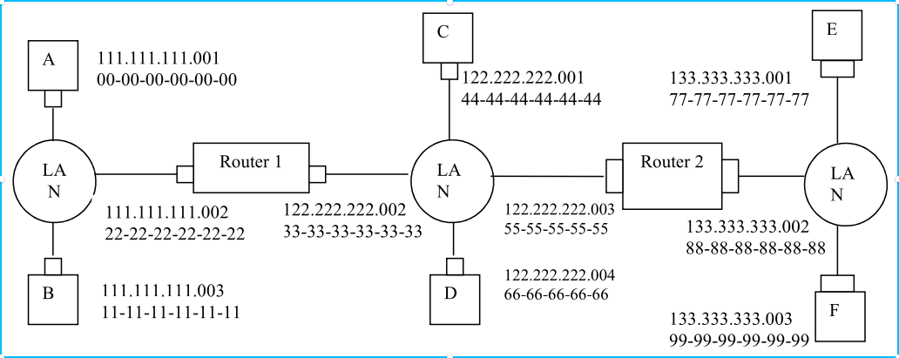

i) 从A到右路由器：

   源MAC地址：00-00-00-00-00-00 

   目的地MAC地址：22-22-22-22-22-22 

   源IP：111.111.111.001 

   目的地IP：133.333.333.003 

ii) 从交换机到右路由器：

   源MAC地址：33-33-33-33-33-33

   目的地MAC地址: 55-55-55-55-55-55 

   源IP: 111.111.111.001 

   目的地IP: 133.333.333.003 

iii) 从右路由器到F：

   源MAC地址: 88-88-88-88-88-88 

   目的地MAC地址: 99-99-99-99-99-99 

   源IP: 111.111.111.001 

   目的地IP: 133.333.333.003


P22、

i) 从A到交换机：

   源MAC地址：00-00-00-00-00-00 

   目的地MAC地址：55-55-55-55-55-55 

   源IP：111.111.111.001 

   目的地IP：133.333.333.003 

ii) 从交换机到右路由器：

   源MAC地址：00-00-00-00-00-00

   目的地MAC地址: 55-55-55-55-55-55 

   源IP: 111.111.111.001 

   目的地IP: 133.333.333.003 

iii) 从右路由器到F：

   源MAC地址: 88-88-88-88-88-88 

   目的地MAC地址: 99-99-99-99-99-99 

   源IP: 111.111.111.001 

   目的地IP: 133.333.333.003 


P23、如果所有11=9.2节点以100 Mbps的最大可能速率发送数据，则总总吞吐量为11*100=1100 Mbps是可能的。

P24、每个部门中心都是一个冲突域，最大吞吐量为100 Mbps。连接Web服务器和邮件服务器的链接的最大吞吐量为100 Mbps。因此，如果三个碰撞域以及Web服务器和邮件服务器以各自100 Mbps的最大可能速率发送数据，则11端系统之间的总总吞吐量可达到500 Mbps。

P25、所有的11端系统都将处于相同的碰撞域。在这种情况下，在11端系统中，最大总吞吐量为100 Mbps是可能的。

P26、

|行为|开关表状态|链路包前往|解释|
|---|---------|--------|---|
|B发送一帧给E|与B的MAC地址对应的交换机学习接口|A,C,D,E,F|由于交换机表是空的，所以交换机不知道与E的MAC地址对应的接口|
|E发送一帧给B|与E的MAC地址对应的交换机学习接口|B|由于交换机已经知道与B的MAC地址对应的接口|
|A发送一帧给B|与A的MAC地址对应的交换机学习接口|B|由于交换机已经知道与B的MAC地址对应的接口|
|B发送一帧给A|切换表状态与以前相同。|A|由于交换机已经知道与A的MAC地址对应的接口|

P27、

a）填充$L\cdot8$ bits需要的时间是：

$\frac{L\cdot8}{128\times 10^3 } sec = \frac{L}{16}ms$

b）对于L=1500，包化延迟为：

$\frac{1500}{16}ms=93.75 ms$

对于L=50，包化延迟为：

$\frac{50}{16}ms=3.125 ms$

c）存储和转发延迟为$\frac{L \cdot 8+40}{R}$

对于L=1500，延迟为

$\frac{1500\cdot 8+40}{622\times 10^{6}} sec \approx 19.4 \mu s$

对于L=50，存储和转发延迟<1微秒。

d）对于典型的链路速度，存储和转发延迟对于这两种情况都是很小的.然而，L=1500的分组化延迟对于实时语音应用来说太大了.

P28、EE部门这三台计算机(从左到右)的IP地址是：111.111.1.1、111.111.1.2、111.111.1.3。子网掩码为111.111.1/24。

CS部门这三台计算机(从左到右)的IP地址是：111.111.2.1、111.111.2.2、111.111.2.3。子网掩码为111.111.2/24。

连接到端口1的路由器接口卡可以配置为包含两个子接口IP地址：111.111.1.0和111.111.2.0。第一种是针对EE部门的子网，第二种是针对CS部门的子网。每个IP地址都与VLAN ID相关联。假设111.111.1.0与VLAN 11相关联，111.111.2.0与VLAN 12相关联。这意味着来自子网111.111.1/24的每一帧将被添加一个带有VLAN ID 11的802.1q标记，而来自111.111.2/24的每一帧将被添加一个带有VLAN ID 12的802.1q标记。

假设EE部门中具有IP地址111.111.1.1的主机A希望向CS部门中的主机B(111.111.2.1)发送IP数据报。主机A首先将IP数据报(目的地为111.111.2.1)封装到具有与连接到交换机端口1的路由器接口卡的MAC地址相等的目标MAC地址的帧中。一旦路由器接收到该帧，然后将其传递到IP层，该层决定通过子接口111.111.2.0将IP数据报转发到子网111.111.2/24。然后路由器将IP数据报封装成一个帧并发送到端口1。请注意，该帧有一个802.1q标记VLAN ID 12。一旦交换机接收到帧端口1，它就知道该帧被发送到ID为12的VLAN，因此交换机将该帧发送到位于CS部门的主机B。一旦主机B接收到此帧，它将删除802.1q标记。

P29、

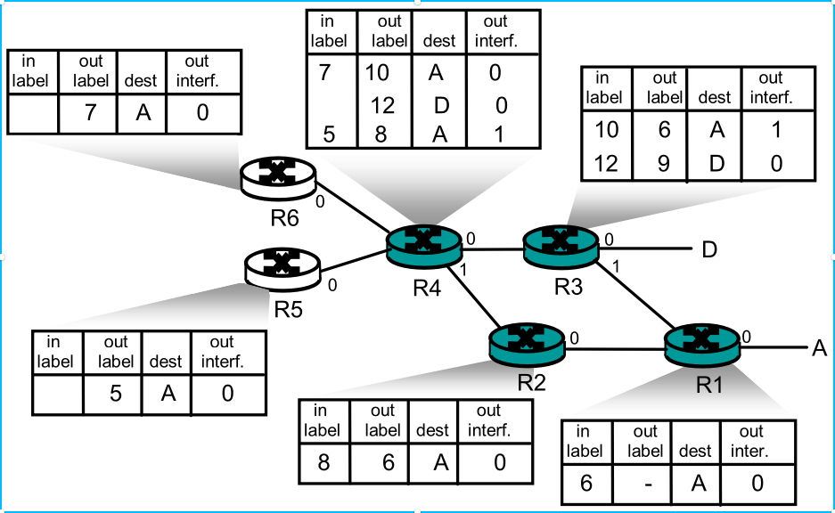

P30、

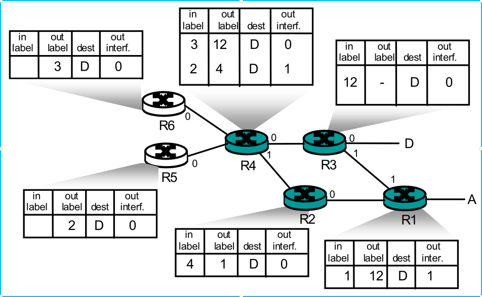

P31、(下面的说明很简短，但包含了所有主要的关键步骤和涉及的关键协议。)

您的计算机首先使用DHCP获取IP地址。您的计算机首先在DHCP服务器发现步骤中创建一个指定为255.255.255.255的特殊IP数据报，并将其放在以太网帧中并在以太网中广播。然后，按照DHCP协议中的步骤，您的计算机能够获得具有给定租约时间的IP地址。

以太网上的DHCP服务器还为计算机提供了第一跳路由器的IP地址列表、计算机所在子网的子网掩码以及本地DNS服务器的地址(如果存在的话)。

由于您的计算机的ARP缓存最初是空的，您的计算机将使用ARP协议来获取第一跳路由器和本地DNS服务器的MAC地址。

您的计算机将首先获得您想要下载的网页的IP地址。如果本地DNS服务器没有IP地址，则计算机将使用DNS协议查找网页的IP地址。

一旦计算机拥有了网页的IP地址，如果网页不驻留在本地Web服务器中，它将通过第一跳路由器发送HTTP请求。HTTP请求消息将被分割并封装到TCP数据包中，然后进一步封装到IP数据包中，最后封装到以太网帧中。您的计算机将以太网帧发送到第一跳路由器.一旦路由器接收到这些帧，就会将它们传递到IP层，检查其路由表，然后将数据包从所有接口发送到正确的接口。

然后，您的IP包将通过互联网路由，直到它们到达Web服务器。

承载网页的服务器将通过HTTP响应消息将网页发送回计算机。这些消息将被封装到TCP数据包中，然后进一步封装到IP数据包中。这些IP数据包遵循IP路由，最终到达第一跳路由器，然后路由器将这些IP数据包封装到以太网帧中，将它们转发到计算机上。

P32、

a)每个流均匀分布一个链路的容量，然后80个流通过B到接入路由器10Gbps链路（以及接入路由器到边界路由器链路），每个都将仅接收10Gbps/80=125Mbps

b)在图5.31的拓扑中，第一层和第三层2交换机之间有四个不同的路径，一起为从机架14到机架912的流量提供40Gbps。类似地，第二层和第四层2交换机之间有四个链路，一起为来自机架58到1316的业务提供40Gbps。因此，总的总带宽是80Gbps，并且每个流速的值是1Gbps。

c)现在20个流量需要在TOR交换机对之间共享每1Gbps带宽。因此，主机到主机的比特率将为0.5Gbps。

P33、

a)电子邮件和视频应用程序使用第四个机架占时间的0.1%。

b)两个应用需要第四机架的概率为0.001*0.001=10-6.

c)假设前三个机架是用于视频的，下一个机架是用于两个机架的共享机架视频和电子邮件，接下来的三个机架用于电子邮件。我们假设第四个机架拥有电子邮件和视频应用程序所需的所有数据和软件。使用图5.31的拓扑，两个应用程序都具有足够的带宽内带宽只要两者都不同时使用第四机架。从B部分，均为：使用第四个机架不超过.00001%的时间，该时间在.0001%以内要求。

[Back to Index](#目录)

<div STYLE="page-break-after: always;"></div>

# 第七章

## 复习题7 

1、在基础设施模式的操作，每一个无线主机都通过一个基站（接入点）连接到更大的网络。如果不是在基础模式操作，网络以ad-hoc模式操作。在ad-hoc模式下，无线主机没有可连接的基础设施。在缺少基础设施的情况下，主机必须自己提供如路由器、地址分配、DNS类似名称翻译和更多的服务。

2、

a)单点，基于设备

b)单点，缺少设备

c)多点，基于设备

d)多点，缺少设备

3、路径损耗是由于电磁信号在物质中传播时的衰减所致。多径传播导致接收端接收信号模糊，当电磁波部分反射物体和地面时，在发送者和接收者之间选择不同长度的路径时发生。当另一个源也在与无线网络相同的频率范围内发送时，来自其他源的干扰发生。

4、

a)增加传输功率

b)降低传输率

5、AP发射信标帧。AP的信标帧将通过11个信道中的一个进行传输。信标帧允许附近的无线站发现和识别AP。

6、假

7、AP发射信标帧。AP的信标帧将通过11个信道中的一个进行传输。信标帧允许附近的无线站发现和识别AP。

8、假

9、每个无线站可以设置RTS阈值，使RTS/CTS序列仅在要发送的数据帧大于阈值时使用。这确保RTS/CTS机制仅用于大帧。

10、不，不会有什么好处的。假设有两个站同时发送，它们都使用RTS/CTS。如果RTS帧与数据帧一样长，则只要信道被浪费在两个冲突的数据帧上，信道就会被浪费。因此，只有当RTS/CTS帧明显小于数据帧时，RTS/CTS交换才是有用的。

11、最初，交换机在其转发表中有一个条目，该条目将无线站与较早的AP相关联。当无线站与新AP相关联时，新AP创建具有无线电台MAC地址的帧并广播该帧。该帧由交换机接收。这迫使交换机更新其转发表，以便通过新的AP发送发送到无线站的帧。

12、任何普通的蓝牙节点都可以是主节点，而802.11网络中的接入点是特殊的设备(普通的无线设备，如膝上型计算机，不能用作接入点)。

13、假

14、“机会主义调度”是指将物理层协议与发送方和接收方之间的信道条件相匹配，并根据信道条件选择要发送数据包的接收方。这使得基站能够充分利用无线媒体。

15、UMTS对于GSM和CDMA-2000对与IS-95.

16、eNodeB的数据平面作用是在UE(通过LTE无线接入网)和P-GW之间转发数据报。它的控制平面作用是代表UE处理注册和移动信令业务。

移动管理实体(MME)代表驻留在其控制单元中的ue执行连接和移动管理。它从HHS接收UE订阅信息。

分组数据网络网关(P-GW)将IP地址分配给UE并执行QoS强制执行。作为隧道端点，它还在向UE转发数据报时执行数据报封装/解封装。

服务网关(S-GW)是数据平面移动锚点，因为所有UE业务都将通过S-GW.S-GW还执行收费/计费功能和合法的流量拦截。

17、在3G体系结构中，话音和数据有独立的网络组件和路径，即话音通过公用电话网络，而数据通过公共互联网。4G体系结构是一个统一的全IP网络体系结构，即语音和数据在IP数据报中传送到或从无线设备传送到多个网关，然后传送到因特网的其他部分。

4G网络体系结构将数据和控制平面清晰地分开，这与3G体系结构不同。

4G架构有一个增强的无线接入网(E-UTRAN)，它不同于3G的无线接入网UTRAN。

18、没有。在连接到Internet的整个过程中，节点可以保持与同一接入点的连接(因此，不能移动)。移动节点是随着时间的推移将其连接点转换为网络的节点。由于用户总是通过同一个接入点访问Internet，所以她不能移动。

19、移动节点的永久地址是其在家庭网络中的IP地址。地址的关心是它在访问外国网络时得到的地址.COA由外部代理(可以是外部网络中的边缘路由器或移动节点本身)分配。

20、假

21、GSM中的家庭网络维护一个称为归属位置寄存器的数据库(HLR)，其包含永久单元电话号码和用户简档关于其每个用户的信息。HLR还包含关于这些用户的当前位置。被访问的网络维护一个数据库称为访问位置寄存器(VLR)，其包含每个移动台的条目当前位于由VLR服务的网络部分中的用户。VLR条目因此，当移动用户进入并离开网络时，进入并进入。

移动IP中归属网络中的边缘路由器与GSM中的HLR和GSM中的HLR类似,国外网络中的边缘路由器与GSM中的VLR类似。

22、锚MSC是在第一次呼叫开始时由移动访问的MSC；因此，锚MSC在呼叫期间保持不变。在整个呼叫持续时间内，无论由移动执行的MSC间传输的次数如何，呼叫都是从家乡MSC路由到锚MSC，然后从锚MSC路由到当前移动位置所在的已访问MSC。

23、

a)本地恢复

b)TCP发送方对无线链路的感知

c)拆分连接方法

[Back to Index](#目录)

<div STYLE="page-break-after: always;"></div>

## 问题7 

P1、
位d1对应的输出 = [-1,1,-1,1,-1,1,-1,1]

位d0对应的输出= [1,-1,1,-1,1,-1,1,-1] 

P2、
发送方2输出为：

[1,-1,1,1,1,-1,1,1]

[1,-1,1,1,1,-1,1,1] 

P3、

$d_{2}^{1}=\frac{1 \times 1+(-1)\times(-1)+1 \times 1+1 \times 1+1 \times 1+(-1)\times(-1)+1\times1+1\times1}{8}=1$

$d_{2}^{2}=\frac{1 \times 1+(-1)\times(-1)+1 \times 1+1 \times 1+1 \times 1+(-1)\times(-1)+1\times1+1\times1}{8}=1$


P4、

发送方 1: (1, 1, 1, -1, 1, -1, -1, -1) 

发送方 2: (1, -1, 1, 1, 1, 1, 1, 1) 


P5、

a)两个AP通常具有不同的SSID和MAC地址。无线到达CAFTA的站将与其中一个SSID（即，其中一个AP）相关联。在关联之后，在新站点和AP之间存在虚拟链路。标记AP1和AP2。假设新站点与AP1相关联。当新的站发送帧，它将被寻址到AP1。尽管AP2还将接收帧，因为帧未被寻址，所以它将不处理帧。是的。因此，两个ISP可以在同一信道上并行工作。然而,这两个ISP将共享相同的无线带宽。如果不同的无线站不同ISP同时发送，会发生冲突。对于802.11b，最大值两个ISP的聚合传输速率为11Mbps。

b)现在，如果不同ISP（以及因此不同的信道）中的两个无线站发送同时，不会发生碰撞。因此,最大骨料对于802.11b，两个ISP的传输速率为22Mbps。

P6、假设无线站h1有1000个长帧要发送。(h1可能是将MP3转发到其他无线电台的AP。)假设最初h1是唯一想要传输的站，但是在传输其第一个帧的中途，h2想发送一个帧。为了简单起见，也假设每个站都能听到其他站的信号(也就是说，没有隐藏的终端)。在传输之前，H2将感觉到信道是繁忙的，因此选择一个随机的退避值。

现在假设在发送第一个帧之后，h1返回到步骤1；也就是说，它等待一个短时间(DIFS)，然后开始发送第二个帧。h1的第二帧将被传输，而h2被卡在退避中，等待空闲信道。因此，h1应该能够在h2有机会访问信道之前传输其所有1000帧。另一方面，如果h1在发送帧后进入步骤2，那么它也会选择一个随机的退避值，从而给h2一个公平的机会。因此，公平是这种设计选择的理由。

P7、没有数据的帧有32个字节长。假设传输速率为11 Mbps，发送控制帧(例如RTS帧、CTS帧或ACK帧)的时间为(256 bits)/(11 Mbps)=23 USEC。传输数据帧所需的时间为(8256 bits)/(11 Mbps)=751

P8、

a) 1 message/ 2 slots 

b) 2 messages/slot 

c) 1 message/slot 

d)
   i) 1 message/slot 

   ii) 2 messages/slot 

   iii) 2 messages/slot 

e) 

   i) 1 message/4 slots 

   ii)

   slot 1: Message A→ B, message D→ C 

   slot 2: Ack B→ A 

   slot 3: Ack C→ D 

   = 2 messages/ 3 slots 

iii) 

   slot 1: Message C→ D 

   slot 2: Ack D→C, message A→ B 

   slot 3: Ack B→ A 

   = 2 messages/3 slots

P10、

a)如果只向节点A发送10 Mbps，则此解决方案不公平，因为只有A正在得到服务。所谓“公平”，意味着四个节点中的每一个都应该分配相同数量的插槽。

b)对于公平性要求，使每个节点在每个下游子帧期间接收相等数量的数据，让n1、n2、n3和n4分别表示A、B、C和D所得到的时隙数。

现在，在1时隙中发送给A的数据=10 tMbit(假设每个时隙的持续时间为t)，

因此，发送给A(在N1时隙中)的总数据量=10tN1，

同样地，发送给B、C和D的数据总量分别等于5tN2、2.5tn3和tN4。

现在，为了满足既定的公平要求，我们有以下条件：

10t n1 = 5t n2 = 2.5t n3 = t n4 

因此 
   n2 = 2 n1 

   n3 = 4 n1 

   n4 = 10 n1 

现在， 槽的总数是N。因此， 

   n1+ n2+ n3+ n4 = N 

   i.e. n1+ 2 n1 + 4 n1 + 10 n1 = N 

   i.e. n1 = N/17 

因此， 
   n2 = 2N/17 

   n3 = 4N/17 

   n4 = 10N/17 

平均传输速率为： 
   (10t n1+5t n2+ 2.5t n3+t n4)/tN 

   = (10N/17 + 5 * 2N/17 + 2.5 * 4N/17 + 1 * 10N/17)/N 

   = 40/17 = 2.35 Mbps 

c)在子帧中，节点A接收的数据是节点B、C和D的两倍。因此，

 10tn1 = 2 * 5tn2 = 2 * 2.5tn3 = 2 * tn4 

 i.e. n2 = n1 

 n3 = 2n1 

 n4 = 5n1 

同样的， 

 n1 + n2 + n3 + n4 = N 

 i.e. n 1+ n1 + 2n1 + 5n1 = N 

 i.e. n1 = N/9 

平均传输速率是： 

 (10t n1+5t n2+ 2.5t n3+t n4)/tN 

 = 25/9 = 2.78 Mbps 

同样，考虑节点B、C或D接收的数据是任何其他节点的两倍，可以计算平均传输速率的不同值。

P11、

a)否。所有路由器可能无法立即路由数据报。这是因为距离向量算法（以及AS之间的路由协议，如是分散的，需要一些时间来终止。所以，在这段时间算法仍在运行，因为广告来自新的外国网络，一些路由器可能无法将数据报路由到移动节点。

b)是。当其中一个节点刚刚离开一个外国网络时可能会发生这种情况加入了一个新的外国网络。在这种情况下，从旧的路由条目外国网络可能没有完全撤回时，从新的网络正在被传播。

c)路由器学习移动节点路径所需的时间取决于的路由器和边缘路由器之间的跳数节点。

P12、

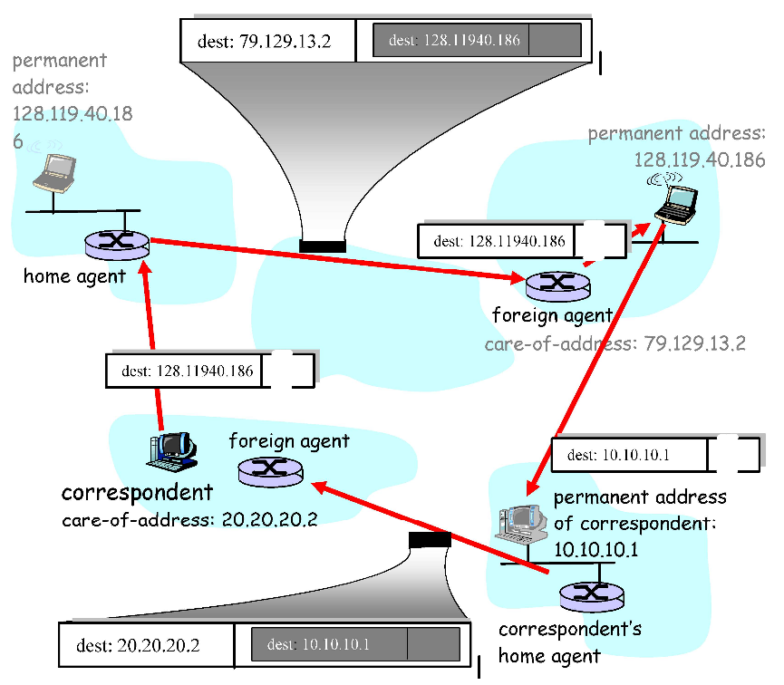

如果通讯员是可移动的，那么发送给记者的任何数据报都必须通过通讯员的家庭代理。访问的网络中的外国代理也需要参与，因为正是该外国代理将通讯员的位置通知通讯员的本国代理。记者的本地代理接收到的数据报需要在通讯员的本地代理和外部代理之间封装/隧道化(如图6.23顶部的封装图所示)。

P13、因为数据报必须首先转发给归属代理，并且从那里转发到移动设备，所以延迟通常将比通过直接路由更长。但是，可能的是，从通信方到移动设备的直接延迟(即，如果数据报没有通过归属代理路由)实际上可以小于从通信方到归属代理和从那里到移动设备的延迟的总和。这取决于这些不同路径段的延迟。注意，间接路由还增加了归属代理处理(例如，封装)延迟。

P14、首先，我们注意到在第6.5节末尾讨论了链接。在使用通过归属代理的间接路由进行链接的情况下，将发生以下事件：
- 移动节点到达A，A通知归属代理移动正在访问A，移动到移动端的数据报现在应该被转发到A中指定的注意地址(COA)。
- 移动节点移动到B。B处的外国代理必须通知A处的外国代理，该移动设备已不在A中，但实际上是在B中，并且在B中有指定的COA。从那时起，A中的外国代理将接收到的数据报发送到A中的移动COA到B中的移动COA。
- 移动节点移动到C。C处的外国代理必须通知B处的外国代理，该移动设备已不在B中，但实际上是C中的C，并且在C中具有指定的COA。从那时起，B中的外国代理将它收到的(从A中的外国代理接收的)发送到移动台B中的COA的数据报转发到移动的C中的COA。

请注意，当移动设备离线(即，没有地址)或返回到其家乡网络时，必须删除由A、B和C中的外国代理维护的数据报转发状态。这种拆卸也必须通过信令消息来完成。请注意，本地代理不知道移动设备的移动性超过A，并且通讯员根本不知道移动设备的移动性。

在不使用链接的情况下，将发生以下事件：
- 移动节点到达A，A通知归属代理移动正在访问A，移动到移动端的数据报现在应该被转发到A中指定的注意地址(COA)。
- 移动节点移动到B。B处的外国代理必须通知A处的外国代理和本地代理，移动台已不再是A中的居民，但实际上是在B中，并且在B中有指定的COA。A中的外国代理可以移除其关于移动的状态，因为它不再在A中，因此本地代理将转发它在B中收到的发送到移动的COA的数据报。
- 移动节点移动到C。C处的外国代理必须通知B处的外国代理和本地代理，移动台已不再是B中的居民，但实际上是C中的C，并且在C中有指定的COA。B中的外国代理可以移除其关于移动的状态，因为它不再在B中。从那时起，本地代理将转发它在C中收到的发送到移动的COA的数据报。

当移动设备离线或返回其家庭网络时，必须移除外国代理在C中维护的数据报转发状态。这种拆卸也必须通过信令消息来完成。请注意，本地代理总是知道移动当前的外部网络。然而，记者仍然幸灾乐祸地不知道手机的移动性。

P15、在同一个访问网络中，两个移动电话的地址肯定是相同的。事实上，如果地址是外国代理人的地址，那么这个地址也是一样的.一旦外国代理解封装隧道数据报并确定移动地址，则需要使用单独的地址将数据报分别发送到访问网络中的不同目的地(手机)。

P16、如果向HLR提供了MSRN，则当MSRN发生变化时(例如，当切换要求MSRN改变时)，必须在HLR中更新MSRN的值。在HLR中拥有MSRN的优点是可以快速提供值，而无需查询VLR。通过提供VLR而不是MSRN的地址，无需刷新HLR中的MSRN。

[Back to Index](#目录)

<div STYLE="page-break-after: always;"></div>

# 第八章

## 复习题8

R1、机密性是原始明文消息不能由拦截原始明文消息的密文加密的攻击者确定的属性。消息完整性是接收器可以检测发送的消息(无论是否加密)在传输中改变的属性。这两个概念是不同的概念，一个可以没有另一个概念。在传输中被更改的加密消息仍然是机密的(攻击者不能确定原始明文)，但如果未检测到错误，则不会具有消息完整性。类似地，在传输(和检测到)中被改变的消息可能已经以明文发送，因此不会是机密的。

R2、用户的笔记本电脑和一个web服务器；（ii）两个路由器；（iii）两个DNS名称服务器

R3、对称密钥系统和公钥系统的一个重要区别是
对称密钥系统发送者和接收者必须知道相同的（秘密）密钥。

在公钥系统中，R。这个加密密钥是全世界都知道的（包括发送方），但是解密钥匙只有接收者知道。

R4、在这种情况下，将执行已知的明文攻击。如果发送者加密的消息是由攻击者选择的，那么这将是被选择的明文攻击。

R5、一个8块密码有$2^8$个可能的输入块.每个映射都是两个输入块的排列，所以有$2^8!$可能的映射；所以有$2^8!$可能的钥匙。

R6、如果每个用户想要与N个其他用户通信，则每对用户必须必须具有共享对称密钥。存在n*(n-1)/2这样的对,因此,n*(n-1)/2键。利用公共密钥系统,每个用户具有公共密钥,众所周知，私有密钥(它是秘密的并且仅由用户知道)。在那里因此是公共密钥系统中的2n个密钥。

R7、a mod n=23，b mod n=4

所以(a*b) mod n=23*4=92

R8、175

R9、消息摘要的一个要求是，给定消息M，很难找到具有相同消息摘要的另一个消息M‘，作为推论，给定消息摘要值很难找到具有该消息摘要值的消息M’‘。我们有“消息完整性”，在某种意义上，我们有合理的信心，即给定消息M及其签名消息摘要，消息没有被更改，因为消息摘要是计算和签名的。Internet校验和不是这样的，我们在图7.18中看到，很容易找到两条具有相同Internet校验和的消息。

R10、没有。这是因为散列函数是单向函数。也就是说，给定任何哈希值，原始消息都无法恢复(给定h，使得h=H(M)，则不能从h恢复m)。

R11、这显然是有缺陷的。Truddy，攻击者，可以先嗅探通信并且通过从H(M)S中提取最后一部分数字来获得共享秘密S。然后,Truddy可以通过创建自己的消息T并发送(T,h(t)s)。

R12、假设Bob向Alice发送加密文档。要验证，Alice必须是能够说服自己Bob发送了加密的文档。为了不可伪造，Alice必须能够使自己确信只有Bob可以发送加密的加密文档(例如，没有其他人可以猜出密钥并加密/发送)(文件)为非声誉的，Alice必须能够说服其他人只有鲍勃发了这份文件。为了说明后一种区分,假设Bob和Alice共享密钥，他们是世界上唯一知道的人钥匙。如果Alice接收用密钥加密的文档，并且知道如果她自己没有对文档进行加密，则该文档是已知的可验证和不可伪造（假设适当强的加密系统）使用)。然而，Alice不能说服其他人Bob必须已经发送了文档，因为实际上爱丽丝知道自己的钥匙，并且可能已经加密/发送了文件。

R13、公钥签名的消息摘要是“较好”，其中一个只需要加密(使用私钥)短消息摘要，而不是整个消息。因为公开了使用像RSA这样的技术的密钥加密是昂贵的，需要签名(加密)比大量数据少的数据量。

R14、这是假的。要创建证书，certifier.com将包括数字签名，这是foo.com信息（包括其公共密钥）的散列，并与certifier.com的私钥。

R15、对于基于MAC的方案，Alice必须与每个潜在的接收者建立共享密钥。对于数字签名，她对每个接收者使用相同的数字签名；数字签名是通过用她的私钥签名消息的散列来创建的。数字签名显然是更好的选择。

R16、现时的目的是防范重放攻击。

R17、生命周期中的一次意味着发送nonce的实体将不再使用该值来检查另一个实体是否“活动”。

R18、在中间人攻击中，攻击者将自己置于Alice和Bob之间，改变它们之间发送的数据。如果Bob和Alice共享秘密认证键，然后将检测到任何更改。

R19、Alice提供数字签名，Bob可以从中验证该消息来自艾丽丝。PGP使用数字签名，而不是MAC，用于消息完整性。

R20、是假的。SSL使用隐式序列号。

R21、握手中的随机不连续的目的是为了抵御连接重播攻击。

R22、真的。IV通常是在清除中发送的。在SSL中，它在SSL握手期间发送。

R23、客户端将生成预主密钥(PMS)后，它将用Alice对其进行加密公钥，然后将加密的PMS发送到Truddy。特鲁迪将无法解密PMS，因为她没有Alice的私钥。因此,Truddy将不能够确定共享的认证密钥。她可以猜猜看一个人选择随机密钥。在握手的最后一个步骤中，她向BobA发送所有握手消息的MAC，使用所猜测的验证密钥。当Bob接收MAC，MAC测试将失败，Bob将结束TCP连接。

R24、是假的。通常，在主机A和主机B之间首先建立IPsecSA。然后，流中的分组使用SA。

R25、是假的。IPsec将为其发送的每个数据包增加序列号。

R26、假的。IKE SA用于建立一个或多个IPSec SAS。

R27、01011100

R28、正确

R29、过滤表和连接表。连接表跟踪连接，允许更好地过滤数据包。

R30、正确

R31、正确

R32、如果没有数据包过滤器，则该机构的网络中的用户仍将能够直接连接到机构的网络之外的主机。所述过滤器强制用户首先连接到应用程序网关。

R33、正确

[Back to Index](#目录)

<div STYLE="page-break-after: always;"></div>

## 问题8

P1、“这是一个简单的问题”的编码是“UASI我的cmiw lokngch”。“rmij‘u uamu xyj”的解码是“没有那么有趣”。

P2、如果特鲁迪知道“bob”和“Alice”这两个词出现在文本中，那么她就会知道b，o，a，l，i，c，e的密文(因为“bob”是消息中唯一的回文，而“Alice”是唯一的5个字母。)如果Trudy知道7个字母的密文，那么她只需要尝试19！，而不是26！明文-密文对。19！还有26！差别是26*25*24.*20，等于3315312000，或大约10^9

P3、字母表中的每一个字母出现在短语“快速狐狸跳过懒惰”的短语中。BrownDog."在选定的明文攻击中(攻击者拥有此短语)明文和密文,凯撒密码将被破坏-入侵者将了解每个明文字符的密文字符。然而，Vigenere密码不总是将给定明文字符转换为相同的密文每次字符，因此Vigenere密码将不会立即被打破。此选定的明文攻击。

P4、

A)输出等于00000101次重复八次。

B)输出等于00000101次重复，7次乘以10000101次。

c)我们有(ARBRCR)R=CBA，其中A，B，C是字符串，R是逆运算。因此：

1.对于(A)，输出为10100000次，重复8次；

2.对于(B)，输出为10100001 10100000次，重复7次。

P5、

a)有8个表格。每个表格都有28个条目。每个条目具有8位。每个表*大小的表*大小*每个条目大小=8*28*8=214位

b)有264条目的。每个条目具有64位。271位

P6、

a)100100100=>011011011 特鲁迪将知道三个街区的明文是相同的。 c（i）=KS（m（i）异或c（i-1）） c（1）=KS（100XOR111）=KS（011）=100 c（2）=KS（100XOR100）=KS（000）=110 c（1）=KS（100XOR110）=KS（010）=101。

P7、

a)我们被给予了P-3和Q为11。因此，我们有N-33和Q-11。选择E或9（它也许是个好主意给学生一个提示：9是一个很好的选择，因为所得到的计算不太可能遇到比数值稳定性问题更小的数值稳定性问题。E.)自3和(p.1)*(q/1)*(20)中的其他选择没有共同的因素。选择D或9也使得E*D/81和因此E*D或80完全可被整除。20.现在，我们可以使用N/33、E或9执行RSA加密和解密，并且D/9。

letter m m**e ciphertext = m**e mod 33 

d 4 262144 25 

o 15 38443359375 3 

g 7 40353607 19 

ciphertext c**d m = c**d mod n letter 

25 38146972265625 4 d 

3 19683 15 o 

19 322687697779 7 g 

我们首先将每个字母视为5位数字：00100、01111、00111。现在我们将每个字母连接到001000111100111并加密生成的十进制数编号M=4583。级联十进制数m(=4583)大于电流n(＝33)。我们需要m<n，因此我们使用p=43,q=107,n=p*q=4601,z=(p-1)(q-1)=4452。E=61，D=73

ciphertext = m**e mod 4601 

m**e= 21386577601828057804089602156530567188611499869029788733808438

804302864595620613956725840720949764845640956118784875246785033236197

777129730258961756918400292048632806197527785447791567255101894492820

972508185769802881718983 

ciphertext = m**e mod 4601 = 402 

c**d=283813313619771634195712132539793287643533147482536209328405262793

027158861012392053287249633570967493122280221453815012934241370540204

5814598714979387232141014703227794586499817945633390592 

ciphertext = m**e mod 4601 = 4583 


P8、p = 5, q = 11 

a) n = p*q = 55, z = (p-1)(q-1) = 40 

b) e = 3 is less than n and has no common factors with z. 

c) d = 27 

d) m = 8, me = 512, Ciphertext c= me mod n = 17 


P9、 Alice Bob 

secrect key: SA SB

public key: TA = (g^SA) mod p TB = (g^SB) mod p 

shared key: S = (TB^SA) mod p S' = (TA^SB ) mod p 

a) S = (TB^SA ) mod p = ((g^SB mod p)^SA ) mod p = (g^(SBSA )) mod p 

= ((g^SA mod p)^SB ) mod p = (TA^SB ) mod p = S' 

(b and c) p = 11, g = 2 

Alice Bob 

secrect key: SA= 5 SB = 12 

public key: TA = (g^SA) mod p = 10 TB = (g^SB) mod p = 4 

shared key: S = (TB^SA) mod p = 1 S' = (TA^SB ) mod p = 1 

d) 

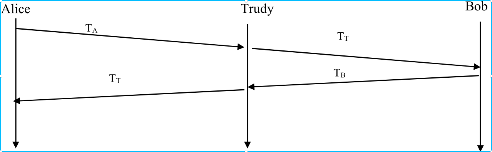

Diffie-Hellman公钥加密算法有可能被中间人攻击.

1.在这次攻击中，Trudy接收Alice的公共价值(TA)，并将自己的公共价值(TT)发送给Bob。

2.当Bob传送他的公共价值(TB)时，Trudy将她的公钥发送给Alice(TT)。

3.Trudy和Alice同意一个共享密钥(SAT)，Trudy和Bob商定另一个共享密钥(SBT)。TA TT TT TB Alice Trudy Bo

4.在此交换之后，Truddy简单地对Alice或Bob发送的任何消息进行解密。公共密钥SAT和SBT。

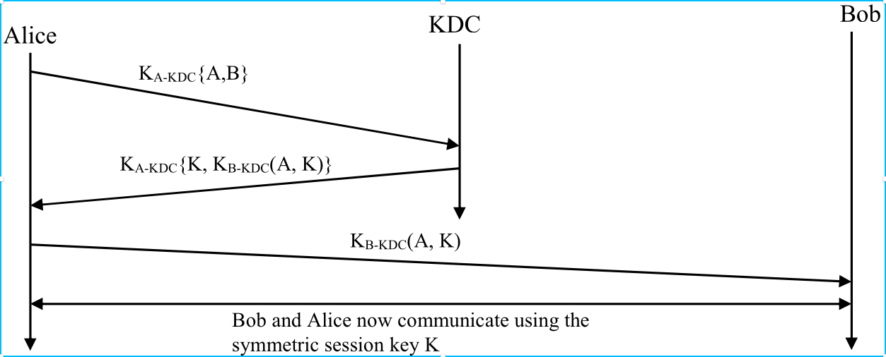

P11、消息

I O U 1 

9 0 . 9 

0 B O B 

有相同的校验值

P12、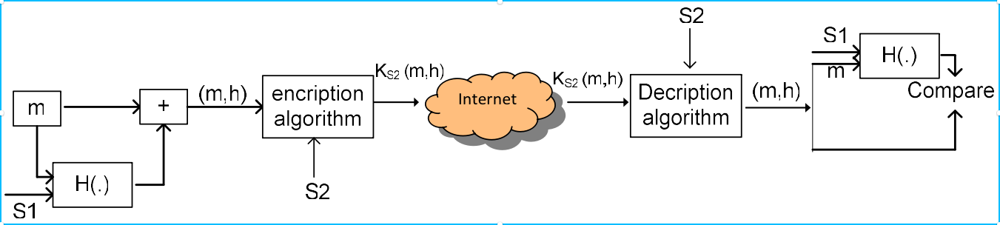

P13、该文件被分成相等大小的块。对于每个块，计算散列（用于MD5或SHA-1的示例）。所有块的哈希将保存在中。激流文件。每当对等体下载块时,它计算该块的散列,并且将其与中的哈希进行比较。激流文件。如果两个散列相等，则块是有效的。否则，块是假的，应该被丢弃。

P14、数字签名需要具有认证的基础公钥基础设施(PKI)当局。对于OSPF，所有路由器都处于同一域中，因此管理员可以很容易地在每台路由器上部署对称密钥，而不需要PKI。

P15、鲍勃不知道他最初是否在和特鲁迪或爱丽丝说话。Bob和Alice共享一个秘密密钥卡-B，对特鲁迪来说是unknown。特鲁迪想要鲍勃验证她(特鲁迪)就像爱丽丝。Truddy会让Bob验证自己，并等待Bob启动：1、Bob-to-Truddy："我是鲍勃"评论：Bob开始验证自己。鲍勃斯然后，将自己认证到另一侧，然后停止几个步骤。2.Truddy-to-Bob："我是爱丽丝"评论：Truddy开始验证自己艾丽斯3.Bob-to-Truddy："RR"评论：Bob通过发送临时数响应步骤2。回复。特鲁迪还不知道KA-B(R)，所以她还没有回复。4.Truddy-to-bob："RR"评论：Truddy现在响应第1步，现在继续BobS身份验证，选择要加密的BOB的现时值，与之完全相同的值Bob在步骤3中发送她来加密。5.Bob-to-Truddy："KA-B(R)"Bob完成自己对自己的认证通过对在步骤4中发送的现时数进行加密来进行另一侧的加密。特鲁迪现在有KA-B(R)。（注意：她没有，也不需要，KA-B6.Truddy-to-Bob："KA-B(R)"Truddy完成了她的身份验证，响应了RBob在上述步骤3中与KA-B(R)一起发送。因为特鲁迪已经正确地返回了Bob在步骤3中发送的加密的随机数，Bob认为Truddy是Alice！

P16、这不会真正解决这个问题。正如鲍勃认为（不正确地）他是在图7.14的前半点对爱丽丝进行认证，所以你也可以欺骗爱丽丝认为（错误地）她在验证鲍勃。问题的根源Bob和Alice都可以说他们正在得到的公钥确实是Alice的公钥鲍勃。

P17、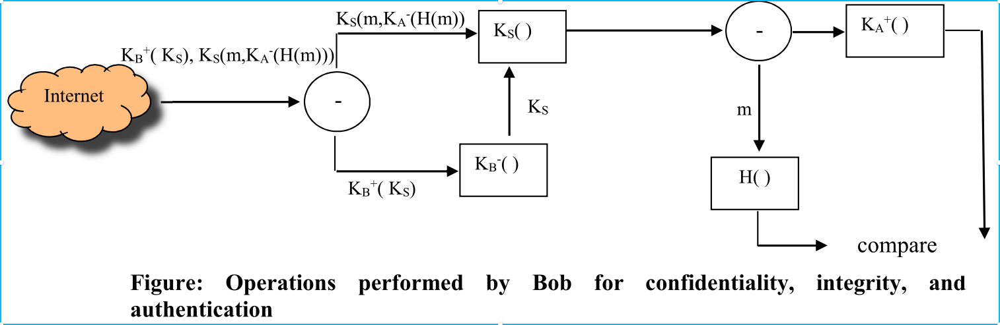

P18、

a)不具有公钥/私钥对或预共享秘密，Bob无法验证Alice创建了消息。

b)是的，Alice简单地使用Bob的公钥对消息进行加密，并发送对Bob的加密消息。

P19、

a) Client 

b) IP: 216.75.194.220, port: 443 

c) 283 

d) 3 SSL records 

e) Yes, it contains an encrypted master secret 

f) First byte: bc; Last byte: 29 

g) 6 


P20、再次，我们假设SSL不提供序列号。假设Truddy，A中、中、删除TCP段。所以鲍勃什么都不知道，特鲁迪需要为了还调整从Alice发送到Bob的后续分组中的序列号,以及从Bob发送到Alice的确认号。结果是鲍勃现在，将丢失字节流中的数据包S值。

P21、否，伪数据包将失败完整性检查（使用共享MAC密钥）。

P22、

a) F

b) T

c) T

d) F


P23、如果Trudy不费事地更改序列号，R2将在检查ESP报头中的序列号时检测到重复的序列。如果Trudy增加序列号，该数据包将在R2处不通过完整性检查。

P24、

(A)由于IV=11，密钥流为111110100000.…。...如果m=10100000，则icv=1010 xor 0000=1010这三个字段将是：IV：11加密消息：10100000 XOR 11111010=01011010加密icv：1010 xor 0000=1010 

b)接收器提取IV(11)并生成密钥流111110100000。...使用密钥流恢复原始消息的加密消息：01011010 XOR 11111010=10100000XOR加密ICV与密钥流恢复原始ICV：1010 XOR 0000=1010接收机然后XOR恢复消息的前4位与其最后4位：1010 XOR 0000=1010(这等于已恢复的ICV)

c)，因为ICV被计算为前4位消息的XOR和最后4位消息的XOR，消息的第1位或第5位必须翻转以使接收的数据包通过ICV检查。

d)对于a)部分，加密的消息是01011010翻转第一个比特给出，11011010 TrudyXOR这个消息与密钥流：11011010 XOR 11111010=00100000

如果Trudy翻转了加密ICV的第一位，则接收方接收的ICV值为0010--接收方XOR值与密钥流一起得到ICV：0010 XOR 0000=0010，接收器现在从恢复消息：0010 XOR 0000=0010计算ICV：0010 XOR 0000=0010(这等于恢复的ICV，因此接收到的数据包通过ICV检查)

P25、筛选表:

Action Source 

Address 

Dest 

address Protocol Source 

port 

Dest 

port 

Flag 

bit 

Check 

connection

allow 222.22/16 outside of 

222.22/16 TCP > 1023 23 any 

allow outside of 

222.22/16 222.22/16 TCP 23 > 1023 ACK 

x 

Allow outside of 

222.22/16 222.22.0.12 TCP >1023 80 Any 

Allow 222.22.0.12 outside of 

222.22/16 TCP 80 >1023 Any 

deny All all all all all All 

连接表：

|Source address |Dest address |Source port|Dest port|
|-----|---|---|---|---|
|222.22.1.7| 37.96.87.123 |12699 |23 |
|222.22.93.2 |199.1.205.23 |37654| 23 |
|222.22.65.143 |203.77.240.43 |48712| 23 |

P26、

a)
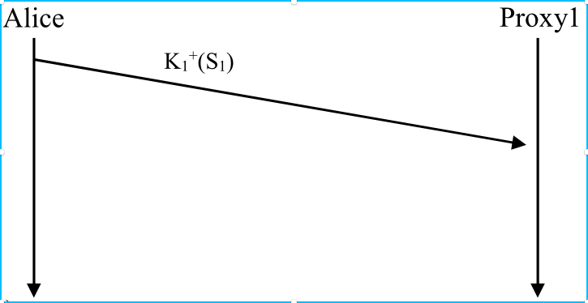

b)
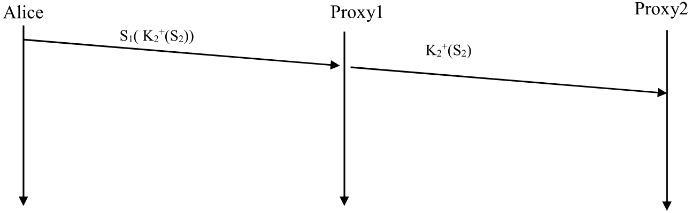

c)
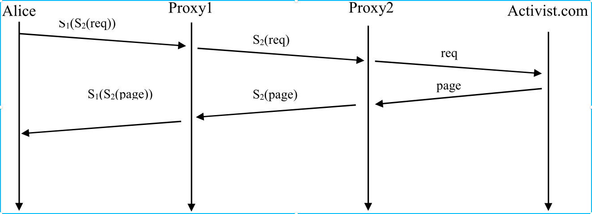

[Back to Index](#目录)