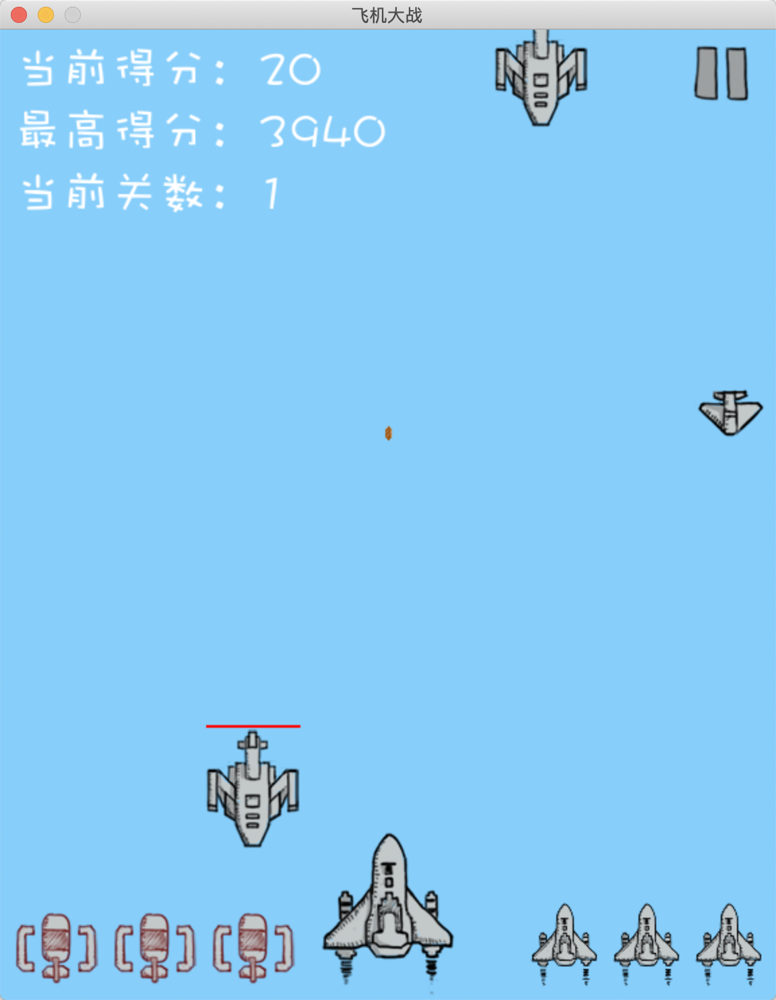

## 飞机大战游戏简介
- 手把手地带领大家`编写每一行代码`,共同完成一个`完全面向对象版本`的
飞机大战实战项目。
- 在项目代码的编写和讲解过程中,`每行代码都有详尽的注释`。
- 学习完这个实战项目后,可以掌握`Python项目开发中的众多技能`,
包括:编码规范、面向对象、代码重构,等等,从而可以`极大地提高
Python技能和水平`。
> [视频教程](https://edu.51cto.com/course/19962.html)


## 搭建开发环境
1. Python 
2. 集成开发环境PyCharm
3. 用于游戏开发的第三方库pygame
```
pip3 install pygame
pip3 install pygame -i https://pypi.tuna.tsinghua.edu.cn/simple/
python3 -m pygame.examples.aliens
```

## pygame HelloWorld程序的实现步骤
1. 创建并显示一个固定尺寸的窗口
2. 处理用户关闭窗口从而退出程序的事件
3. 设置窗口的标题和背景色
4. 在窗口的底部居中位置绘制一架飞机
5. 让飞机向上匀速移动


